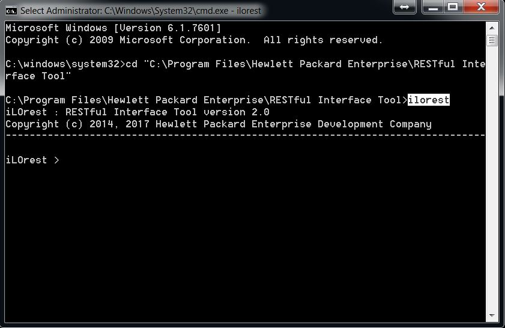
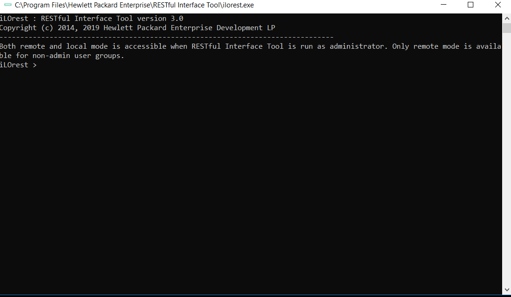
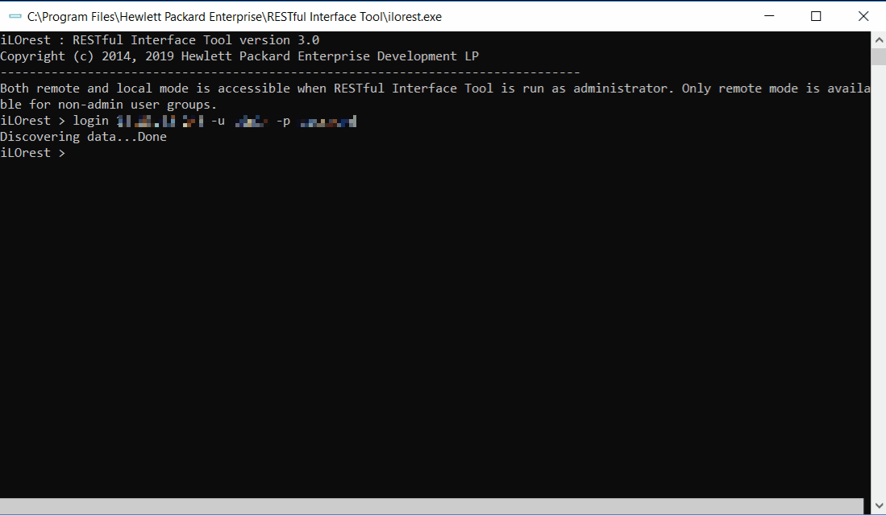
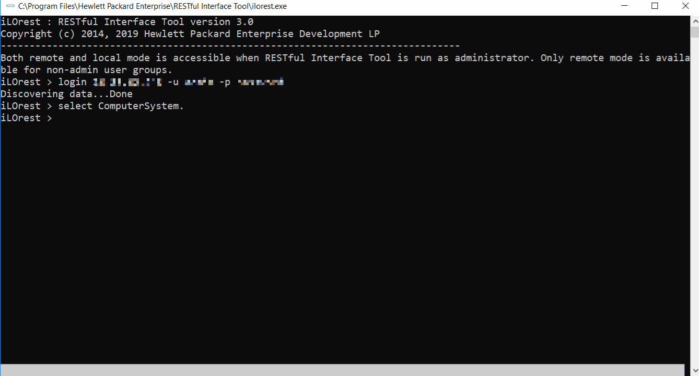
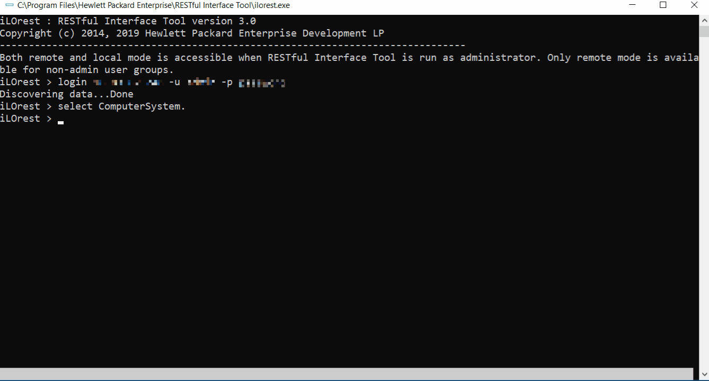
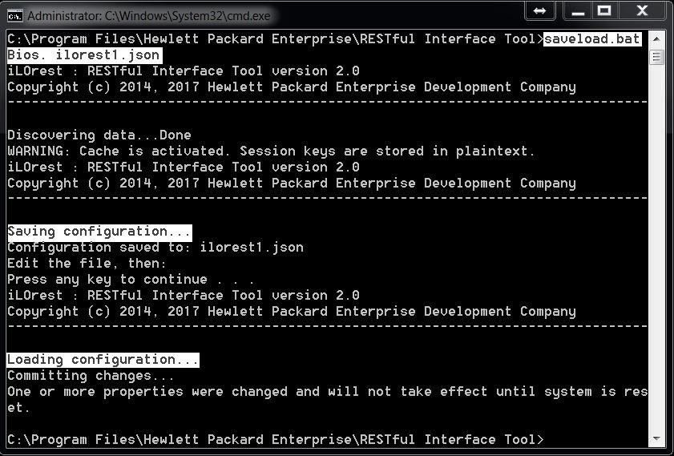

# Using the RESTful Interface Tool

## RESTful Interface Tool Modes of Operation

The RESTful Interface Tool has three modes of operation. By default, the interactive mode is utilized when you start the RESTful Interface Tool. With scriptable mode, you can use a script that gives commands to the RESTful Interface Tool. The file-based mode allows you to use a script that gives commands to the RESTful Interface Tool and uses a file to load and save settings.

### Interactive Mode

Interactive mode is started when you run the RESTful Interface Tool without any command-line parameters. The `ilorest >` prompt is displayed and you can enter commands one at a time. Interactive mode provides immediate feedback for an entered command. You can also use this mode to validate a script.

To start an interactive session:
- On Windows systems, double-click `ilorest.exe`. You must be an administrator to run `ilorest.exe`.
- On Linux systems, enter the following command as administrator: `/usr/sbin/ilorest`

You can exit the interactive mode by entering the `exit` command at the prompt.



#### Tab complete

Tab complete is available for interactive mode in multiple capacities. See the features below.

##### Commands

Tab complete is available for viewing and completing commands.



##### Types

Tab complete is available for viewing and completing types.

- You must be logged in



##### Properties and sub-properties

Tab complete is available for viewing and completing properties.

- You must be logged in and have a type selected
- Also available for set and list



##### Schema information for properties

Tab complete can also show schema information for properties.

- You must be logged in and have a type selected
- Also available for set and list



### Scriptable Mode

<details>
<summary>
The following script retrieves information regarding the Bios type:
</summary>
<p>

```cmd
:: This is a batch file that logs into a remote server,
:: selects the Bios type, and gets the BootMode value

:: Usage ::
:: selectget.bat [URI] [USERNAME] [PASSWORD]
@echo off

set argC=0
for %%x in (%*) do Set /A argC+=1
if %argC% LSS 3 goto :failCondition
goto :main

:failCondition
@echo Usage:
@echo selectget.bat [URI] [USERNAME] [PASSWORD]
goto :EOF

:main
@echo *****************************************
@echo ************* Logging in... *************
@echo *****************************************
ilorest.exe login %1 -u %2 -p %3
@echo *****************************************
@echo ******* selecting Bios type... ********
@echo *****************************************
ilorest.exe select Bios.
@echo *****************************************
@echo ********** getting BootMode... **********
@echo *****************************************
ilorest.exe get BootMode
pause
```

</p>
</details>

You can use the scriptable mode to script all the commands using an external input file. The script contains a list of the RESTful Interface Tool command lines that let users get and set properties of server objects.

In this example, first the `Bios` type is selected, and then the `get` command is used to retrieve information about the `BootMode` property of `Bios`.

### File-based mode

<details>
<summary>
The following script allows you to save, edit, and load a file to the server.
</summary>
<p>

```cmd
:: This a file-based edit mode helper for RESTful Interface Tool
:: 1. Run to download selected type to a file called ilorest.json
:: 2. Edit the ilorest.json file to make changes.
:: 3. Press any key running batch program to continue with program,
::    uploading the newly edited program to the server.

:: Usage ::
:: saveload.bat [SELECTOR] [FILENAME]
:: Specify a type with the SELECTOR tag, and
:: save to a file called FILENAME
@echo off
set argC=0
for %%x in (%*) do Set /A argC+=1
if %argC% LSS 2 goto :failCondition
goto :main

:failCondition
@echo Usage:
@echo saveload.bat [SELECTOR] [FILENAME]
@echo specify a type with the SELECTOR tag, and
@echo save to a file called FILENAME
goto :EOF

:main
ilorest.exe login
ilorest.exe save --selector=%1 --json -f %2
@echo Edit the file, then:
pause
ilorest.exe load -f %2
```

</p>
</details>

File-based mode allows you to save and load settings from a file. This is similar to the `conrep.dat` files used by CONREP. File-based mode supports the JSON format.

When the example script is run, the following result is produced:



Here, the `Bios` type is saved to a file called `ilorest1.json`. Then, after you modify any properties, the `load` command is used to make these changes on the server.

The properties of `Bios` can be edited here, and then loaded on the server. When the file is loaded on the server, changes to read-only values are not reflected. The full list in this example is truncated to save space.

<details>
<summary>
After saving this configuration, the **ilorest1.json** file looks like this:
</summary>
<p>

```json
{
	{
		"Comments":{
			"Manufacturer": "HP",
			"Model": "ProLiant DL360 Gen9",
			"BIOSFamily": "P89",
			"BIOSDate": "05/03/2015"
		}
	},
	{
		"HpBios.1.2.0": {
			"/rest/v1/systems/1/bios/Settings": {
				"AcpiRootBridgePxm": "Enabled",
				"AcpiSlit": "Enabled",
				"AdminName": "Jean Kranz",
				...
				"WakeOnLan": "Enabled"
			}
		}
	}
}
```
</p>
</details>

## Executing commands in parallel

Run the following command to start an iLOREST session in 10 different iLO servers:

```Shell
pdsh -R exec -w server[1-10] ilorest --cache-dir=%h login ilo-%h -u username -p password.
```

:::info

When you run the example command, PDSH issues the following 10 commands in batch and background mode. For each command, iLOREST saves the data in a different location. For example, for server1, the data is cached in directory server1, for server2, the data is cached in directory server2.

:::

```Shell
ilorest --cache-dir=server1 login ilo-server1 -u username -p password
ilorest --cache-dir=server2 login ilo-server2 -u username -p password
ilorest --cache-dir=server3 login ilo-server3 -u username -p password
ilorest --cache-dir=server4 login ilo-server4 -u username -p password
ilorest --cache-dir=server5 login ilo-server5 -u username -p password
ilorest --cache-dir=server6 login ilo-server6 -u username -p password
ilorest --cache-dir=server7 login ilo-server7 -u username -p password
ilorest --cache-dir=server8 login ilo-server8 -u username -p password
ilorest --cache-dir=server9 login ilo-server9 -u username -p password
ilorest --cache-dir=server10 login ilo-server10 -u username -p password
```

Now that an iLOREST session is created on each iLO, you can **select**, **set**, or **get** information from them.

The **-R exec** part of the example finds and locally executes the iLOREST executable. **The -w server[1-10]** part of the example replaces the string `%h` in the rest of the command with `1, 2, &#8230; 10`.

```Shell
pdsh -R exec --cache-dir=server[1-10] ilorest <select, list, get or set> <Type or property>.
```

iLOREST uses a caching method to locally save servers' data. To send iLOREST commands to many different systems at once remotely, you will need to specify a different cache directory for each of them. The following example uses `PDSH`, but any method of parallel scripting will work as long as you are specifying different cache directories.

Running iLOREST on multiple systems locally can be done using automation tools such as Ansible, Chef, and Puppet.

## Configuration file (Redfish.conf)

<details>
<summary>
Windows default configuration file
</summary>
<p>

```ini
[ilorest]
#iLOrest reads the following environment variables, and applies them at runtime.  
#Note that they can be overridden by command line switches.

#####          Log Settings          #####
##########################################
# directory where iLOrest writes its log file
# logdir = .\ilorest_logs

#####         Cache Settings         #####
##########################################
# option to disable caching of all data
# cache = False

#####       Credential Settings      #####
##########################################
# option to use the provided url to login
# url = https://127.0.0.1

# option to use the provided username to login
# username = admin

# option to use the provided password to login
# password = password

# option to use the provided SSL certificate or certificate bundle for HTTPS validation
#sslcert = .\

#####         Commit Settings        #####
##########################################
# flag to commit in all places where applicable
# commit = True

#####    Output Default Settings     #####
##########################################
# flag to change output format in all places where applicable
# format = json

#####    Schema Default Settings     #####
##########################################
# directory where iLOrest will look for ilo schemas
# iloschemadir = .\

# directory where iLOrest will look for bios schemas
# biosschemadir = .\

#####  Default Save/Load Settings    #####
##########################################
# option to set default save output file
# savefile = ilorest.json

# option to set default load input file
# loadfile = ilorest.json
```

</p>
</details>

<details>
<summary>
Linux default configuration file
</summary>
<p>

```ini
[iLOrest]
#iLOrest reads the following environment variables, and applies them at runtime.  
#Note that they can be overridden by command line switches.

#####          Log Settings          #####
##########################################
# directory where iLOrest writes its log file
# logdir = /var/log/ilorest/

#####         Cache Settings         #####
##########################################
# option to disable caching of all data
# cache = False

#####       Credential Settings      #####
##########################################
# option to use the provided url to login
# url = https://127.0.0.1

# option to use the provided username to login
# username = admin

# option to use the provided password to login
# password = password

# option to use the provided SSL certificate or certificate bundle for HTTPS validation
#sslcert = ./

#####         Commit Settings        #####
##########################################
# flag to commit in all places where applicable
# commit = True

#####    Output Default Settings     #####
##########################################
# flag to change output format in all places where applicable
# format = json

#####    Schema Default Settings     #####
##########################################
# directory where iLOrest will look for ilo schemas
# iloschemadir = /usr/share/ilorest/

# directory where iLOrest will look for bios schemas
# biosschemadir = /usr/share/ilorest/

#####  Default Save/Load Settings    #####
##########################################
# option to set default save output file
# savefile = ilorest.json

# option to set default load input file
# loadfile = ilorest.json
```

</p>
</details>

The configuration file contains the default settings for the tool. You can use a text editor to change the behavior of the tool such as adding a server IP address, username, and password. The settings that you add or update in the configuration file are automatically loaded each time you start the tool.

Configuration file locations:

- Windows OS: The same location as the executable file that starts the tool.
- Linux OS: `/etc/ilorest/Redfish.conf`
