# Use Case Examples and Macro Commands

This section outlines ready to use example commands, as well as some general use scenarios for obtaining and configuring iLO 4 (iLO 4 2.00+) and iLO 5 systems through Redfish. Legacy modes are supported for older HPRest iLO 4 systems.

## Quick Reference Table: Available scripts for Linux and Windows

|    **Name**                    | **Description**                                                              |
|--------------------------------|------------------------------------------------------------------------------|
| <a href="https://github.com/HewlettPackard/python-redfish-utility/blob/master/examples/Linux/Abort_Directory_Test.sh" target="_blank">Abort_Directory_Test.sh</a><br><a href="https://github.com/HewlettPackard/python-redfish-utility/blob/master/examples/Windows/Abort_Directory_Test.bat" target="_blank">Abort_Directory_Test.bat</a>                  | Aborts the directory test on iLO 5.                                           |
| <a href="https://github.com/HewlettPackard/python-redfish-utility/blob/master/examples/Linux/Add_Federation_Group.sh" target="_blank">Add_Federation_Group.sh</a><br><a href="https://github.com/HewlettPackard/python-redfish-utility/blob/master/examples/Windows/Add_Federation_Group.bat" target="_blank">Add_Federation_Group.bat</a>             | Adds a Federation group membership and grant associated privileges on iLO4 and iLO5.            |
| <a href="https://github.com/HewlettPackard/python-redfish-utility/blob/master/examples/Linux/Add_sso_rec.sh" target="_blank">Add_sso_rec.sh</a><br><a href="https://github.com/HewlettPackard/python-redfish-utility/blob/master/examples/Windows/Add_sso_rec.bat" target="_blank">Add_sso_rec.bat</a>                     | Adds an HPE SIM Single Sign-On (SSO) server record to the end of the database on iLO4 or iLO5.  |
| <a href="https://github.com/HewlettPackard/python-redfish-utility/blob/master/examples/Linux/Add_User.sh" target="_blank">Add_User.sh</a><br><a href="https://github.com/HewlettPackard/python-redfish-utility/blob/master/examples/Windows/Add_User.bat" target="_blank">Add_User.bat</a>                          | Adds an iLO account to the server either locally or remotely using the  RESTful Interface Tool.     |            
| <a href="https://github.com/HewlettPackard/python-redfish-utility/blob/master/examples/Linux/Administrator_reset_pw.sh" target="_blank">Administrator_reset_pw.sh</a><br><a href="https://github.com/HewlettPackard/python-redfish-utility/blob/master/examples/Windows/Administrator_reset_pw.bat" target="_blank">Administrator_reset_pw.bat</a>            | Sets the default Administrator account password using iLOREST.EXE.           |
| <a href="https://github.com/HewlettPackard/python-redfish-utility/blob/master/examples/Linux/Boot_spp.sh" target="_blank">Boot_spp.sh</a><br><a href="https://github.com/HewlettPackard/python-redfish-utility/blob/master/examples/Windows/Boot_spp.bat" target="_blank">Boot_spp.bat</a>                          | Mounts the SPP media image, reboot the system, and boot to it.               |
| <a href="https://github.com/HewlettPackard/python-redfish-utility/blob/master/examples/Linux/Cert_Request.sh" target="_blank">Cert_Request.sh</a><br><a href="https://github.com/HewlettPackard/python-redfish-utility/blob/master/examples/Windows/Cert_Request.bat" target="_blank">Cert_Request.bat</a>                     | Gets a certificate signing request from iLO4 and iLO5.                       |
| <a href="https://github.com/HewlettPackard/python-redfish-utility/blob/master/examples/Linux/Change_Password.sh" target="_blank">Change_Password.sh</a><br><a href="https://github.com/HewlettPackard/python-redfish-utility/blob/master/examples/Windows/Change_Password.bat" target="_blank">Change_Password.bat</a>                  | Change a user's password in the database of local users on iLO4 and iLO5.    |
| <a href="https://github.com/HewlettPackard/python-redfish-utility/blob/master/examples/Linux/Clear_AHS_Data.sh" target="_blank">Clear_AHS_Data.sh</a><br><a href="https://github.com/HewlettPackard/python-redfish-utility/blob/master/examples/Windows/Clear_AHS_Data.bat" target="_blank">Clear_AHS_Data.bat</a>                    | Clears AHS data.                                                             |
| <a href="https://github.com/HewlettPackard/python-redfish-utility/blob/master/examples/Linux/Clear_EventLog.sh" target="_blank">Clear_EventLog.sh</a><br><a href="https://github.com/HewlettPackard/python-redfish-utility/blob/master/examples/Windows/Clear_EventLog.bat" target="_blank">Clear_EventLog.bat</a>                   | Clears the event log on iLO4 and iLO5.                                       |
| <a href="https://github.com/HewlettPackard/python-redfish-utility/blob/master/examples/Linux/Clear_IML.sh" target="_blank">Clear_IML.sh</a><br><a href="https://github.com/HewlettPackard/python-redfish-utility/blob/master/examples/Windows/Clear_IML.bat" target="_blank">Clear_IML.bat</a>                        | Clears the server IML log from iLO4 and iLO5.                                |
| <a href="https://github.com/HewlettPackard/python-redfish-utility/blob/master/examples/Linux/Computer_Lock_Config.sh" target="_blank">Computer_Lock_Config.sh</a><br><a href="https://github.com/HewlettPackard/python-redfish-utility/blob/master/examples/Windows/Computer_Lock_Config.bat" target="_blank">Computer_Lock_Config.bat</a>              | Configures Computer Lock settings on iLO5.                                   |
| <a href="https://github.com/HewlettPackard/python-redfish-utility/blob/master/examples/Linux/Delete_Federation_Group.sh" target="_blank">Delete_Federation_Group.sh</a><br><a href="https://github.com/HewlettPackard/python-redfish-utility/blob/master/examples/Windows/Delete_Federation_Group.bat" target="_blank">Delete_Federation_Group.bat</a>           | Deletes a Federation group membership on iLO4 and iLO5.                      |
| <a href="https://github.com/HewlettPackard/python-redfish-utility/blob/master/examples/Linux/Delete_sso_rec.sh" target="_blank">Delete_sso_rec.sh</a><br><a href="https://github.com/HewlettPackard/python-redfish-utility/blob/master/examples/Windows/Delete_sso_rec.bat" target="_blank">Delete_sso_rec.bat</a>                    | Deletes an HPE SIM Single Sign-On (SSO) server record by index.              |
| <a href="https://github.com/HewlettPackard/python-redfish-utility/blob/master/examples/Linux/Delete_User.sh" target="_blank">Delete_User.sh</a><br><a href="https://github.com/HewlettPackard/python-redfish-utility/blob/master/examples/Windows/Delete_User.bat" target="_blank">Delete_User.bat</a>                       | Deletes a user from the database of local users on iLO4 and iLO5.              |
| <a href="https://github.com/HewlettPackard/python-redfish-utility/blob/master/examples/Linux/delete_sso_rec.sh" target="_blank">delete_sso_rec.sh</a><br><a href="https://github.com/HewlettPackard/python-redfish-utility/blob/master/examples/Windows/delete_sso_rec.bat" target="_blank">delete_sso_rec.bat</a>                       | Deletes an HPE SIM Single Sign-On (SSO) server record by index.              |
| <a href="https://github.com/HewlettPackard/python-redfish-utility/blob/master/examples/Linux/Eject_Virtual_Media.sh" target="_blank">Eject_Virtual_Media.sh</a><br><a href="https://github.com/HewlettPackard/python-redfish-utility/blob/master/examples/Windows/Eject_Virtual_Media.bat" target="_blank">Eject_Virtual_Media.bat</a>               | Ejects virtual media.                                                        |
| <a href="https://github.com/HewlettPackard/python-redfish-utility/blob/master/examples/Linux/ERS_DC_SetWebProxy.sh" target="_blank">ERS_DC_SetWebProxy.sh</a><br><a href="https://github.com/HewlettPackard/python-redfish-utility/blob/master/examples/Windows/ERS_DC_SetWebProxy.bat" target="_blank">ERS_DC_SetWebProxy.bat</a>             | Starts director test on  iLO4 and iLO5.                                      |
| <a href="https://github.com/HewlettPackard/python-redfish-utility/blob/master/examples/Linux/ERS_Get_Settings.sh" target="_blank">ERS_Get_Settings.sh</a><br><a href="https://github.com/HewlettPackard/python-redfish-utility/blob/master/examples/Windows/ERS_Get_Settings.bat" target="_blank">ERS_Get_Settings.bat</a>                | Retrieves current ERS settings                                               |
| <a href="https://github.com/HewlettPackard/python-redfish-utility/blob/master/examples/Linux/Factory_Defaults.sh" target="_blank">Factory_Defaults.sh</a><br><a href="https://github.com/HewlettPackard/python-redfish-utility/blob/master/examples/Windows/Factory_Defaults.bat" target="_blank">Factory_Defaults.bat</a>                 | Sets the Lights-Out device to factory default settings.                      |
| <a href="https://github.com/HewlettPackard/python-redfish-utility/blob/master/examples/Linux/Get_AHS_Status.sh" target="_blank">Get_AHS_Status.sh</a><br><a href="https://github.com/HewlettPackard/python-redfish-utility/blob/master/examples/Windows/Get_AHS_Status.bat" target="_blank">Get_AHS_Status.bat</a>                   | Provides the status of AHS being enabled or disabled.                        |
| <a href="https://github.com/HewlettPackard/python-redfish-utility/blob/master/examples/Linux/Get_All_Languages.sh" target="_blank">Get_All_Languages.sh</a><br><a href="https://github.com/HewlettPackard/python-redfish-utility/blob/master/examples/Windows/Get_All_Languages.bat" target="_blank">Get_All_Languages.bat</a>                | Reads all read all languages that are supported on iLO.                      |
| <a href="https://github.com/HewlettPackard/python-redfish-utility/blob/master/examples/Linux/Get_All_Licenses.sh" target="_blank">Get_All_Licenses.sh</a><br><a href="https://github.com/HewlettPackard/python-redfish-utility/blob/master/examples/Windows/Get_All_Licenses.bat" target="_blank">Get_All_Licenses.bat</a>                | Obtains the license information 																						 |
| <a href="https://github.com/HewlettPackard/python-redfish-utility/blob/master/examples/Linux/Get_All_User_Info.sh" target="_blank">Get_All_User_Info.sh</a><br><a href="https://github.com/HewlettPackard/python-redfish-utility/blob/master/examples/Windows/Get_All_User_Info.bat" target="_blank">Get_All_User_Info.bat</a>                 | Returns all user's account information in the local user database.           |
| <a href="https://github.com/HewlettPackard/python-redfish-utility/blob/master/examples/Linux/Get_Asset_Tag.sh" target="_blank">Get_Asset_Tag.sh</a><br><a href="https://github.com/HewlettPackard/python-redfish-utility/blob/master/examples/Windows/Get_Asset_Tag.bat" target="_blank">Get_Asset_Tag.bat</a>                     | Obtains the asset tag.                                                       |
| <a href="https://github.com/HewlettPackard/python-redfish-utility/blob/master/examples/Linux/Get_Boot_Mode.sh" target="_blank">Get_Boot_Mode.sh</a><br><a href="https://github.com/HewlettPackard/python-redfish-utility/blob/master/examples/Windows/Get_Boot_Mode.bat" target="_blank">Get_Boot_Mode.bat</a>                     | Obtains the pending boot mode.                                               |
| <a href="https://github.com/HewlettPackard/python-redfish-utility/blob/master/examples/Linux/Get_Current_Boot_Mode.sh" target="_blank">Get_Current_Boot_Mode.sh</a><br><a href="https://github.com/HewlettPackard/python-redfish-utility/blob/master/examples/Windows/Get_Current_Boot_Mode.bat" target="_blank">Get_Current_Boot_Mode.bat</a>             | Obtains the current boot mode.                                               |
| <a href="https://github.com/HewlettPackard/python-redfish-utility/blob/master/examples/Linux/Get_Directory_Test_Results.sh" target="_blank">Get_Directory_Test_Results.sh</a><br><a href="https://github.com/HewlettPackard/python-redfish-utility/blob/master/examples/Windows/Get_Directory_Test_Results.bat" target="_blank">Get_Directory_Test_Results.bat</a>       | Obtains directory test results.                                              |
| <a href="https://github.com/HewlettPackard/python-redfish-utility/blob/master/examples/Linux/Get_Embedded_Health.sh" target="_blank">Get_Embedded_Health.sh</a><br><a href="https://github.com/HewlettPackard/python-redfish-utility/blob/master/examples/Windows/Get_Embedded_Health.bat" target="_blank">Get_Embedded_Health.bat</a>              | Retrieves the health information of the server.                              |
| <a href="https://github.com/HewlettPackard/python-redfish-utility/blob/master/examples/Linux/Get_EmHealth.sh" target="_blank">Get_EmHealth.sh</a><br><a href="https://github.com/HewlettPackard/python-redfish-utility/blob/master/examples/Windows/Get_EmHealth.bat" target="_blank">Get_EmHealth.bat</a>                     | Retrieves the health information of the server.                              |
| <a href="https://github.com/HewlettPackard/python-redfish-utility/blob/master/examples/Linux/Get_Encrypt.sh" target="_blank">Get_Encrypt.sh</a><br><a href="https://github.com/HewlettPackard/python-redfish-utility/blob/master/examples/Windows/Get_Encrypt.bat" target="_blank">Get_Encrypt.bat</a>                       | Returns the current encryption settings.                                     |
| <a href="https://github.com/HewlettPackard/python-redfish-utility/blob/master/examples/Linux/Get_Federation_All_Groups_Info.sh" target="_blank">Get_Federation_All_Groups_Info.sh</a><br><a href="https://github.com/HewlettPackard/python-redfish-utility/blob/master/examples/Windows/Get_Federation_All_Groups_Info.bat" target="_blank">Get_Federation_All_Groups_Info.bat</a>    | Retrieves a list of all federation group memberships and granted privileges. |
| <a href="https://github.com/HewlettPackard/python-redfish-utility/blob/master/examples/Linux/Get_Federation_Group.sh" target="_blank">Get_Federation_Group.sh</a><br><a href="https://github.com/HewlettPackard/python-redfish-utility/blob/master/examples/Windows/Get_Federation_Group.bat" target="_blank">Get_Federation_Group.bat</a>            | Retrieves the privileges granted to a specified federation group.            |
| <a href="https://github.com/HewlettPackard/python-redfish-utility/blob/master/examples/Linux/Get_Federation_Multicast_Options.sh" target="_blank">Get_Federation_Multicast_Options.sh</a><br><a href="https://github.com/HewlettPackard/python-redfish-utility/blob/master/examples/Windows/Get_Federation_Multicast_Options.bat" target="_blank">Get_Federation_Multicast_Options.bat</a>  | Retrieves the current federation multicast options.                          |
| <a href="https://github.com/HewlettPackard/python-redfish-utility/blob/master/examples/Linux/Get_FIPS_Status.sh" target="_blank">Get_FIPS_Status.sh</a><br><a href="https://github.com/HewlettPackard/python-redfish-utility/blob/master/examples/Windows/Get_FIPS_Status.bat" target="_blank">Get_FIPS_Status.bat</a>                 | Returns the current FIPs mode.                                               |
| <a href="https://github.com/HewlettPackard/python-redfish-utility/blob/master/examples/Linux/Get_FW_Version.sh" target="_blank">Get_FW_Version.sh</a><br><a href="https://github.com/HewlettPackard/python-redfish-utility/blob/master/examples/Windows/Get_FW_Version.bat" target="_blank">Get_FW_Version.bat</a>                 | Returns the version number of the current firmware.                           |
| <a href="https://github.com/HewlettPackard/python-redfish-utility/blob/master/examples/Linux/Get_Global.sh" target="_blank">Get_Global.sh</a><br><a href="https://github.com/HewlettPackard/python-redfish-utility/blob/master/examples/Windows/Get_Global.bat" target="_blank">Get_Global.bat</a>                       | Returns the current global settings.                                          |
| <a href="https://github.com/HewlettPackard/python-redfish-utility/blob/master/examples/Linux/Get_Host_APO.sh" target="_blank">Get_Host_APO.sh</a><br><a href="https://github.com/HewlettPackard/python-redfish-utility/blob/master/examples/Windows/Get_Host_APO.bat" target="_blank">Get_Host_APO.bat</a>                    | Obtains the automatic power on and power on delay settings of the server.     |
| <a href="https://github.com/HewlettPackard/python-redfish-utility/blob/master/examples/Linux/Get_Host_Power.sh" target="_blank">Get_Host_Power.sh</a><br><a href="https://github.com/HewlettPackard/python-redfish-utility/blob/master/examples/Windows/Get_Host_Power.bat" target="_blank">Get_Host_Power.bat</a>                  | Returns the current power state for the host server.                          |
| <a href="https://github.com/HewlettPackard/python-redfish-utility/blob/master/examples/Linux/Get_Host_Power_Saver.sh" target="_blank">Get_Host_Power_Saver.sh</a><br><a href="https://github.com/HewlettPackard/python-redfish-utility/blob/master/examples/Windows/Get_Host_Power_Saver.bat" target="_blank">Get_Host_Power_Saver.bat</a>           | Returns the current power state for the host server.                          |
| <a href="https://github.com/HewlettPackard/python-redfish-utility/blob/master/examples/Linux/Get_Hotkey_Config.sh" target="_blank">Get_Hotkey_Config.sh</a><br><a href="https://github.com/HewlettPackard/python-redfish-utility/blob/master/examples/Windows/Get_Hotkey_Config.bat" target="_blank">Get_Hotkey_Config.bat</a>               | Obtains the remote console hot keys.                                          |
| <a href="https://github.com/HewlettPackard/python-redfish-utility/blob/master/examples/Linux/Get_IML.sh" target="_blank">Get_IML.sh</a><br><a href="https://github.com/HewlettPackard/python-redfish-utility/blob/master/examples/Windows/Get_IML.bat" target="_blank">Get_IML.bat</a>                          | Retrieves the Integrated Management Log.                                      |
| <a href="https://github.com/HewlettPackard/python-redfish-utility/blob/master/examples/Linux/Get_LDAP_CA_Cert_Status.sh" target="_blank">Get_LDAP_CA_Cert_Status.sh</a><br><a href="https://github.com/HewlettPackard/python-redfish-utility/blob/master/examples/Windows/Get_LDAP_CA_Cert_Status.bat" target="_blank">Get_LDAP_CA_Cert_Status.bat</a>         | Obtains the LDAP CA certificate status on iLO4 and iLO5                       |
| <a href="https://github.com/HewlettPackard/python-redfish-utility/blob/master/examples/Linux/Get_Language.sh" target="_blank">Get_Language.sh</a><br><a href="https://github.com/HewlettPackard/python-redfish-utility/blob/master/examples/Windows/Get_Language.bat" target="_blank">Get_Language.bat</a>                   | Reads the default language on iLO.                                            |
| <a href="https://github.com/HewlettPackard/python-redfish-utility/blob/master/examples/Linux/Get_Network.sh" target="_blank">Get_Network.sh</a><br><a href="https://github.com/HewlettPackard/python-redfish-utility/blob/master/examples/Windows/Get_Network.bat" target="_blank">Get_Network.bat</a>                    | Returns the current network settings.                                         |
| <a href="https://github.com/HewlettPackard/python-redfish-utility/blob/master/examples/Linux/Get_OA_Info.sh" target="_blank">Get_OA_Info.sh</a><br><a href="https://github.com/HewlettPackard/python-redfish-utility/blob/master/examples/Windows/Get_OA_Info.bat" target="_blank">Get_OA_Info.bat</a>                     | Returns the enclosure data for c-Class blade infrastructure.                  |
| <a href="https://github.com/HewlettPackard/python-redfish-utility/blob/master/examples/Linux/Get_One_Time_Boot_Order.sh" target="_blank">Get_One_Time_Boot_Order.sh</a><br><a href="https://github.com/HewlettPackard/python-redfish-utility/blob/master/examples/Windows/Get_One_Time_Boot_Order.bat" target="_blank">Get_One_Time_Boot_Order.bat</a>         | Retrieves the current state of the One Time Boot.                             |
| <a href="https://github.com/HewlettPackard/python-redfish-utility/blob/master/examples/Linux/Get_PS_Data.sh" target="_blank">Get_PS_Data.sh</a><br><a href="https://github.com/HewlettPackard/python-redfish-utility/blob/master/examples/Windows/Get_PS_Data.bat" target="_blank">Get_PS_Data.bat</a>                     | Retrieves power supply information from the server.                           |
| <a href="https://github.com/HewlettPackard/python-redfish-utility/blob/master/examples/Linux/Get_Persistent_Boot_Order.sh" target="_blank">Get_Persistent_Boot_Order.sh</a><br><a href="https://github.com/HewlettPackard/python-redfish-utility/blob/master/examples/Windows/Get_Persistent_Boot_Order.bat" target="_blank">Get_Persistent_Boot_Order.bat</a>      | Retrieves the current state of the boot order.                                |
| <a href="https://github.com/HewlettPackard/python-redfish-utility/blob/master/examples/Linux/Get_Persmouse_Status.sh" target="_blank">Get_Persmouse_Status.sh</a><br><a href="https://github.com/HewlettPackard/python-redfish-utility/blob/master/examples/Windows/Get_Persmouse_Status.bat" target="_blank">Get_Persmouse_Status.bat</a>            | Obtains the persistent mouse and keyboard status.                             |
| <a href="https://github.com/HewlettPackard/python-redfish-utility/blob/master/examples/Linux/Get_PowerCap.sh" target="_blank">Get_PowerCap.sh</a><br><a href="https://github.com/HewlettPackard/python-redfish-utility/blob/master/examples/Windows/Get_PowerCap.bat" target="_blank">Get_PowerCap.bat</a>                    | Returns the power cap setting on the host server.                             |
| <a href="https://github.com/HewlettPackard/python-redfish-utility/blob/master/examples/Linux/Get_Power_On_Time.sh" target="_blank">Get_Power_On_Time.sh</a><br><a href="https://github.com/HewlettPackard/python-redfish-utility/blob/master/examples/Windows/Get_Power_On_Time.bat" target="_blank">Get_Power_On_Time.bat</a>                | Obtains the server power on time.                                             |
| <a href="https://github.com/HewlettPackard/python-redfish-utility/blob/master/examples/Linux/Get_Power_Readings.sh" target="_blank">Get_Power_Readings.sh</a><br><a href="https://github.com/HewlettPackard/python-redfish-utility/blob/master/examples/Windows/Get_Power_Readings.bat" target="_blank">Get_Power_Readings.bat</a>             | Obtains the power readings from the server.                                   |
| <a href="https://github.com/HewlettPackard/python-redfish-utility/blob/master/examples/Linux/Get_Product_Name.sh" target="_blank">Get_Product_Name.sh</a><br><a href="https://github.com/HewlettPackard/python-redfish-utility/blob/master/examples/Windows/Get_Product_Name.bat" target="_blank">Get_Product_Name.bat</a>                 | Obtains the product name.                                                     |
| <a href="https://github.com/HewlettPackard/python-redfish-utility/blob/master/examples/Linux/Get_Pwreg_Alert_Threshold.sh" target="_blank">Get_Pwreg_Alert_Threshold.sh</a><br><a href="https://github.com/HewlettPackard/python-redfish-utility/blob/master/examples/Windows/Get_Pwreg_Alert_Threshold.bat" target="_blank">Get_Pwreg_Alert_Threshold.bat</a>       | Obtains the power alert threshold.                                            |
| <a href="https://github.com/HewlettPackard/python-redfish-utility/blob/master/examples/Linux/Get_Rack_Settings.sh" target="_blank">Get_Rack_Settings.sh</a><br><a href="https://github.com/HewlettPackard/python-redfish-utility/blob/master/examples/Windows/Get_Rack_Settings.bat" target="_blank">Get_Rack_Settings.bat</a>                | Returns the enclosure data for c-Class blade infrastructure.                  |
| <a href="https://github.com/HewlettPackard/python-redfish-utility/blob/master/examples/Linux/Get_SDCard_Status.sh" target="_blank">Get_SDCard_Status.sh</a><br><a href="https://github.com/HewlettPackard/python-redfish-utility/blob/master/examples/Windows/Get_SDCard_Status.bat" target="_blank">Get_SDCard_Status.bat</a>               | Provides information as to whether an SD card is connected to the server. Possible return values are "PRESENT", "Absent", and "UNKNOWN".  |
| <a href="https://github.com/HewlettPackard/python-redfish-utility/blob/master/examples/Linux/Get_SNMP_IM.sh" target="_blank">Get_SNMP_IM.sh</a><br><a href="https://github.com/HewlettPackard/python-redfish-utility/blob/master/examples/Windows/Get_SNMP_IM.bat" target="_blank">Get_SNMP_IM.bat</a>                    | Returns current SNMP and HPE Insight Manager security settings.               |
| <a href="https://github.com/HewlettPackard/python-redfish-utility/blob/master/examples/Linux/Get_SSO_Settings.sh" target="_blank">Get_SSO_Settings.sh</a><br><a href="https://github.com/HewlettPackard/python-redfish-utility/blob/master/examples/Windows/Get_SSO_Settings.bat" target="_blank">Get_SSO_Settings.bat</a>                 | Retrieves the HPE SIM Single Sign-On (SSO) settings.                          |
| <a href="https://github.com/HewlettPackard/python-redfish-utility/blob/master/examples/Linux/Get_Security_Msg.sh" target="_blank">Get_Security_Msg.sh</a><br><a href="https://github.com/HewlettPackard/python-redfish-utility/blob/master/examples/Windows/Get_Security_Msg.bat" target="_blank">Get_Security_Msg.bat</a>                 | Retrieves the current security text message set in the iLO login banner.      |
| <a href="https://github.com/HewlettPackard/python-redfish-utility/blob/master/examples/Linux/Get_Server_FQDN.sh" target="_blank">Get_Server_FQDN.sh</a><br><a href="https://github.com/HewlettPackard/python-redfish-utility/blob/master/examples/Windows/Get_Server_FQDN.bat" target="_blank">Get_Server_FQDN.bat</a>                  | Obtains the fully qualified domain name from the host server.                 |
| <a href="https://github.com/HewlettPackard/python-redfish-utility/blob/master/examples/Linux/Get_Server_Name.sh" target="_blank">Get_Server_Name.sh</a><br><a href="https://github.com/HewlettPackard/python-redfish-utility/blob/master/examples/Windows/Get_Server_Name.bat" target="_blank">Get_Server_Name.bat</a>                  | Obtains the host server name.                                                 |
| <a href="https://github.com/HewlettPackard/python-redfish-utility/blob/master/examples/Linux/Get_Supported_Boot_Mode.sh" target="_blank">Get_Supported_Boot_Mode.sh</a><br><a href="https://github.com/HewlettPackard/python-redfish-utility/blob/master/examples/Windows/Get_Supported_Boot_Mode.bat" target="_blank">Get_Supported_Boot_Mode.bat</a>         | Obtains the supported boot modes.                                             |
| <a href="https://github.com/HewlettPackard/python-redfish-utility/blob/master/examples/Linux/Get_TPM_Status.sh" target="_blank">Get_TPM_Status.sh</a><br><a href="https://github.com/HewlettPackard/python-redfish-utility/blob/master/examples/Windows/Get_TPM_Status.bat" target="_blank">Get_TPM_Status.bat</a>                  | Returns the status of the Trusted Platform Module (TPM).                      |
| <a href="https://github.com/HewlettPackard/python-redfish-utility/blob/master/examples/Linux/Get_UID_Status.sh" target="_blank">Get_UID_Status.sh</a><br><a href="https://github.com/HewlettPackard/python-redfish-utility/blob/master/examples/Windows/Get_UID_Status.bat" target="_blank">Get_UID_Status.bat</a>                  | Returns the current state of the Unit ID LED of the host server.              |
| <a href="https://github.com/HewlettPackard/python-redfish-utility/blob/master/examples/Linux/Get_User.sh" target="_blank">Get_User.sh</a><br><a href="https://github.com/HewlettPackard/python-redfish-utility/blob/master/examples/Windows/Get_User.bat" target="_blank">Get_User.bat</a>                        | Returns data about the user account named in the GET_USER command.            |
| <a href="https://github.com/HewlettPackard/python-redfish-utility/blob/master/examples/Linux/Get_VM_Status.sh" target="_blank">Get_VM_Status.sh</a><br><a href="https://github.com/HewlettPackard/python-redfish-utility/blob/master/examples/Windows/Get_VM_Status.bat" target="_blank">Get_VM_Status.bat</a>                    | Obtains the status of the virtual media devices.                              |
| <a href="https://github.com/HewlettPackard/python-redfish-utility/blob/master/examples/Linux/Get_iLO_Log.sh" target="_blank">Get_iLO_Log.sh</a><br><a href="https://github.com/HewlettPackard/python-redfish-utility/blob/master/examples/Windows/Get_iLO_Log.bat" target="_blank">Get_iLO_Log.bat</a>                     | Retrieves the event log.                                                      |
| <a href="https://github.com/HewlettPackard/python-redfish-utility/blob/master/examples/Linux/Hotkey_Config.sh" target="_blank">Hotkey_Config.sh</a><br><a href="https://github.com/HewlettPackard/python-redfish-utility/blob/master/examples/Windows/Hotkey_Config.bat" target="_blank">Hotkey_Config.bat</a>                  | Configures a set of remote console hot keys for iLO.                          |
| <a href="https://github.com/HewlettPackard/python-redfish-utility/blob/master/examples/Linux/Import_Cert.sh" target="_blank">Import_Cert.sh</a><br><a href="https://github.com/HewlettPackard/python-redfish-utility/blob/master/examples/Windows/Import_Cert.bat" target="_blank">Import_Cert.bat</a>                     | Imports a signed certificate into iLO.                                        |
| <a href="https://github.com/HewlettPackard/python-redfish-utility/blob/master/examples/Linux/Import_LDAP_CA_Cert.sh" target="_blank">Import_LDAP_CA_Cert.sh</a><br><a href="https://github.com/HewlettPackard/python-redfish-utility/blob/master/examples/Windows/Import_LDAP_CA_Cert.bat" target="_blank">Import_LDAP_CA_Cert.bat</a>             | Imports an LDAP CA certificate on iLO 4 and iLO 5.                            |
| <a href="https://github.com/HewlettPackard/python-redfish-utility/blob/master/examples/Linux/Insert_Virtual_Media.sh" target="_blank">Insert_Virtual_Media.sh</a><br><a href="https://github.com/HewlettPackard/python-redfish-utility/blob/master/examples/Windows/Insert_Virtual_Media.bat" target="_blank">Insert_Virtual_Media.bat</a>           | Inserts a virtual media image.                                                |
| <a href="https://github.com/HewlettPackard/python-redfish-utility/blob/master/examples/Linux/License.sh" target="_blank">License.sh</a><br><a href="https://github.com/HewlettPackard/python-redfish-utility/blob/master/examples/Windows/License.bat" target="_blank">License.bat</a>                          | Applies the license key for the Integrated Lights-Out Advanced Pack.          |
| <a href="https://github.com/HewlettPackard/python-redfish-utility/blob/master/examples/Linux/Mod_Encrypt_Settings.sh" target="_blank">Mod_Encrypt_Settings.sh</a><br><a href="https://github.com/HewlettPackard/python-redfish-utility/blob/master/examples/Windows/Mod_Encrypt_Settings.bat" target="_blank">Mod_Encrypt_Settings.bat</a>            | Configures the encryption settings for iLO.                                   |
| <a href="https://github.com/HewlettPackard/python-redfish-utility/blob/master/examples/Linux/Mod_Federation_Group.sh" target="_blank">Mod_Federation_Group.sh</a><br><a href="https://github.com/HewlettPackard/python-redfish-utility/blob/master/examples/Windows/Mod_Federation_Group.bat" target="_blank">Mod_Federation_Group.bat</a>            | Modifies a federation group membership and associated privileges on iLO.      |
| <a href="https://github.com/HewlettPackard/python-redfish-utility/blob/master/examples/Linux/Mod_Network_Settings.sh" target="_blank">Mod_Network_Settings.sh</a><br>Script not available for Windows            | Configures the network settings for iLO.                                      |
| <a href="https://github.com/HewlettPackard/python-redfish-utility/blob/master/examples/Linux/Mod_SNMP_IM_Settings.sh" target="_blank">Mod_SNMP_IM_Settings.sh</a><br><a href="https://github.com/HewlettPackard/python-redfish-utility/blob/master/examples/Windows/Mod_SNMP_IM_Settings.bat" target="_blank">Mod_SNMP_IM_Settings.bat</a>             | Configures the SNMP and HPE Insight Manager integration settings.             |
| <a href="https://github.com/HewlettPackard/python-redfish-utility/blob/master/examples/Linux/Mod_SSO_Settings.sh" target="_blank">Mod_SSO_Settings.sh</a><br><a href="https://github.com/HewlettPackard/python-redfish-utility/blob/master/examples/Windows/Mod_SSO_Settings.bat" target="_blank">Mod_SSO_Settings.bat</a>                 | Configures HPE SIM Single Sign-ON (SSO) settings on iLO.                      |
| <a href="https://github.com/HewlettPackard/python-redfish-utility/blob/master/examples/Linux/Mod_User.sh" target="_blank">Mod_User.sh</a><br><a href="https://github.com/HewlettPackard/python-redfish-utility/blob/master/examples/Windows/Mod_User.bat" target="_blank">Mod_User.bat</a>                         | Modifies an existing password and privileges in the database of iLO users.    |
| <a href="https://github.com/HewlettPackard/python-redfish-utility/blob/master/examples/Linux/Mod_VLAN.sh" target="_blank">Mod_VLAN.sh</a><br><a href="https://github.com/HewlettPackard/python-redfish-utility/blob/master/examples/Windows/Mod_VLAN.bat" target="_blank">Mod_VLAN.bat</a>                        | Configures the iLO Shared Network Port with a user-defined VLAN ID.           |
| <a href="https://github.com/HewlettPackard/python-redfish-utility/blob/master/examples/Linux/Mod_VM_Port_Settings.sh" target="_blank">Mod_VM_Port_Settings.sh</a><br><a href="https://github.com/HewlettPackard/python-redfish-utility/blob/master/examples/Windows/Mod_VM_Port_Settings.bat" target="_blank">Mod_VM_Port_Settings.bat</a>            | Configures the virtual media port functionality on iLO.                       |
| <a href="https://github.com/HewlettPackard/python-redfish-utility/blob/master/examples/Linux/RBSU_POST_IP.sh" target="_blank">RBSU_POST_IP.sh</a><br><a href="https://github.com/HewlettPackard/python-redfish-utility/blob/master/examples/Windows/RBSU_POST_IP.bat" target="_blank">RBSU_POST_IP.bat</a>                     | Configures the management processor RBSU to display the IP address during POST |
| <a href="https://github.com/HewlettPackard/python-redfish-utility/blob/master/examples/Linux/Reset_RIB.sh" target="_blank">Reset_RIB.sh</a><br><a href="https://github.com/HewlettPackard/python-redfish-utility/blob/master/examples/Windows/Reset_RIB.bat" target="_blank">Reset_RIB.bat</a>                       | Resets (reboots) the iLO.                                                     |
| <a href="https://github.com/HewlettPackard/python-redfish-utility/blob/master/examples/Linux/Reset_Server.sh" target="_blank">Reset_Server.sh</a><br><a href="https://github.com/HewlettPackard/python-redfish-utility/blob/master/examples/Windows/Reset_Server.bat" target="_blank">Reset_Server.bat</a>                    | Power cycles (off and then on) the host server in which the iLO is operating. |
| <a href="https://github.com/HewlettPackard/python-redfish-utility/blob/master/examples/Linux/Send_Snmp_Test_Trap.sh" target="_blank">Send_Snmp_Test_Trap.sh</a><br><a href="https://github.com/HewlettPackard/python-redfish-utility/blob/master/examples/Windows/Send_Snmp_Test_Trap.bat" target="_blank">Send_Snmp_Test_Trap.bat</a>              | Sends a test SNMP trap to the alert destinations configured for the iLO.      |
| <a href="https://github.com/HewlettPackard/python-redfish-utility/blob/master/examples/Linux/Set_AHS_Status.sh" target="_blank">Set_AHS_Status.sh</a><br><a href="https://github.com/HewlettPackard/python-redfish-utility/blob/master/examples/Windows/Set_AHS_Status.bat" target="_blank">Set_AHS_Status.bat</a>                  | Enables or disables AHS logging.                                              |
| <a href="https://github.com/HewlettPackard/python-redfish-utility/blob/master/examples/Linux/Set_Asset_Tag.sh" target="_blank">Set_Asset_Tag.sh</a><br><a href="https://github.com/HewlettPackard/python-redfish-utility/blob/master/examples/Windows/Set_Asset_Tag.bat" target="_blank">Set_Asset_Tag.bat</a>                  | Sets the asset tag, which is limited to 32 characters.                        |
| <a href="https://github.com/HewlettPackard/python-redfish-utility/blob/master/examples/Linux/Set_Boot_Mode.sh" target="_blank">Set_Boot_Mode.sh</a><br><a href="https://github.com/HewlettPackard/python-redfish-utility/blob/master/examples/Windows/Set_Boot_Mode.bat" target="_blank">Set_Boot_Mode.bat</a>                    | Sets the pending boot mode.                                                   |
| <a href="https://github.com/HewlettPackard/python-redfish-utility/blob/master/examples/Linux/Set_Brownout.sh" target="_blank">Set_Brownout.sh</a><br><a href="https://github.com/HewlettPackard/python-redfish-utility/blob/master/examples/Windows/Set_Brownout.bat" target="_blank">Set_Brownout.bat</a>                    | Enables or disables brownout support.                                         |
| <a href="https://github.com/HewlettPackard/python-redfish-utility/blob/master/examples/Linux/Set_FIPS_Enable.sh" target="_blank">Set_FIPS_Enable.sh</a><br><a href="https://github.com/HewlettPackard/python-redfish-utility/blob/master/examples/Windows/Set_FIPS_Enable.bat" target="_blank">Set_FIPS_Enable.bat</a>                  | Enables FIPs mode.                                                            |
| <a href="https://github.com/HewlettPackard/python-redfish-utility/blob/master/examples/Linux/Set_Federation_Multicast_Options.sh" target="_blank">Set_Federation_Multicast_Options.sh</a><br><a href="https://github.com/HewlettPackard/python-redfish-utility/blob/master/examples/Windows/Set_Federation_Multicast_Options.bat" target="_blank">Set_Federation_Multicast_Options.bat</a> | Sets the federation multicast options.                                        |
| <a href="https://github.com/HewlettPackard/python-redfish-utility/blob/master/examples/Linux/Set_Host_APO.sh" target="_blank">Set_Host_APO.sh</a><br><a href="https://github.com/HewlettPackard/python-redfish-utility/blob/master/examples/Windows/Set_Host_APO.bat" target="_blank">Set_Host_APO.bat</a>                     | Sets the automatic power on and power on delays settings of the server.       |
| <a href="https://github.com/HewlettPackard/python-redfish-utility/blob/master/examples/Linux/Set_Host_Power.sh" target="_blank">Set_Host_Power.sh</a><br><a href="https://github.com/HewlettPackard/python-redfish-utility/blob/master/examples/Windows/Set_Host_Power.bat" target="_blank">Set_Host_Power.bat</a>                  | Toggles the power of the host server in which iLO 4 or iLO5 is executing.     |
| <a href="https://github.com/HewlettPackard/python-redfish-utility/blob/master/examples/Linux/Set_Host_Power_Saver.sh" target="_blank">Set_Host_Power_Saver.sh</a><br><a href="https://github.com/HewlettPackard/python-redfish-utility/blob/master/examples/Windows/Set_Host_Power_Saver.bat" target="_blank">Set_Host_Power_Saver.bat</a>           | Sets the Power Regulator feature on the host server in iLO.                   |
| <a href="https://github.com/HewlettPackard/python-redfish-utility/blob/master/examples/Linux/Set_Language.sh" target="_blank">Set_Language.sh</a><br><a href="https://github.com/HewlettPackard/python-redfish-utility/blob/master/examples/Windows/Set_Language.bat" target="_blank">Set_Language.bat</a>                     | Sets the default language on iLO.                                             |
| <a href="https://github.com/HewlettPackard/python-redfish-utility/blob/master/examples/Linux/Set_One_Time_Boot_Order.sh" target="_blank">Set_One_Time_Boot_Order.sh</a><br><a href="https://github.com/HewlettPackard/python-redfish-utility/blob/master/examples/Windows/Set_One_Time_Boot_Order.bat" target="_blank">Set_One_Time_Boot_Order.bat</a>          | Sets a one-time boot order.                                                   |
| <a href="https://github.com/HewlettPackard/python-redfish-utility/blob/master/examples/Linux/Set_Persistent_Boot_Order.sh" target="_blank">Set_Persistent_Boot_Order.sh</a><br><a href="https://github.com/HewlettPackard/python-redfish-utility/blob/master/examples/Windows/Set_Persistent_Boot_Order.bat" target="_blank">Set_Persistent_Boot_Order.bat</a>        | Sets a persistent boot order.                                                 |
| <a href="https://github.com/HewlettPackard/python-redfish-utility/blob/master/examples/Linux/Set_Persmouse_Status.sh" target="_blank">Set_Persmouse_Status.sh</a><br><a href="https://github.com/HewlettPackard/python-redfish-utility/blob/master/examples/Windows/Set_Persmouse_Status.bat" target="_blank">Set_Persmouse_Status.bat</a>            | Sets the persistent mouse and keyboard.                                       |
| <a href="https://github.com/HewlettPackard/python-redfish-utility/blob/master/examples/Linux/Set_Power_Cap.sh" target="_blank">Set_Power_Cap.sh</a><br><a href="https://github.com/HewlettPackard/python-redfish-utility/blob/master/examples/Windows/Set_PowerCap.bat" target="_blank">Set_PowerCap.bat</a> | Sets the Power Cap feature on the host server.                             |
| <a href="https://github.com/HewlettPackard/python-redfish-utility/blob/master/examples/Linux/Set_Pwreg_Alert_Threshold.sh" target="_blank">Set_Pwreg_Alert_Threshold.sh</a><br><a href="https://github.com/HewlettPackard/python-redfish-utility/blob/master/examples/Windows/Set_Pwreg_Alert_Threshold.bat" target="_blank">Set_Pwreg_Alert_Threshold.bat</a>       | Sets the power alert threshold for iLO.                                       |
| <a href="https://github.com/HewlettPackard/python-redfish-utility/blob/master/examples/Linux/Set_Security_Msg.sh" target="_blank">Set_Security_Msg.sh</a><br><a href="https://github.com/HewlettPackard/python-redfish-utility/blob/master/examples/Windows/Set_Security_Msg.bat" target="_blank">Set_Security_Msg.bat</a>                | Configures a security text message in the iLO login banner.                   |
| <a href="https://github.com/HewlettPackard/python-redfish-utility/blob/master/examples/Linux/Set_Server_Name.sh" target="_blank">Set_Server_Name.sh</a><br><a href="https://github.com/HewlettPackard/python-redfish-utility/blob/master/examples/Windows/Set_Server_Name.bat" target="_blank">Set_Server_Name.bat</a>                 | Sets the host server name.                                                    |
| <a href="https://github.com/HewlettPackard/python-redfish-utility/blob/master/examples/Linux/Set_Virtual_Power_BTN.sh" target="_blank">Set_Virtual_Power_BTN.sh</a><br><a href="https://github.com/HewlettPackard/python-redfish-utility/blob/master/examples/Windows/Set_Virtual_Power_BTN.bat" target="_blank">Set_Virtual_Power_BTN.bat</a>           | Simulates a physical press of the server power button or simulates the physical press and hold of the server power button for a cold boot or warm boot. |
| <a href="https://github.com/HewlettPackard/python-redfish-utility/blob/master/examples/Linux/Shared_Network_Port.sh" target="_blank">Shared_Network_Port.sh</a><br><a href="https://github.com/HewlettPackard/python-redfish-utility/blob/master/examples/Windows/Shared_Network_Port.bat" target="_blank">Shared_Network_Port.bat</a>             | Configures the iLO device to pass network traffic on the shared host network port.  |
| <a href="https://github.com/HewlettPackard/python-redfish-utility/blob/master/examples/Linux/Start_Directory_Test.sh" target="_blank">Start_Directory_Test.sh</a><br><a href="https://github.com/HewlettPackard/python-redfish-utility/blob/master/examples/Windows/Start_Directory_Test.bat" target="_blank">Start_Directory_Test.bat</a>           | Validates the configured directory settings. The directory test results are reset when directory settings are saved or when the directory tests are started.  |
| <a href="https://github.com/HewlettPackard/python-redfish-utility/blob/master/examples/Linux/UID_Control.sh" target="_blank">UID_Control.sh</a><br><a href="https://github.com/HewlettPackard/python-redfish-utility/blob/master/examples/Windows/UID_Control.bat" target="_blank">UID_Control.bat</a>                     | Toggles the UID on the host server. |
| <a href="https://github.com/HewlettPackard/python-redfish-utility/blob/master/examples/Linux/Update_Firmware.sh" target="_blank">Update_Firmware.sh</a><br><a href="https://github.com/HewlettPackard/python-redfish-utility/blob/master/examples/Windows/Update_Firmware.bat" target="_blank">Update_Firmware.bat</a>                 | Updates the iLO firmware.                                                     |
| <a href="https://github.com/HewlettPackard/python-redfish-utility/blob/master/examples/Linux/Update_Language.sh" target="_blank">Update_Language.sh</a><br><a href="https://github.com/HewlettPackard/python-redfish-utility/blob/master/examples/Windows/Update_Language.bat" target="_blank">Update_Language.bat</a>                  | Updates the language pack of iLO4 or iLO5.                                    |

## BIOS Attributes Examples

BIOS Attributes are configurable selections for the system BIOS. Configured attributes in iLO are transferred by the BIOS provider and staged for implementation
upon the next system reboot.

### Get System Asset Tag
<pre>
>./Get_Asset_Tag.bat 100.100.100.101 administrator password
iLOrest : RESTful Interface Tool version 3.1
Copyright (c) 2014, 2020 Hewlett Packard Enterprise Development LP
--------------------------------------------------------------------------------
Discovering data...Done
<span style="color: #01a982; ">ServerAssetTag="MySystem"</span>
Logging session out.
</pre>

Retrieve a system's asset tag.

|    **Linux**                   | **Windows**                                                                   |
|--------------------------------|------------------------------------------------------------------------------ |
| <a href="https://github.com/HewlettPackard/python-redfish-utility/blob/master/examples/Linux/Get_Asset_Tag.sh" target="_blank">Get_Asset_Tag.sh</a> | <a href="https://github.com/HewlettPackard/python-redfish-utility/blob/master/examples/Windows/Get_Asset_Tag.bat" target="_blank">Get_Asset_Tag.bat</a> |

### Set System Asset Tag
<pre>
> ./Set_Asset_Tag.bat 100.100.100.101 administrator password
iLOrest : RESTful Interface Tool version 3.1
Copyright (c) 2014-2020 Hewlett Packard Enterprise Development LP
--------------------------------------------------------------------------------
Discovering data...Done
<span style="color: #01a982; ">Committing changes...
One or more properties were changed and will not take effect until system is reset.</span>
Logging session out.
</pre>
Configure a system's asset tag.

|    **Linux**                   | **Windows**                                                                   |
|--------------------------------|------------------------------------------------------------------------------ |
| <a href="https://github.com/HewlettPackard/python-redfish-utility/blob/master/examples/Linux/Set_Asset_Tag.sh" target="_blank">Set_Asset_Tag.sh</a> | <a href="https://github.com/HewlettPackard/python-redfish-utility/blob/master/examples/Windows/Set_Asset_Tag.bat" target="_blank">Set_Asset_Tag.bat</a> |

### Set Server Name
<pre>
>./Set_Server_Name.bat 100.100.100.101 administrator password
iLOrest : RESTful Interface Tool version 3.1
Copyright (c) 2014-2020 Hewlett Packard Enterprise Development LP
--------------------------------------------------------------------------------
Discovering data...Done
<span style="color: #01a982; ">Committing changes...
One or more properties were changed and will not take effect until system is reset.</span>
Logging session out.
</pre>
Configure server name.

|    **Linux**                   | **Windows**                                                                   |
|--------------------------------|------------------------------------------------------------------------------ |
| <a href="https://github.com/HewlettPackard/python-redfish-utility/blob/master/examples/Linux/Set_Server_Name.sh" target="_blank">Set_Server_Name.sh</a> | <a href="https://github.com/HewlettPackard/python-redfish-utility/blob/master/examples/Windows/Set_Server_Name.bat" target="_blank">Set_Server_Name.bat</a> |

## Changing BIOS Administrator Password

This example shows how the set password command on a Gen9 system is just a few set commands.

The `Bios` type has two properties that both need to be used to change the administrator password, `AdminPassword` and `OldAdminPassword`. `AdminPassword` is the new password you want to change to, and `OldAdminPassword` is the current password you have.

<aside class="notice">If there is no current password, you must include <b>OldAdminPassword=""</b>.</aside>

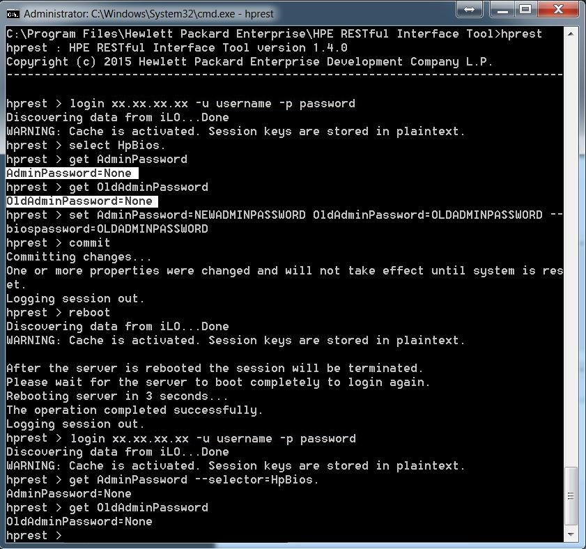

If you perform a `get` command to find the current `AdminPassword` and `OldAdminPassword` values, you will notice that their values are listed as `None`, regardless of what their actual values are, as seen above.

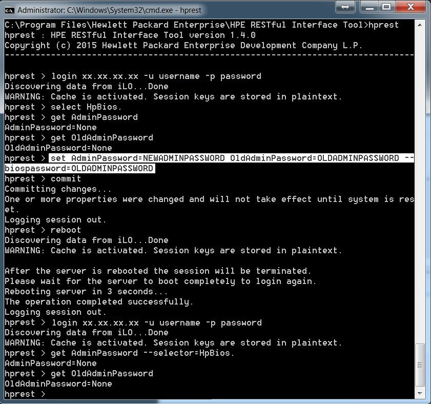

In order to change the administrator password, you need to set the `AdminPassword` (the new value you want) and the `OldAdminPassword` (what the admin password was before), as well as include the `–biospassword` flag if the system is iLO 4.

<aside class="notice">The <b>biospassword</b> value is the same as the <b>OldAdminPassword</b> value.</aside>

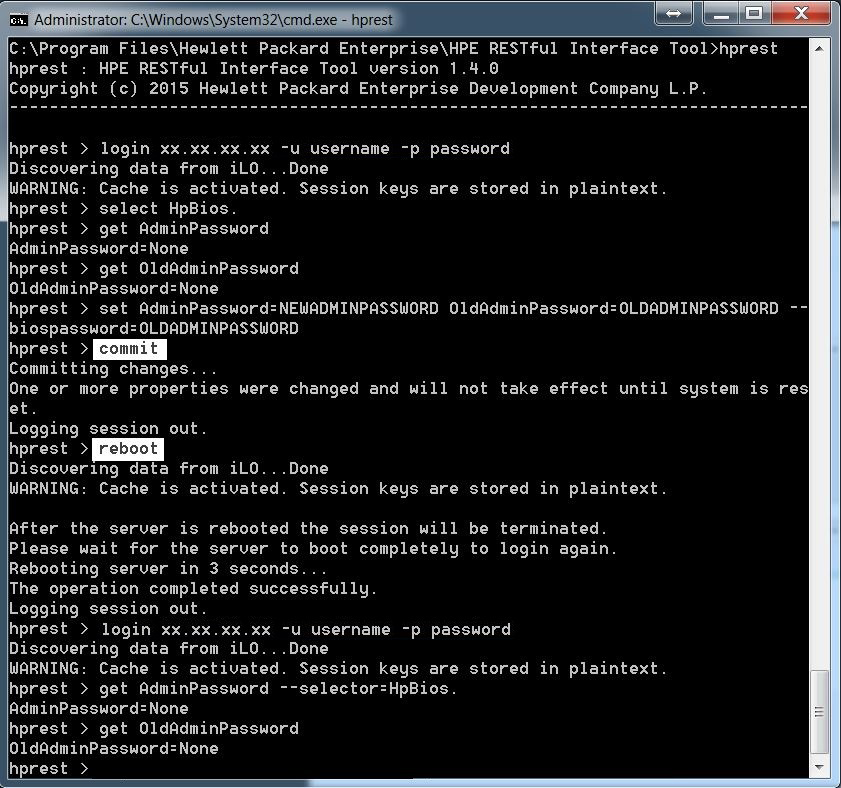

After you&apos;ve set the values for `AdminPassword` and `OldAdminPassword`, you need to commit your changes and reboot your server:

<aside class="notice">To change the administrator password, <b>AdminPassword</b> and <b>OldAdminPassword</b> must be set in the same line.</aside>

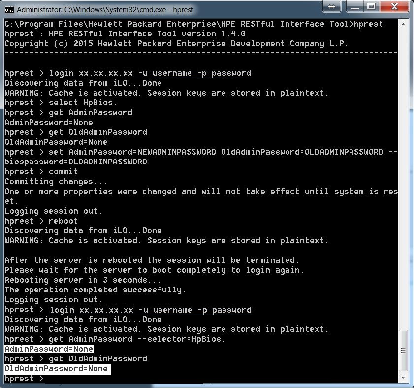

Then when you log into the server again, the BIOS password will have been updated to the new value. However, you cannot see the values for `AdminPassword` or `OldAdminPassword`.

## BIOS Boot Settings and Control

The following examples demonstrate methods to alter the boot configuration of the system.
<aside class="notice">Redfish BIOS boot settings only support UEFI (Unified Extensible Firmware Interface). Legacy options are not supported,
but may be available through configuration of BIOS attributes.</aside>

### Get Current Boot Mode
<pre>
>./Get_Boot_Mode.bat 100.100.100.101 administrator password
iLOrest : RESTful Interface Tool version 3.1
Copyright (c) 2014-2020 Hewlett Packard Enterprise Development LP
--------------------------------------------------------------------------------
Discovering data...Done
<span style="color: #01a982; ">BootMode=Uefi</span>
Logging session out.
</pre>
Obtain current boot mode setting.

|    **Linux**                   | **Windows**                                                                   |
|--------------------------------|------------------------------------------------------------------------------ |
| <a href="https://github.com/HewlettPackard/python-redfish-utility/blob/master/examples/Linux/Get_Boot_Mode.sh" target="_blank">Get_Boot_Mode.sh</a> | <a href="https://github.com/HewlettPackard/python-redfish-utility/blob/master/examples/Windows/Get_Boot_Mode.bat" target="_blank">Get_Boot_Mode.bat</a> |
| <a href="https://github.com/HewlettPackard/python-redfish-utility/blob/master/examples/Linux/Get_Current_Boot_Mode.sh" target="_blank">Get_Current_Boot_Mode.sh</a> | <a href="https://github.com/HewlettPackard/python-redfish-utility/blob/master/examples/Windows/Get_Current_Boot_Mode.bat" target="_blank">Get_Current_Boot_Mode.bat</a> |

### Get Default Boot Order
<pre>
>./Get_Persistent_Boot_Order.bat 100.100.100.101 administrator password
iLOrest : RESTful Interface Tool version 3.1
Copyright (c) 2014-2020 Hewlett Packard Enterprise Development LP
--------------------------------------------------------------------------------
Discovering data...Done
PersistentBootConfigOrder=HD.SD.1.2
                           HD.EmbRAID.1.3
                           CD.RearUSB.4.2
                           Generic.USB.1.1
                           HD.EmbRAID.1.2
                           NIC.FlexLOM.1.1.Httpv4
                           NIC.FlexLOM.1.1.IPv4
                           NIC.FlexLOM.1.1.Httpv6
                           NIC.FlexLOM.1.1.IPv6
Logging session out.
</pre>
Get persistent boot selection.

|    **Linux**                    | **Windows**                                                                 |
|---------------------------------|-----------------------------------------------------------------------------|
| <a href="https://github.com/HewlettPackard/python-redfish-utility/blob/master/examples/Linux/Get_Persistent_Boot_Order.sh" target="_blank">Get_Persistent_Boot_Order.sh</a> | <a href="https://github.com/HewlettPackard/python-redfish-utility/blob/master/examples/Windows/Get_Persistent_Boot_Order.bat" target="_blank">Get_Persistent_Boot_Order.bat</a> |

### Set Default Boot Order
<pre>
>./Set_Persistent_Boot_Order.bat 100.100.100.101 administrator password
iLOrest : RESTful Interface Tool version 3.1
Copyright (c) 2014-2020 Hewlett Packard Enterprise Development LP
--------------------------------------------------------------------------------
Discovering data...Done
<span style="color: #01a982; ">Committing changes...
One or more properties were changed and will not take effect until system is reset.</span>
Logging session out.
</pre>
Configure persistent boot selection.

|    **Linux**                    | **Windows**                                                                 |
|---------------------------------|-----------------------------------------------------------------------------|
| <a href="https://github.com/HewlettPackard/python-redfish-utility/blob/master/examples/Linux/Set_Persistent_Boot_Order.sh" target="_blank">Set_Persistent_Boot_Order.sh</a> | <a href="https://github.com/HewlettPackard/python-redfish-utility/blob/master/examples/Windows/Set_Persistent_Boot_Order.bat" target="_blank">Set_Persistent_Boot_Order.bat</a> |

### Set One Time Boot
<pre>
>./Set_One_Time_Boot_Order.bat 100.100.100.101 administrator password
iLOrest : RESTful Interface Tool version 3.1
Copyright (c) 2014-2020 Hewlett Packard Enterprise Development LP
--------------------------------------------------------------------------------
Discovering data...Done
<span style="color: #01a982; ">Committing changes...</span>
<span style="color: #01a982; ">The operation completed successfully.</span>
Logging session out.
</pre>
Configure one time boot selection. A subsequent system reboot will return the boot settings to normal (property is automatically altered following POST by the BIOS provider)

|    **Linux**                    | **Windows**                                                                 |
|---------------------------------|-----------------------------------------------------------------------------|
| <a href="https://github.com/HewlettPackard/python-redfish-utility/blob/master/examples/Linux/Set_One_Time_Boot_Order.sh" target="_blank">Set_One_Time_Boot_Order.sh</a> | <a href="https://github.com/HewlettPackard/python-redfish-utility/blob/master/examples/Windows/Set_One_Time_Boot_Order.bat"  target="_blank">Set_One_Time_Boot_Order.bat</a> |

### Get Supported Boot Mode
<pre>
>./Get_Supported_Boot_Mode.bat 100.100.100.101 administrator password
iLOrest : RESTful Interface Tool version 3.1
Copyright (c) 2014-2020 Hewlett Packard Enterprise Development LP
--------------------------------------------------------------------------------
Discovering data...Done
NAME
    BootMode


DISPLAY NAME
    Boot Mode


HELP TEXT
    Use this option to select the boot mode of the system. Selecting
    UEFI Mode configures the system to boot Unified Extensible
    Firmware Interface (UEFI) compatible operating systems. Selecting
    Legacy BIOS Mode configures the system to boot traditional
    operating systems in Legacy BIOS compatibility mode. The operating
    system can only boot in the mode in which it is installed. The
    following options require booting in UEFI Mode: Secure Boot, IPv6
    PXE Boot, boot > 2.2 TB Disks in AHCI SATA Mode, and Smart Array
    SW RAID.


************************************************

WARNING
    Boot Mode changes require a system reboot in order to take effect.
    Changing the Boot Mode can impact the ability of the server to
    boot the installed operating system. An operating system is
    installed in the same mode as the platform during the
    installation. If the Boot Mode does not match the operating system
    installation, the system cannot boot. The following features
    require that the server be configured for UEFI Mode: Secure Boot,
    IPv6 PXE Boot, Boot > 2.2 TB Disks in AHCI SATA Mode, and Smart
    Array SW RAID.


**********************************************


TYPE
    Enumeration


READ-ONLY
    False


POSSIBLE VALUES
    Uefi
    LegacyBios

Logging session out.
</pre>
Retrieve Supported System Boot Modes

|    **Linux**                    | **Windows**                                                                 |
|--------------------------------|------------------------------------------------------------------------------|
| <a href="https://github.com/HewlettPackard/python-redfish-utility/blob/master/examples/Linux/Get_Supported_Boot_Mode.sh" target="_blank">Get_Supported_Boot_Mode.sh</a>| <a href="https://github.com/HewlettPackard/python-redfish-utility/blob/master/examples/Windows/Get_Supported_Boot_Mode.bat" target="_blank">Get_Supported_Boot_Mode.bat</a>|

###Set Boot Mode
<pre>
.\Set_Boot_Mode.bat 100.100.100.101 administrator password
iLOrest : RESTful Interface Tool version 3.1
Copyright (c) 2014-2020 Hewlett Packard Enterprise Development LP
--------------------------------------------------------------------------------
Discovering data...Done
Committing changes...
<span style="color: #01a982; ">One or more properties were changed and will not take effect until system is reset.</span>
Logging session out.
</pre>
Configure system boot mode.

|    **Linux**                    | **Windows**                                                                 |
|--------------------------------|------------------------------------------------------------------------------|
| <a href="https://github.com/HewlettPackard/python-redfish-utility/blob/master/examples/Linux/Set_Boot_Mode.sh" target="_blank">Set_Boot_Mode.sh</a>|
| <a href="https://github.com/HewlettPackard/python-redfish-utility/blob/master/examples/Windows/Set_Boot_Mode.bat" target="_blank">Set_Boot_Mode.bat</a>|

## BootOrder Command Examples

The `bootorder` command is made up of a list of select, get, and set commands. In order to demonstrate the order of these events, the `bootorder` command is manually stepped through one step at a time to show that it only uses other provided commands to perform its task.

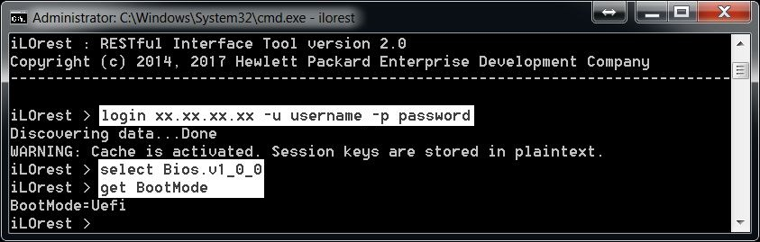

First the server is logged into, and the `select` and `get` commands are performed on the `Bios` type and the `BootMode` property, respectively.


Next the `select` and `get` commands are used to retrieve the `BootSourceOverrideSupported` property of the `ComputerSystem` type.

<aside class="notice">All of these operations, such as <b>select</b> and <b>get</b>, are already implemented in the RESTful Interface Tool.</aside>

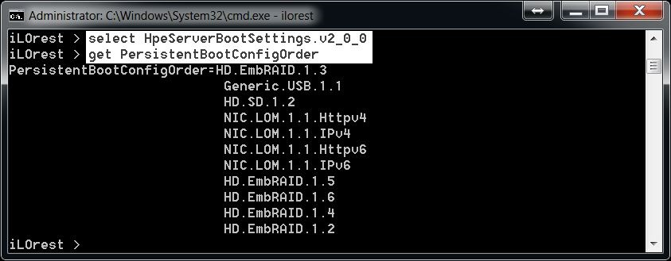

If the `bootmode` retrieved earlier is UEFI, then the `UefiTargetBootSourceOverrideSupported` property (one time boot settings) is retrieved with the get command. If the `bootmode` is not UEFI, then the one time boot settings would have been set to `None`.


If this is not a one time boot or a continuous boot, and the `disable boot` flag has not been set, then the `HpServerBootSettings` type is selected with the `select` command, and the `PersistentBootConfigOrder` property is retrieved with the `get` command.

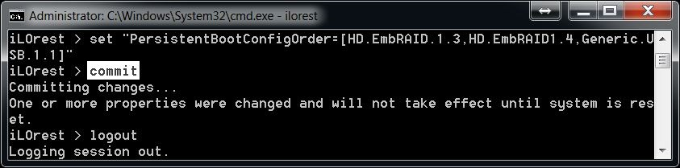

Then, using this information along with the specified boot order provided in the command, the new boot order is updated using the `set` command.

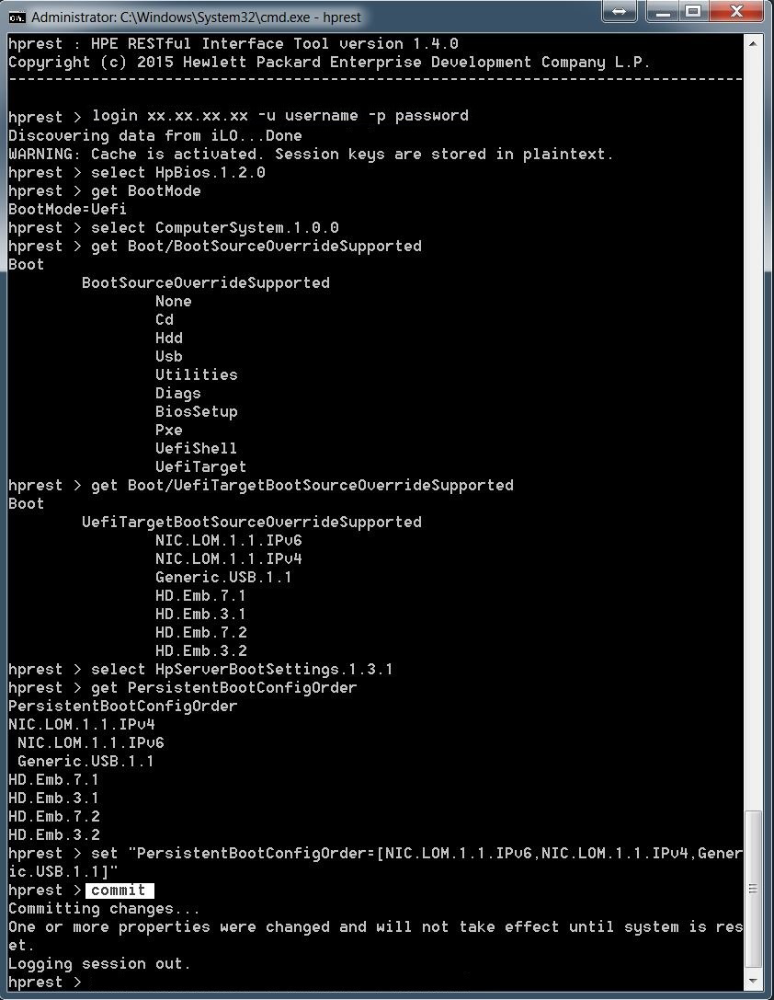

After making all the changes to the boot order, the changes are finally committed with the commit command.

All of the commands shown here are executed the same way in the actual `bootorder` command, and are called in the same order to execute the `bootorder` command. You can write your own scripts to combine commands just like bootorder did, to use the provided commands in the RESTful Interface Tool for higher-level functionality.

## Miscellaneous

Configure iLO licensing, set unit identification lamp, hotkey configuration, obtaining system power metrics, and configuring the iLO's time zone.

### iLO Licensing
<pre>
> ./License.bat 100.100.100.101 administrator password
iLOrest : RESTful Interface Tool version 3.1
Copyright (c) 2014-2020 Hewlett Packard Enterprise Development LP
--------------------------------------------------------------------------------
Discovering data...Done
<span style="color: #01a982; ">The resource has been created successfully.</span>
Logging session out.
</pre>
Configure iLO's licensing key.

|    **Linux**                   | **Windows**                                                                  |
|--------------------------------|------------------------------------------------------------------------------|
| <a href="https://github.com/HewlettPackard/python-redfish-utility/blob/master/examples/Linux/License.sh" target="_blank">License.sh</a> | <a href="https://github.com/HewlettPackard/python-redfish-utility/blob/master/examples/Windows/License.bat" target="_blank">Licesnse.bat</a>|

### UID Control
<pre>
>./UID_Control.bat 100.100.100.101 administrator password
iLOrest : RESTful Interface Tool version 3.1
Copyright (c) 2014-2020 Hewlett Packard Enterprise Development LP
--------------------------------------------------------------------------------
Discovering data...Done
<span style="color: #01a982; ">Committing changes...</span>
<span style="color: #01a982; ">The operation completed successfully.</span>
Logging session out.

>ilorest get IndicatorLED --selector=ComputerSystem.
iLOrest : RESTful Interface Tool version 3.1
Copyright (c) 2014-2020 Hewlett Packard Enterprise Development LP
--------------------------------------------------------------------------------
<span style="color: #01a982; ">IndicatorLED=Lit</span>
</pre>
iLO 4 and iLO 5 systems utilize a unit identification lamp which can be controlled to easily and uniquely identify a physical device. This script will
alter the UID light state.

|    **Linux**                   | **Windows**                                                                  |
|--------------------------------|------------------------------------------------------------------------------|
| <a href="https://github.com/HewlettPackard/python-redfish-utility/blob/master/examples/Linux/UID_Control.sh" target="_blank">UID_Control.sh</a> | <a href="https://github.com/HewlettPackard/python-redfish-utility/blob/master/examples/Windows/UID_Control.bat" target="_blank">UID_Control.bat</a>|

### Hotkey Configuration
<pre>
./Hotkey_Config.bat 100.100.100.101 administrator password
iLOrest : RESTful Interface Tool version 3.1
Copyright (c) 2014-2020 Hewlett Packard Enterprise Development LP
--------------------------------------------------------------------------------
The operation completed successfully.
Logging session out.
</pre>
Set Hotkey configuration.

|    **Linux**                   | **Windows**                                                                  |
|--------------------------------|------------------------------------------------------------------------------|
| <a href="https://github.com/HewlettPackard/python-redfish-utility/blob/master/examples/Linux/Hotkey_Config.sh" target="_blank">Hotkey_Config.sh</a> | <a href="https://github.com/HewlettPackard/python-redfish-utility/blob/master/examples/Windows/Hotkey_Config.bat" target="_blank">Hotkey_Config.bat</a>|

### Setting iLO Timezone

In setting the iLO Timezone, we will be using both rawpost and commands.

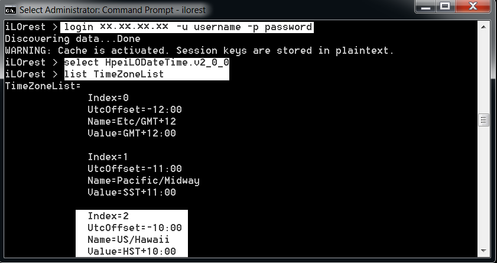

First we login and select the HpeiLODateTime. type. If using Gen9, select the HpiLODateTime type instead. We then `list` the `TimeZoneList`.

Now scroll around looking for the timezone that is wanted. In the case of the example, we will be using US/Hawaii. Take note of the index associated with the Name.(2 in the case of US/Hawaii)

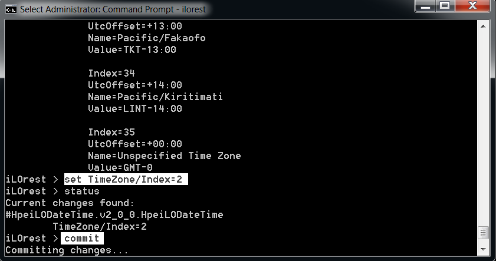

Finally, we `set` the Index to 2. Check the status to make sure the change is queued and finally make sure to `commit` to finalize the changes.

### Getting Powermetric Average

First login to the server.

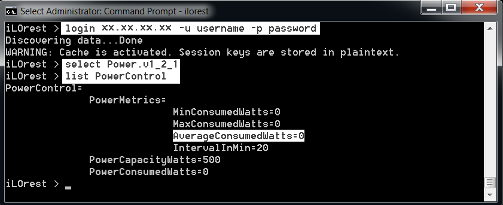

Next `select` the Power. type. Finally `list` powercontrol. The powermetric average is represented by the `AverageConsumedWatts` value.

### Getting Encryption Settings

To get the encryption settings, first login to the server

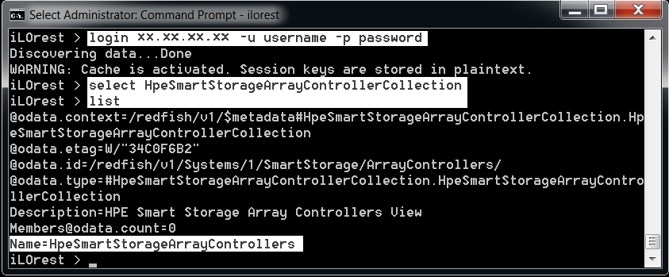

Then `select` the `HpeSmartStorageArrayControllerCollection` type. If on a `Gen9` server select `HpSmartStorageArrayControllerCollection` instead.

In the provided example, many of the resources for the encryption setting are not available. If available there will be values of `Name`, `Model`, `SerialNumber`, `EncryptionBootPasswordSet`, `EncryptionCryptoOfficerPasswordSet`, `EncrpytionLocalKeyCacheEnabled`, `EncryptionMixedVolumesEnabled`,`EncryptionPhyiscalDriveCount`,`EncryptionRecoveryParamsSet`,`EncryptionStandaloneModeEnabled`, and/or `EncryptionUserPasswordSet`.

## Resetting iLO
<pre>
>./Reset_RIB.bat 100.100.100.101 administrator password
iLOrest : RESTful Interface Tool version 3.1
Copyright (c) 2014-2020 Hewlett Packard Enterprise Development LP
--------------------------------------------------------------------------------
Discovering data...Done
<span style="color: #01a982; ">After iLO resets the session will be terminated.
Please wait for iLO to initialize completely before logging in again.
This process may take up to 3 minutes.</span>

A management processor reset is in progress.
</pre>
Reset iLO.

|    **Linux**                   | **Windows**                                                                  |
|--------------------------------|------------------------------------------------------------------------------|
| <a href="https://github.com/HewlettPackard/python-redfish-utility/blob/master/examples/Linux/RIB.sh" target="_blank">RIB.sh</a> | <a href="https://github.com/HewlettPackard/python-redfish-utility/blob/master/examples/Windows/RIB.bat" target="_blank">RIB.bat</a>|

## Reboot the Server
<pre>
> ./Reset_Server.bat 100.100.100.101 administrator password
iLOrest : RESTful Interface Tool version 3.1
Copyright (c) 2014-2020 Hewlett Packard Enterprise Development LP
--------------------------------------------------------------------------------
Discovering data...Done
<span style="color: #01a982; ">After the server is rebooted the session will be terminated.
Please wait for the server to boot completely to login again.
Rebooting server in 3 seconds...
The operation completed successfully.</span>
Logging session out.
</pre>
Initiate a server reboot.

|    **Linux**                   | **Windows**                                                                  |
|--------------------------------|------------------------------------------------------------------------------|
| <a href="https://github.com/HewlettPackard/python-redfish-utility/blob/master/examples/Linux/Reset_Server.sh" target="_blank">Reset_Server.sh</a> | <a href="https://github.com/HewlettPackard/python-redfish-utility/blob/master/examples/Windows/Reset_Server.bat" target="_blank">Reset_Server.bat</a>|

## Logging Examples

iLO Logs consist of Active Health System (AHS), Integrated Event Log (IEL), and an Integrated Management Log (IML). Logs can be retrieved for analysis or cleared to wipe the slate.

### Set AHS Status
<pre>
./Set_AHS_Status.bat 100.100..100.101 administrator password
iLOrest : RESTful Interface Tool version 3.1
Copyright (c) 2014-2020 Hewlett Packard Enterprise Development LP
--------------------------------------------------------------------------------
Discovering data...Done
<span style="color: #01a982; ">One or more properties were changed and will not take effect until system is reset.</span>
Logging session out.

</pre>

Set AHS Status.

|    **Linux**                   | **Windows**                                                                  |
|--------------------------------|------------------------------------------------------------------------------|
| <a href="https://github.com/HewlettPackard/python-redfish-utility/blob/master/examples/Linux/Set_AHS_Status.sh" target="_blank">Set_AHS_Status.sh</a> | <a href="https://github.com/HewlettPackard/python-redfish-utility/blob/master/examples/Windows/Set_AHS_Status.bat" target="_blank">Set_AHS_Status.bat</a> |


### Clear AHS Log
<pre>
> ./Clear_AHS_Data.bat 100.100.100.101 administrator password
iLOrest : RESTful Interface Tool version 3.1
Copyright (c) 2014, 2019 Hewlett Packard Enterprise Development LP
--------------------------------------------------------------------------------
Discovering data...Done
<span style="color: #01a982; ">One or more properties were changed and will not take effect until the device is reset and system is rebooted</span>
Logging session out.
</pre>
Clear Active Health System log.

|    **Linux**                   | **Windows**                                                                  |
|--------------------------------|------------------------------------------------------------------------------|
| <a href="https://github.com/HewlettPackard/python-redfish-utility/blob/master/examples/Linux/Clear_AHS_Data.sh" target="_blank">Clear_AHS_Data.sh</a> | <a href="https://github.com/HewlettPackard/python-redfish-utility/blob/master/examples/Windows/Clear_AHS_Data.bat" target="_blank">Clear_AHS_Data.bat</a> |

### Clear IML Log
<pre>
> ./Clear_IML.bat 100.100.100.101 administrator password
iLOrest : RESTful Interface Tool version 3.1
Copyright (c) 2014, 2019 Hewlett Packard Enterprise Development LP
--------------------------------------------------------------------------------
Discovering data...Done
<span style="color: #01a982; ">Event log cleared successfully.</span>
Logging session out.
</pre>
Clear iLO's Integrated Management Log

|    **Linux**                    | **Windows**                                                                |
|--------------------------------|------------------------------------------------------------------------------|
| <a href="https://github.com/HewlettPackard/python-redfish-utility/blob/master/examples/Linux/Clear_IML.sh" target="_blank">Clear_IML.sh</a>|  <a href="https://github.com/HewlettPackard/python-redfish-utility/blob/master/examples/Windows/Clear_IML.bat" target="_blank">Clear_IML.bat</a> |

### Clear IEL Log
<pre>
> ./Clear_EventLog.bat 100.100.100.101 administrator password
word
iLOrest : RESTful Interface Tool version 3.1
Copyright (c) 2014, 2019 Hewlett Packard Enterprise Development LP
--------------------------------------------------------------------------------
Discovering data...Done
<span style="color: #01a982; ">Event log cleared successfully.</span>
Logging session out.

</pre>
Clear iLO's Integrated Event Log

|    **Linux**                   | **Windows**                                                                  |
|--------------------------------|------------------------------------------------------------------------------|
| <a href="https://github.com/HewlettPackard/python-redfish-utility/blob/master/examples/Linux/Clear_EventLog.sh" target="_blank">Clear_EventLog.sh</a>|  <a href="https://github.com/HewlettPackard/python-redfish-utility/blob/master/examples/Windows/Clear_EventLog.bat" target="_blank">Clear_EventLog.bat</a> |

## Directory Command Examples

iLO 4 and 5 systems can be linked to domain controllers, usage of the the directory command can perform modification and tests against Lightweight Directory Access Protocol (LDAP) directory information services and Microsoft based active directory (AD) domain network controllers. The following examples are of interest:

### Get LDAP CA Certificate State
<pre>
> ./Get_LDAP_CA_Cert_Status.bat 100.100.100.101 administrator password
iLOrest : RESTful Interface Tool version 3.1
Copyright (c) 2014-2020 Hewlett Packard Enterprise Development LP
--------------------------------------------------------------------------------
Discovering data...Done
<span style="color: #01a982; ">Oem=
     Hpe=
          Sessions=
                    LDAPAuthLicenced=True</span>
Logging session out.

</pre>
Obtain Certificate Authority for Lightweight Directory Access Protocol.

### Start Directory Test
<pre>
>./Start_Directory_Test.bat 100.100.100.101 administrator password
iLOrest : RESTful Interface Tool version 3.1
Copyright (c) 2014, 2020 Hewlett Packard Enterprise Development LP
--------------------------------------------------------------------------------
Discovering data...Done
The operation completed successfully.
<span style="color: #01a982; ">Starting the directory test. Monitor results with command: directory viewresults</span>
The operation completed successfully.
Logging session out.
</pre>
Starts tests against LDAP servers or AD domain network controllers based on the settings provided.

|    **Linux**                   | **Windows**                                                                  |
|--------------------------------|------------------------------------------------------------------------------|
| <a href="https://github.com/HewlettPackard/python-redfish-utility/blob/master/examples/Linux/Start_Directory_Test.sh" target="_blank">Start_Directory_Test.sh</a> | <a href="https://github.com/HewlettPackard/python-redfish-utility/blob/master/examples/Windows/Start_Directory_Test.bat" target="_blank">Start_Directory_Test.bat</a> |

<b>ilorest directory test start</b>


### Directory Test Abort
<pre>
> ./Abort_Directory_Test.bat 100.100.100.101 administrator password
iLOrest : RESTful Interface Tool version 3.1
Copyright (c) 2014, 2020 Hewlett Packard Enterprise Development LP
--------------------------------------------------------------------------------
Discovering data...Done
<span style="color: #01a982; ">Stopping the directory test.</span>
The operation completed successfully.
Logging session out.
</pre>

Stops tests against LDAP servers or AD domain network controllers.

|    **Linux**                   | **Windows**                                                                  |
|--------------------------------|------------------------------------------------------------------------------|
| <a href="https://github.com/HewlettPackard/python-redfish-utility/blob/master/examples/Linux/Abort_Directory_Test.sh" target="_blank">Abort_Directory_Test.sh</a> |<a href="https://github.com/HewlettPackard/python-redfish-utility/blob/master/examples/Windows/Abort_Directory_Test.bat" target="_blank">Abort_Directory_Test.bat</a> |

<b>ilorest directory test stop</b>

### Directory Test Results
<pre>
>./Get_Directory_Test_Results.bat 100.100.100.101 administrator password
iLOrest : RESTful Interface Tool version 3.1
Copyright (c) 2014, 2020 Hewlett Packard Enterprise Development LP
--------------------------------------------------------------------------------
Discovering data...Done
The operation completed successfully.

Test: Directory Server DNS Name
------------------------
Status: Failed
Notes: Unable to resolve host name

Test: Ping Directory Server
------------------------
Status: Failed
Notes:

Test: Connect to Directory Server
------------------------
Status: Failed
Notes: Unable to connect to the directory server LDAP port within timeout. Verify directory server address.

Test: Connect using SSL
------------------------
Status: Failed
Notes: Unable to connect to directory server within timeout.

Test: Bind to Directory Server
------------------------
Status: NotRun
Notes:

Test: Directory Administrator login
------------------------
Status: NotRun
Notes:

Test: User Authentication
------------------------
Status: NotRun
Notes:

Test: User Authorization
------------------------
Status: Failed
Notes:

Test: Directory User Contexts
------------------------
Status: NotRun
Notes:

Test: LOM Object exists
------------------------
Status: NotRun
Notes:

Logging session out.
</pre>

Retrieve the results of the directory tests.

|    **Linux**                   | **Windows**                                                                  |
|--------------------------------|------------------------------------------------------------------------------|
| <a href="https://github.com/HewlettPackard/python-redfish-utility/blob/master/examples/Linux/Get_Directory_Test_Results.sh" target="_blank">Get_Directory_Test_Results.sh</a> |<a href="https://github.com/HewlettPackard/python-redfish-utility/blob/master/examples/Windows/Get_Directory_Test_Results.bat" target="_blank">Get_Directory_Test_Results.bat</a> |

<b>ilorest directory test results</b>


## iLO User Management Examples

iLO Management Account Users are able to perform a range of operations on a system based on permissions levels (or in iLO 5, based on Redfish predefined roles). This can vary from
administrative level system changes to monitoring/read-only get requests, as well as a number.  

### Privileges Table (iLO 4 and iLO 5)

|          **Privileges**        |        **Description**        |**iLO Support**|
|--------------------------------|-------------------------------|---------------|
|            LoginPriv           |            Login              |      iLO5     |
|        RemoteConsolePriv       |         Remote Console        |   iLO4, iLO5  |
|     VirtualPowerandResetPriv   |    Virtual Power and Reset    |   iLO4, iLO5  |
|        VirtualMediaPriv        |        Virtual Media          |   iLO4, iLO5  |
|       HostBIOSConfigPriv       |          Host Bios            |      iLO5     |
|          iLOConfigPriv         |    Configure iLO Settings     |   iLO4, iLO5  |
|          UserConfigPriv        |   Administer User Accounts    |   iLO4, iLO5  |
|        HostNICConfigPriv       |          Host NIC             |      iLO5     |
|     HostStorageConfigPriv      |        Host Storage           |      iLO5     |
|    SystemRecoveryConfigPriv    |     System Recovery Set       |      iLO5     |

### Predefined Roles Table (iLO 5 Only)

|  **Predefined Roles**  |                    **Privileges**                     |
|------------------------|-------------------------------------------------------|
|      Administrator     |  LoginPriv, RemoteConsolePriv, VirtualMediaPriv,      |
|                        |  VirtualPowerandResetPriv, HostBIOSConfigPriv,        |
|                        |  iLOConfigPriv, UserConfigPriv, HostNICConfigPriv,    |
|                        |  HostStorageConfigPriv, SystemRecoveryConfigPriv      |
|        Operator        |  HostBIOSConfigPriv, HostNICConfigPriv, LoginPriv,    |
|                        |  HostStorageConfigPriv, RemoteConsolePriv,            |
|                        |  VirtualMediaPriv, VirtualPowerandResetPriv           |
|        ReadOnly        |                       LoginPriv                       |

### Add User
<pre>
>./Add_User.bat 100.100.100.101 administrator password
iLOrest : RESTful Interface Tool version 3.1
Copyright (c) 2014, 2020 Hewlett Packard Enterprise Development LP
--------------------------------------------------------------------------------
Discovering data...Done
The operation completed successfully.

ilorest iloaccounts

iLO Account info:
[Id] UserName (LoginName):
Privileges
-----------------
[1] Administrator (Administrator):
ServiceAccount=False
HostNICConfigPriv=True
HostStorageConfigPriv=True
RemoteConsolePriv=True
iLOConfigPriv=True
VirtualMediaPriv=True
UserConfigPriv=True
HostBIOSConfigPriv=True
VirtualPowerAndResetPriv=True
LoginPriv=True
SystemRecoveryConfigPriv=True

[2] admin (admin):
ServiceAccount=False
HostNICConfigPriv=True
HostStorageConfigPriv=True
RemoteConsolePriv=True
iLOConfigPriv=True
VirtualMediaPriv=True
UserConfigPriv=True
HostBIOSConfigPriv=True
VirtualPowerAndResetPriv=True
LoginPriv=True
SystemRecoveryConfigPriv=False

[3] testUser (testAccount):
ServiceAccount=False
HostNICConfigPriv=False
HostStorageConfigPriv=False
RemoteConsolePriv=False
iLOConfigPriv=False
VirtualMediaPriv=False
UserConfigPriv=False
HostBIOSConfigPriv=False
VirtualPowerAndResetPriv=False
LoginPriv=True
SystemRecoveryConfigPriv=False

Logging session out.
</pre>

Add a new iLO management user account. By default only the login privilege is provided (equivalent to read-only predefined role).
Additional privileges (and roleIDs for iLO 5 systems) can be configured.

<b>iloaccounts add</b>

|    **Linux**                   | **Windows**                                                                  |
|--------------------------------|------------------------------------------------------------------------------|
| <a href="https://github.com/HewlettPackard/python-redfish-utility/blob/master/examples/Linux/Add_User.sh" target="_blank">Add_User.sh</a> |<a href="https://github.com/HewlettPackard/python-redfish-utility/blob/master/examples/Windows/Add_User.bat" target="_blank">Add_User.bat</a>|

### Modify User Password
<pre>
> ./Administrator_reset_pw.bat 100.100.100.101 administrator password
iLOrest : RESTful Interface Tool version 3.1
Copyright (c) 2014, 2020 Hewlett Packard Enterprise Development LP
--------------------------------------------------------------------------------
Discovering data...Done
<span style="color: #01a982; ">The account was modified successfully.</span>
Logging session out.
</pre>

Reset an iLO management account password. The first example is specifically for the default Administrator account, the second for any subsequently
created account.

<b> iloaccounts modify </b>

|    **Linux**                   | **Windows**                                                                  |
|--------------------------------|------------------------------------------------------------------------------|
| <a href="https://github.com/HewlettPackard/python-redfish-utility/blob/master/examples/Linux/Administrator_reset_pw.sh" target="_blank">Administrator_reset_pw.sh</a> |<a href="https://github.com/HewlettPackard/python-redfish-utility/blob/master/examples/Windows/Administrator_reset_pw.bat" target="_blank">Administrator_reset_pw.bat</a>|
| <a href="https://github.com/HewlettPackard/python-redfish-utility/blob/master/examples/Linux/Change_password.sh" target="_blank">Change_password.sh</a> |<a href="https://github.com/HewlettPackard/python-redfish-utility/blob/master/examples/Windows/Change_password.bat" target="_blank">Change_password.bat</a>|

### Get All User Info
<pre>
>./Get_User.bat 100.100.100.101 administrator password
iLOrest : RESTful Interface Tool version 3.1
Copyright (c) 2014, 2020 Hewlett Packard Enterprise Development LP
--------------------------------------------------------------------------------
Discovering data...Done

Oem=
     Hpe=
          Privileges=
                      HostNICConfigPriv=True
                      HostStorageConfigPriv=True
                      RemoteConsolePriv=True
                      iLOConfigPriv=True
                      VirtualMediaPriv=True
                      UserConfigPriv=True
                      HostBIOSConfigPriv=True
                      VirtualPowerAndResetPriv=True
                      LoginPriv=True
                      SystemRecoveryConfigPriv=True
Logging session out.
</pre>

Get all iLO management account user privileges.

<b> iloaccounts </b> OR <b>iloaccounts default</b>

|    **Linux**                   | **Windows**                                                                  |
|--------------------------------|------------------------------------------------------------------------------|
| <a href="https://github.com/HewlettPackard/python-redfish-utility/blob/master/examples/Linux/Get_User.sh" target="_blank">Get_User.sh</a> |<a href="https://github.com/HewlettPackard/python-redfish-utility/blob/master/examples/Windows/Get_User.bat" target="_blank">Get_User.bat</a>|

### Delete User
<pre>
>./Delete_User.bat 100.100.100.101 administrator password
iLOrest : RESTful Interface Tool version 3.1
Copyright (c) 2014, 2020 Hewlett Packard Enterprise Development LP
--------------------------------------------------------------------------------
Discovering data...Done
<span style="color: #01a982; ">The account was removed successfully.</span>
Logging session out.
</pre>

Completely remove an iLO management account.

<b> iloaccounts delete </b>

|    **Linux**                   | **Windows**                                                                  |
|--------------------------------|------------------------------------------------------------------------------|
| <a href="https://github.com/HewlettPackard/python-redfish-utility/blob/master/examples/Linux/Delete_User.sh" target="_blank">Delete_User.sh</a>| <a href="https://github.com/HewlettPackard/python-redfish-utility/blob/master/examples/Windows/Delete_User.bat" target="_blank">Delete_User.bat</a> |

## Federation Group Examples

iLO Federation allows management of a collection of servers from a single iLO.

### Add Federation Group
<pre>
>./Add_Federation_Group.bat 100.100.100.101 administrator password
iLOrest : RESTful Interface Tool version 3.1
Copyright (c) 2014, 2019 Hewlett Packard Enterprise Development LP
--------------------------------------------------------------------------------
Discovering data...Done
<span style="color: #01a982; ">[200] The operation completed successfully.</span>
<span style="color: #01a982; ">The resource has been created successfully.</span>
Logging session out.

iLOrest > ilofederation default
<span style="color: #01a982; ">[200] The operation completed successfully.</span>
iLO Federation Id list with Privileges:

Name=DEFAULT:
HostNICConfigPriv=False
HostStorageConfigPriv=False
RemoteConsolePriv=False
iLOConfigPriv=False
VirtualMediaPriv=False
UserConfigPriv=False
HostBIOSConfigPriv=False
VirtualPowerAndResetPriv=False
LoginPriv=True
SystemRecoveryConfigPriv=False

Name=newfedname:
HostNICConfigPriv=False
HostStorageConfigPriv=False
RemoteConsolePriv=False
iLOConfigPriv=False
VirtualMediaPriv=False
UserConfigPriv=False
HostBIOSConfigPriv=False
VirtualPowerAndResetPriv=False
LoginPriv=False
SystemRecoveryConfigPriv=False
</pre>
Add a new federation group by defining a federation name, key and associated privileges for the group.

|    **Linux**                   | **Windows**                                                                  |
|--------------------------------|------------------------------------------------------------------------------|
| <a href="https://github.com/HewlettPackard/python-redfish-utility/blob/master/examples/Linux/Add_Federation_Group.sh" target="_blank">Add_Federation_Group.sh</a>| <a href="https://github.com/HewlettPackard/python-redfish-utility/blob/master/examples/Windows/Add_Federation_Group.bat" target="_blank">Add_Federation_Group.bat</a> |

### Get Federation Group
<pre>
>./Get_Federation_Group.bat 100.100.100.101 administrator password
iLOrest : RESTful Interface Tool version 3.1
Copyright (c) 2014-2020 Hewlett Packard Enterprise Development LP
--------------------------------------------------------------------------------
Discovering data...Done

Privileges=
            HostNICConfigPriv=False
            HostStorageConfigPriv=False
            RemoteConsolePriv=False
            iLOConfigPriv=False
            VirtualMediaPriv=False
            UserConfigPriv=False
            HostBIOSConfigPriv=False
            VirtualPowerAndResetPriv=False
            LoginPriv=True
            SystemRecoveryConfigPriv=False
Logging session out.
</pre>
Obtain Federation Group Privileges.

|    **Linux**                    | **Windows**                                                                  |
|---------------------------------|------------------------------------------------------------------------------|
| <a href="https://github.com/HewlettPackard/python-redfish-utility/blob/master/examples/Linux/Get_Federation_All_Groups_Info.sh" target="_blank">Get_Federation_All_Groups_Info.sh</a>| <a href="https://github.com/HewlettPackard/python-redfish-utility/blob/master/examples/Windows/Get_Federation_All_Groups_Info.bat " target="_blank">Get_Federation_All_Groups_Info.bat </a> |

### Get Federation Multicast Options
<pre>
> ./Get_Federation_Multicast_Options.bat 100.100.100.101 administrator password
iLOrest : RESTful Interface Tool version 3.1
Copyright (c) 2014-2020 Hewlett Packard Enterprise Development LP
--------------------------------------------------------------------------------
Discovering data...Done

Oem=
     Hpe=
          FederationConfig=
                            MulticastDiscovery=Enabled
                            IPv6MulticastScope=Site
                            MulticastAnnouncementInterval=600
                            MulticastTimeToLive=5
                            iLOFederationManagement=Enabled
Logging session out.
</pre>
Obtain Federation Group Multicast Settings. Settings are used in broadcast for iLO collective control.

|    **Linux**                    | **Windows**                                                                  |
|---------------------------------|------------------------------------------------------------------------------|
| <a href="https://github.com/HewlettPackard/python-redfish-utility/blob/master/examples/Linux/Get_Federation_Multicast_Options.sh" target="_blank">Get_Federation_Multicast_Options.sh</a>| <a href="https://github.com/HewlettPackard/python-redfish-utility/blob/master/examples/Windows/Get_Federation_Multicast_Options.bat " target="_blank">Get_Federation_Multicast_Options.bat </a> |

### Delete a Federation Group
<pre>
>./Delete_Federation_Group.bat 100.100.100.101 administrator password
iLOrest : RESTful Interface Tool version 3.1
Copyright (c) 2014, 2019 Hewlett Packard Enterprise Development LP
--------------------------------------------------------------------------------
Discovering data...Done
<span style="color: #01a982; ">[200] The operation completed successfully.
The operation completed successfully.</span>
Logging session out.

</pre>
Deletion of a Federation Group

|    **Linux**                    | **Windows**                                                                  |
|---------------------------------|------------------------------------------------------------------------------|
| <a href="https://github.com/HewlettPackard/python-redfish-utility/blob/master/examples/Linux/Delete_Federation_Group.sh" target="_blank">Delete_Federation_Group.sh</a>| <a href="https://github.com/HewlettPackard/python-redfish-utility/blob/master/examples/Windows/Delete_Federation_Group.bat" target="_blank">Delete_Federation_Group.bat</a> |

## Virtual Media

iLO provides a method to boot from virtualized media by providing a remote URL. This can include bootable virtualized USB, Floppy disk, CD/DVD ISO media.

### Mount Virtual Media

Mount Virtual Media (To Be Updated)

|    **Linux**                    | **Windows**                                                                  |
|---------------------------------|------------------------------------------------------------------------------|
| <a href="https://github.com/HewlettPackard/python-redfish-utility/blob/master/examples/Linux/Mount_Virtual_Media.sh" target="_blank">Mount_Virtual_Media.sh</a>| <a href="https://github.com/HewlettPackard/python-redfish-utility/blob/master/examples/Windows/Mount_Virtual_Media.bat" target="_blank">Mount_Virtual_Media.bat</a> |

### Eject Virtual Media
<pre>
>./Eject_Virtual_Media.bat 100.100.100.101 administrator password
iLOrest : RESTful Interface Tool version 3.1
Copyright (c) 2014, 2019 Hewlett Packard Enterprise Development LP
--------------------------------------------------------------------------------
Discovering data...Done
<span style="color: #01a982; ">The operation completed successfully.</span>
Logging session out.
</pre>
Eject virtual media from the system.

|    **Linux**                    | **Windows**                                                                  |
|---------------------------------|------------------------------------------------------------------------------|
| <a href="https://github.com/HewlettPackard/python-redfish-utility/blob/master/examples/Linux/Eject_Virtual_Media.sh" target="_blank">Eject_Virtual_Media.sh</a>| <a href="https://github.com/HewlettPackard/python-redfish-utility/blob/master/examples/Windows/Eject_Virtual_Media.bat" target="_blank">Eject_Virtual_Media.bat</a> |

## Configuring iLO Management Network Interfaces

iLO's management networking interfaces can be customized to allow for connectivity for physical, dedicated connections, shared networking (single physical adapter contains internal VLAN capabilities) and virtual networking interfaces for connectivity to the host operating system (iLO 5 1.45 and later).

### Get Networking
<pre>
.\Get_Network.bat 100.100.100.101 administrator password
iLOrest : RESTful Interface Tool version 3.1
Copyright (c) 2014-2020 Hewlett Packard Enterprise Development LP
--------------------------------------------------------------------------------
Discovering data...Done
FQDN=ilocn771200w0.americas.hpqcorp.net
HTTP=
      ProtocolEnabled=True
      Port=80
HTTPS=
       ProtocolEnabled=True
       Port=443
HostName=ilocn771200w0
IPMI=
      ProtocolEnabled=False
      Port=623
KVMIP=
       ProtocolEnabled=True
       Port=17990
Oem=
     Hpe=
          RemoteSyslogServer=""
          VirtualMediaEncryptionEnabled=True
          AlertMailSMTPAuthPw=None
          FederationEnabled=True
          RemoteSyslogPort=514
          RemoteSyslogEnabled=False
          ConfigurationSettings=Current
          SerialOverLanLogging=False
          SNMPTrapPort=162
          AlertMailSMTPSecureEnabled=True
          XMLResponseEnabled=True
          AlertMailSMTPAuthEnabled=False
          AlertMailEnabled=False
          AlertMailSMTPAuthUser=""
          AlertMailEmail=""
          AlertMailSenderDomain=""
          AlertMailSMTPPort=25
          FederationSupported=True
          AlertMailSMTPServer=""
SNMP=
      ProtocolEnabled=True
      Port=161
SSDP=
      ProtocolEnabled=True
      NotifyMulticastIntervalSeconds=600
      NotifyTTL=5
      Port=1900
      NotifyIPv6Scope=Site
SSH=
     ProtocolEnabled=True
     Port=22
Status=
        State=Enabled
VirtualMedia=
              ProtocolEnabled=True
              Port=17988
Logging session out.
</pre>
Retrieve networking parameters, enablements and data ports.

|    **Linux**                    | **Windows**                                                                  |
|---------------------------------|------------------------------------------------------------------------------|
| <a href="https://github.com/HewlettPackard/python-redfish-utility/blob/master/examples/Linux/Get_Network.sh" target="_blank">Get_Network.sh</a>| <a href="https://github.com/HewlettPackard/python-redfish-utility/blob/master/examples/Windows/Get_Network.bat" target="_blank">Get_Network.bat</a> |

### Shared Network Port
<pre>
>./Shared_Network_Port.bat 100.100.100.101 administrator password
iLOrest : RESTful Interface Tool version 3.1
Copyright (c) 2014-2020 Hewlett Packard Enterprise Development LP
--------------------------------------------------------------------------------
Discovering data...Done
<span style="color: #01a982; ">Committing changes...</span>
<span style="color: #01a982; ">One or more properties were changed, but these changes will not take effect until the management processor is reset.</span>
Logging session out.
</pre>
Configure iLO shared networking port.

|    **Linux**                    | **Windows**                                                                  |
|---------------------------------|------------------------------------------------------------------------------|
| <a href="https://github.com/HewlettPackard/python-redfish-utility/blob/master/examples/Linux/Shared_Network_Port.sh" target="_blank">Shared_Network_Port.sh</a>
| <a href="https://github.com/HewlettPackard/python-redfish-utility/blob/master/examples/Windows/Shared_Network_Port.bat" target="_blank">Shared_Network_Port.bat</a> |

## Finding iLO MAC address

Finding the iLO MAC address is not implemented in the RESTful Interface Tool, but is easily reached by a set of `select` and `list` commands


First login to the server. Then `select` the `EthernetInterfaces.` type.

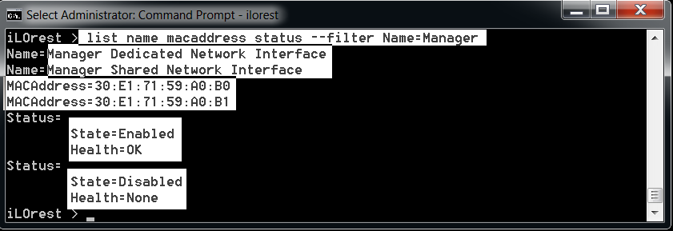

Now using the `list` command, list the `name`, `macaddress`, and `status` values with the filter of the value `Name` starting with Manager.


## Setting Active iLO NIC

> Use for gen10 servers.

```json
{
	"path": "/redfish/v1/Managers/1/EthernetInterfaces/1",
	"body": {
		"Oem": {
			"Hpe": {
				"NICEnabled": true
			}
		}
   	 }
}
```

> Use for gen9 servers.

```json
{
	"path": "/redfish/v1/Managers/1/EthernetInterfaces/1",
	"body": {
		"Oem": {
			"Hp": {
				"NICEnabled": true
			}
		}
   	 }
}
```
To set the iLO NIC, First login to the server. Then use a `rawpatch` command


To set the NIC, first login to the server. Then we will be using a `rawpatch` command

## Updating Firmware

Firmware updates can be submitted to iLO for self update or can be utilized for component level updates. On iLO 5 systems with integrated flash storage, these updates can be uploaded and staged for later use or stored, for recovery purposes (recovery install set).

### Update Component
<pre>
./Update_Language.bat 100.100.100.101 administrator password
iLOrest : RESTful Interface Tool version 3.1
Copyright (c) 2014-2020 Hewlett Packard Enterprise Development LP
--------------------------------------------------------------------------------
Discovering data...Done
A component with the same name (PICGen10_1.0.7s.fwpkg) has been found. Would you like to upload and overwrite this file? (y/n)y
The operation completed successfully.
Component PICGen10_1.0.7s.fwpkg uploaded successfully
Waiting for iLO UpdateService to finish processing the component
0 hour(s) 1 minute(s) 18 second(s)
Logging session out.
</pre>

Update a language pack component.

|    **Linux**                    | **Windows**                                                                  |
|---------------------------------|------------------------------------------------------------------------------|
| <a href="https://github.com/HewlettPackard/python-redfish-utility/blob/master/examples/Linux/Update_Language.sh" target="_blank">Update_Language.sh</a>| <a href="https://github.com/HewlettPackard/python-redfish-utility/blob/master/examples/Windows/Update_Language.bat" target="_blank">Update_Language.bat</a> |

## Trusted Platform Module (TPM)

### Disabling the TPM


> **Above:** When the server is rebooted, the **TpmState** is changed from **PresentEnabled** to **PresentDisabled**.

If you need to disable TPM on a group of servers, you can use a set of commands in RESTful Interface Tool. For example, if you are installing SPPs and OSs on bare-metal servers, and you need to disable TPM prior to starting installation.


### Enabling the TPM

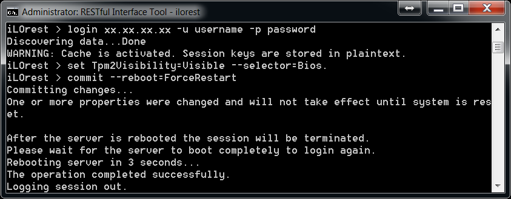

To enable the TPM, you can set the `TpmState` to `PresentEnabled`. **See side example**.

<aside class="notice">When you are disabling or enabling TPM, depending on the TPM chip type on the server, the TPM visibility might be <b>Tpm2Visibility</b> or <b>TpmVisibility</b>.</aside>

## RAW Commands Examples

### Updating the HPE iLO license key

```json
{
	"path": "/rest/v1/Managers/1/LicenseService",
    "body": {
        "LicenseKey": "license key"
    }
}
```

To update an iLO license key, use the `rawpost` command. For more information, see [RawPost command](#rawpost-command).

The following is an example of the JSON to include when using the `rawpost` command.

To delete an iLO license, use the `rawdelete` command. For more information, see [RawDelete command](#rawdelete-command). The following is an example of the JSON to include when using the `rawdelete` command:

`rawdelete /rest/v1/Managers/1/LicenseService`

### Deploying a Service Pack for ProLiant (SPP)

```json
{
    "path": "/rest/v1/Managers/1/VirtualMedia/2",
    "body": {
        "Action": "InsertVirtualMedia",
        "Target": "/OEM/Hp",
        "Image": "https://xx.xxx.xxx.xxx:xx/spp.iso"
    }
}
```


To deploy a SPP, use the rawpost command. For more information, see [RawPost command](#rawpost-command).

`ilorest -v --nologo rawpost virtualmedia.json --url=xx.xx.xx.xxx --user=Admin --password=password`

The following is an example of the JSON to include when using the `rawpost` command.

## General Script Examples

### Selecting and getting properties from a type.

```
:: selectget.bat [URI] [USERNAME] [PASSWORD]
@echo off

set argC=0
for %%x in (%*) do Set /A argC+=1
if %argC% LSS 3 goto :failCondition
goto :main

:failCondition
@echo Usage:
@echo selectget.bat [URI] [USERNAME] [PASSWORD]
goto :EOF

:main
@echo *****************************************
@echo ************* Logging in... *************
@echo *****************************************
ilorest.exe login %1 -u %2 -p %3
@echo *****************************************
@echo ******* selecting Bios type... ********
@echo *****************************************
ilorest.exe select Bios.
@echo *****************************************
@echo ********** getting BootMode... **********
@echo *****************************************
ilorest.exe get
pause
```

This is a batch file that logs into a remote server, selects the `Bios` type, and gets the `BootMode` value.

### Saving and Loading a File Using File-Based Editing Mode

```
:: saveload.bat [SELECTOR] [FILENAME]
:: Specify a type with the SELECTOR tag, and
:: save to a file called FILENAME
@echo off
set argC=0
for %%x in (%*) do Set /A argC+=1
if %argC% LSS 2 goto :failCondition
goto :main

:failCondition
@echo Usage:
@echo saveload.bat [SELECTOR] [FILENAME]
@echo specify a type with the SELECTOR tag, and
@echo save to a file called FILENAME
goto :EOF

:main
ilorest.exe login
ilorest.exe save --selector=%1 --json -f %2
@echo Edit the file, then:
pause
ilorest.exe load -f %2
```

This is a file-based edit mode helper for RESTful Interface Tool.

1. Run to download selected type to a file called `ilorest.json.`

2. Edit the `ilorest.json` file to make changes.

3. Press any key running batch program to continue with program, uploading the newly edited program to the server.
