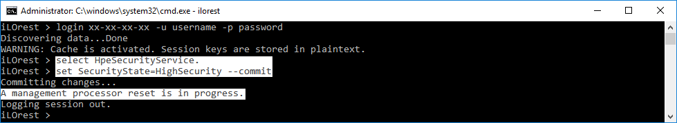
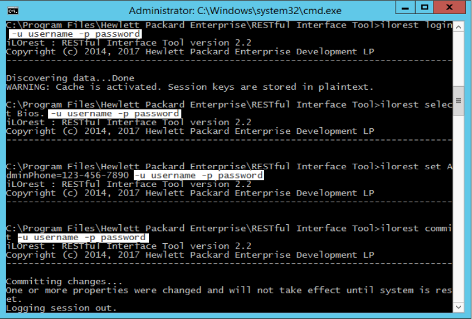
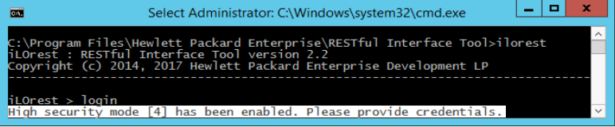

---
seo:
  title: Higher security modes
toc:
  enable: true
  maxDepth: 3
disableLastModified: true
---

## Higher Security Modes

This section describes how to set higher security modes and how to use the RESTful Interface Tool in these modes. For more information about the higher security modes in iLO 5, see the <a href="https://hewlettpackard.github.io/ilo-rest-api-docs/ilo5/#securitystate" target="_blank">Security State topic in the iLO 5 API documentation</a>. 
<aside class="notice">These security settings are only available in HPE Gen10 servers.</aside>

### Setting iLO Higher Security Modes

> To set security modes in RESTful Interface Tool, select the "HpeSecurityService." type, and then set the "SecurityState" property to one of the allowed values and commit.
> 

<aside class="notice">After the commit operation has been completed, iLO will reset to apply the changes.</aside>

### Using RESTful Interface Tool in iLO Higher Security Modes

RESTful Interface Tool in remote mode continues to function normally in higher security modes.
To use RESTful Interface Tool locally in higher security modes, you must pass credentials along with your commands.
<aside class="warning">In interactive mode, you only need to pass your credentials during the login command. In command line mode, you must pass credentials for EACH COMMAND, even if you are already logged in.</aside>

> RESTful Interface Tool functions normally with higher security settings in remote mode.
> 
> To use RESTful Interface Tool locally in higher security modes, you must pass credentials to your commands.
> 
> If you do not pass the proper credentials in local mode, you receive a similar error.
> 

### A note on OS FIPS modes
RESTful Interface Tool 2.2 and greater have OS FIPS support. If an OS is set to enforce FIPS, RESTful Interface Tool uses a FIPS version of OpenSSL.

For users running from source that would like FIPS support, please see [this link](https://developer.hpe.com/blog/creating-a-python-version-that-enforces-fips) for information on including this feature.
