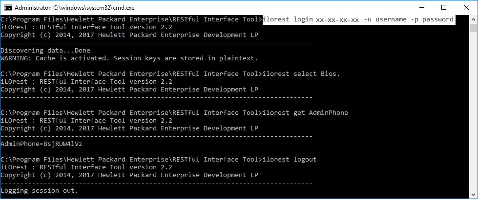
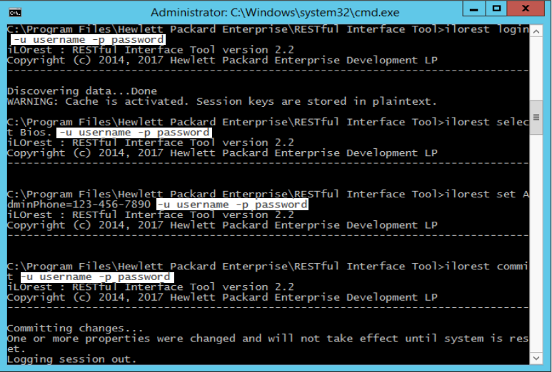

---
seo:
  title: Setting iLO in high security modes
toc:
  enable: true
  maxDepth: 3
disableLastModified: true
---

# Setting iLO in high security modes

This section describes how to set a managed HPE iLO into a high security
state and how to use the RESTful Interface Tool in these modes.
For more information about the security states of HPE iLO, refer to
[Security Service](/docs/redfishservices/ilos/{{process.env.LATEST_ILO_GEN_VERSION}}/{{process.env.LATEST_ILO_GEN_VERSION}}_{{process.env.LATEST_FW_VERSION}}/{{process.env.LATEST_ILO_GEN_VERSION}}_hpe_resourcedefns{{process.env.LATEST_FW_VERSION}}/#hpesecurityservice)
section.

:::info NOTE
The content of this page is only related to iLO 5 and iLO 6 based servers.

Refer to this
[documentation section](/docs/redfishservices/ilos/supplementdocuments/securityservice/#transitioning-to-hpe-ilo-7)
for iLO 7 and later.
:::

## Setting iLO in a high security mode

To modify the security mode of a managed iLO with iLOrest, select the
`HpeSecurityService.` [data type](/docs/concepts/datatypesandcollections/#data-types),
and then set the `SecurityState`
property to one of the
[allowed values](/docs/redfishservices/ilos/{{process.env.LATEST_ILO_GEN_VERSION}}/{{process.env.LATEST_ILO_GEN_VERSION}}_{{process.env.LATEST_FW_VERSION}}/{{process.env.LATEST_ILO_GEN_VERSION}}_hpe_resourcedefns{{process.env.LATEST_FW_VERSION}}/#securitystateredfishallowablevalues-array)
and commit.

:::info NOTE
After the commit operation has been completed, iLO resets to apply the changes.
:::

## Using HPE iLOrest in iLO high security modes

HPE iLOrest, in remote mode (out-of-band), continues to function normally in high security modes.

To use HPE iLOrest locally (in-band) in a high security mode, you must pass credentials along with your commands. Refer to this <a href="https://developer.hpe.com/blog/chif-driver-not-found/" target="_blank">blog post</a> for more information about in-band management.

:::warning Warning
In interactive mode, you only need to pass your credentials during the login
command. In command line mode, you must pass credentials for EACH COMMAND,
even if you are already logged in.
:::

If you do not pass the proper credentials in local mode, you receive and error.

## Operating system FIPS modes

iLOrest version 2.2 and greater have OS FIPS support. If an OS is set to
enforce FIPS, RESTful Interface Tool uses a FIPS version of OpenSSL.

For users running from source that would like FIPS support, please refer to
<a href="https://developer.hpe.com/blog/creating-a-python-version-that-enforces-fips"
target="_blank">this article</a> for information on including this feature.
