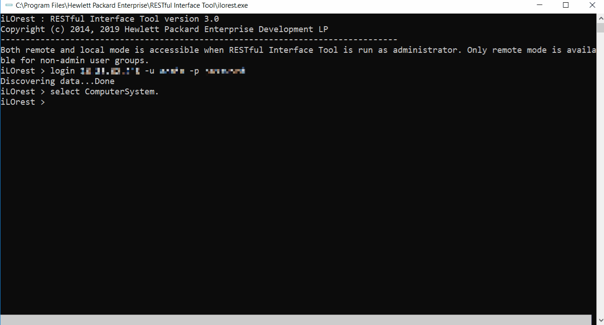

---
markdown:
  toc:
    hide: false
    depth: 3
  lastUpdateBlock:
    hide: true
breadcrumbs:
  hide: true
seo:
  title: Using the RESTful Interface tool
---

# Using the RESTful Interface Tool

## Getting started with iLOrest

The first action to perform before being able to use iLOrest, is to open a Redfish session in a remote iLO (out-of-band management) or, in the local iLO (in-band management). Refer to the generic [Redfish authentication](/docs/concepts/redfishauthentication/) methods as well as the login [global command](/docs/redfishclients/ilorest-userguide/globalcommands/#login-command) for more details.

As mentioned in this
<a href="https://developer.hpe.com/blog/why-is-redfish%C2%AE-different-from-other-rest-apis-part-1/"
target="_blank">blog post</a>,
the Redfish® data model is based upon schemas.
The HPE iLOrest Redfish client also uses schemas to
get or set properties in the Redfish tree. Schemas are referenced
as [data types, types or selectors](/docs/concepts/datatypesandcollections/)
in the iLOrest terminology.

To manage a single property, you need first to identify and select
its data type (schema file).

The exhaustive list of schemas (selectors) can be retrieved with the
`types` atomic command as shown in the following example.

```shell Sequence to retrieve type list
ilorest login <ilo-ip> -u <ilo-user> -p password
ilorest types
ilorest logout
```

```shell Shorter method to retrieve selectors
ilorest types --url <ilo-ip> -u <ilo-user> -p password --logout 
```

```text Output (truncated)
Discovering data...Done
Type options:
AccountService.v1_5_0
Bios.v1_0_0
BootOption.v1_0_1
BootOptionCollection
CertificateCollection
CertificateLocations.v1_0_2
CertificateService.v1_0_3
Chassis.v1_23_0
ChassisCollection
ComputerSystem.v1_17_0
ComputerSystemCollection
Drive.v1_14_0
Drive.v1_16_0
DriveCollection
EthernetInterface.v1_4_1
EthernetInterfaceCollection
EventDestinationCollection
EventService.v1_2_7
...
Thermal.v1_7_1
Triggers.v1_0_0
TriggersCollection
UpdateService.v1_2_1
VirtualMedia.v1_3_0
VirtualMediaCollection
Volume.v1_6_2
VolumeCollection
Logging session out.
```

If you don't know which schema describes the property
you want to manage, follow this method:

1. Try to identify a schema name close to the property. If the property
   belongs to the storage subsystem, look for all selectors having
   "storage" in their name. Here are few example performed
   against an iLO 6 based system.
   
   Storage: controllers, drives, logical volumes
   
   ```shell Storage/drive/volume selectors
   ilorest login <ilo-ip> -u <ilo-username> -p password
   ilorest types | grep -i -E "storage|drive|volume"
   ilorest logout
   ```
   
   ```shell Output
   Drive.v1_15_0
   Drive.v1_17_0
   DriveCollection
   Storage.v1_12_0
   StorageCollection
   StorageController.v1_0_0
   StorageControllerCollection
   Volume.v1_8_0
   VolumeCollection
   ```
   
   Thermal: Fans, temperature
   
   ```shell Thermal types
   ilorest login <ilo-ip> -u <ilo-username> -p password
   ilorest types | grep -i thermal
   ilorest logout
   ````
   
   ```text Output
   Thermal.v1_7_1
   ThermalMetrics.v1_3_1
   ThermalSubsystem.v1_3_1
   ```
   
   :::success TIP
   For each iLO firmware, you can browse the types from
   the [resource map](/docs/redfishservices/ilos/ilo6/ilo6_157/ilo6_resmap157/).
   :::

2. If the above method fails, enter the property string
   in the search box of this portal (top right corner).
   In the proposed list, select a section mentioning
   "Resource Definition". The type is displayed after string "Member of".

   As an example, if you want to view the firmware version of the iLO,
   type "FirmwareVersion" in the search box and click on
   "Manager resource definitions > FirmwareVersion". This displays the
   iLO's `FirmwareVersion` property, part of the `Manager.v` schema.
  
3. Select the found schema to manage your property.

   ```shell
   ilorest login <ilo-ip> -u <ilo-user> -p password
   ilorest select Manager.
   
   ilorest select
   Current selection: Manager.v1_5_1

   ilorest get FirmwareVersion
   FirmwareVersion=iLO 6 v1.59
   ```

   :::success TIP
   iLOrest can select multiple types at once.

   The above example appends a `.` character to the selected
   type to avoid selecting the other types starting with
   string `Manager` like: `ManagerCollection`, `ManagerAccount`, etc.
   :::

## HPE iLOrest operation modes

[HPE iLOrest](/docs/redfishclients/ilorest-userguide/)
has three modes of operation. By default, the interactive
mode is started when you launch it. With the
[scriptable mode](#scriptable-mode), you can use a script
that calls the program followed by commands and arguments.
The [file-based mode](#file-based-mode) allows you to use a
script that calls the program followed by commands,
arguments file(s) to load or save settings.

In addition HPE iLOrest provides a
[debug mode](/docs/redfishclients/ilorest-userguide/globalcommands/#global-commands-and-optional-arguments)
very helpful for learning and troubleshooting.

### Interactive mode

Interactive mode is started when you run the RESTful Interface
Tool without any command-line parameters. An `ilorest >`
prompt is displayed and you can enter commands one at a time.
Interactive mode provides immediate feedback for an entered command.
You can also use this mode to validate a script.

Use the following instructions to start an interactive
session on the different operating systems:

- Microsoft Windows: Go to
  `C:\Program Files\Hewlett Packard Enterprise\RESTful Interface Tool`
  and double-click `ilorest.exe`.
  You must be an administrator to run `ilorest.exe`.
- Linux and Ubuntu: Enter the following
  command : `/usr/sbin/ilorest`
- MAC: Enter the following command as
  administrator: `/Applications/ilorest`
- VMware ESXi 7.0: Enter the following
  command as administrator: `/opt/tools/ilorest`
- VMware ESXi 8.0: Enter the following command
  as administrator: `/opt/ilorest/bin/ilorest.sh`

:::info NOTE
In ESXi 7.0/8.0, HPE iLOrest is integrated with the `esxcli` utility

Here are some Examples:

```shell
esxcli ilorest cmd -q login
esxcli ilorest cmd -q types
esxcli ilorest cmd -q "select Bios."
esxcli ilorest cmd -q logout
esxcli ilorest help
esxcli ilorest debug -q login
esxcli ilorest debug -q logout
```

:::

Use the `exit` command at the prompt to exit from the interactive mode.


#### Tab command completion

Tab command completion is available for interactive
mode in multiple capacities. See the features below.

##### Completing commands

Tab command completion is available for viewing and completing commands.


##### Completing types

Redfish resources and properties are associated to a data type also called
resource type or just type. To view or modify a resource,
you must first select its type.

:::info TIP

Resource types are listed in the
[resource map](/docs/redfishservices/ilos/{{process.env.LATEST_ILO_GEN_VERSION}}/{{process.env.LATEST_ILO_GEN_VERSION}}_{{process.env.LATEST_FW_VERSION}}/{{process.env.LATEST_ILO_GEN_VERSION}}_resmap{{process.env.LATEST_FW_VERSION}}/)
section of the iLO Redfish reference document.

:::

Tab command completion is also available for viewing and completing types.

- You must be logged in a remote or local managed server.


##### Completing properties and sub-properties

Tab command completion is also available for viewing and completing
properties.

- You must be logged in and have a type selected.
- Also available for `set` and `list` commands.



##### Completing schema properties information

Tab command completion can also show schema information for properties.

- You must be logged in and have a type selected
- Also available for `set` and `list`


### Scriptable mode

You can use the scriptable mode to script all the commands
using an external input file. The script contains a list of
HPE iLOrest command lines that let users get and set properties
of server objects.

The following example retrieves information regarding the `Bios` type:

```shell MS-DOS
:: This is a batch file that logs into a remote server,
:: selects the Bios type, and gets the BootMode value

:: Usage ::
:: selectget.bat [URI] [USERNAME] [PASSWORD]
@echo off

set argC=0
for %%x in (%*) do Set /A argC+=1
if %argC% LSS 3 goto :failCondition
goto :main

:failCondition
@echo Usage:
@echo selectget.bat [URI] [USERNAME] [PASSWORD]
goto :EOF

:main
@echo *****************************************
@echo ************* Logging in... *************
@echo *****************************************
ilorest.exe login %1 -u %2 -p %3
@echo *****************************************
@echo ******* selecting Bios type... ********
@echo *****************************************
ilorest.exe select Bios.
@echo *****************************************
@echo ********** getting BootMode... **********
@echo *****************************************
ilorest.exe get BootMode
pause
```

```shell Linux
#!/bin/bash

#    RESTful Interface Tool Sample Script for HPE iLO Products    #
#  Copyright 2014, 2020 Hewlett Packard Enterprise Development LP #

# Description: This is a sample bash script to get the current    #
#              boot mode.                                         #

# NOTE:  You will need to replace the USER_LOGIN and PASSWORD     #
#        and other values inside the quotation marks with values  #
#        that are appropriate for your environment.               #

#        Firmware support information for this script:            #
#            iLO 5 - All versions                                 #
#            iLO 4 - version 1.40 or later.                       #
runLocal(){
  ilorest get BootMode --selector=Bios. -u USER_LOGIN -p PASSWORD
  ilorest logout
}

runRemote(){
  ilorest get BootMode --selector=Bios. --url=$1 --user $2 --password $3
  ilorest logout
}

error(){
  echo "Usage:"
  echo        "remote: Get_Current_Boot_Mode.sh ^<iLO url^> ^<iLO username^>  ^<iLO password^>"
  echo        "local:  Get_Current_Boot_Mode.sh"
}

if [ "$#" -eq "3" ]
then 
  runRemote "$1" "$2" "$3"
elif [ "$#" -eq "0" ]
then
  runLocal
else
  error
fi

```

### File-based mode

File-based mode allows you to save and load settings from a file.
This is similar to the `conrep.dat` files used by CONREP.
File-based mode supports the JSON format.

The following script allows you to save, edit, and load a
file to the server.

The resources and properties of the `Bios` type is saved to a
file called `ilorest1.json`. Then, after you modify any properties,
the `load` command is used to make these changes on the server.
Changes to read-only values are not reflected.

```shell MS-DOS
:: This is a file-based edit mode helper for RESTful Interface Tool
:: 1. Run to download selected type to a file called ilorest.json
:: 2. Edit the ilorest.json file to make changes.
:: 3. Press any key running batch program to continue with program,
::    uploading the newly edited program to the server.

:: Usage ::
:: saveload.bat [SELECTOR] [FILENAME]
:: Specify a type with the SELECTOR tag, and
:: save to a file called FILENAME
@echo off
set argC=0
for %%x in (%*) do Set /A argC+=1
if %argC% LSS 2 goto :failCondition
goto :main

:failCondition
@echo Usage:
@echo saveload.bat [SELECTOR] [FILENAME]
@echo specify a type with the SELECTOR tag, and
@echo save to a file called FILENAME
goto :EOF

:main
ilorest.exe login
ilorest.exe save --selector=%1 --json -f %2
@echo Edit the file, then:
pause
ilorest.exe load -f %2
```

```json ilorest1.json content (truncated)
{
    {
        "Comments":{
            "Manufacturer": "HP",
            "Model": "ProLiant DL360 Gen9",
            "BIOSFamily": "P89",
            "BIOSDate": "05/03/2015"
        }
    },
    {
        "HpBios.1.2.0": {
            "/rest/v1/systems/1/bios/Settings": {
                "AcpiRootBridgePxm": "Enabled",
                "AcpiSlit": "Enabled",
                "AdminName": "Jean Kranz",
                ...
                "WakeOnLan": "Enabled"
            }
        }
    }
}
```

When the example script is run, the following output is produced:


## Atomic, macro commands and raw commands

HPE iLOrest provides three types of commands:

1. Atomic commands also referred as
   [global commands](/docs/redfishclients/ilorest-userguide/globalcommands/#global-commands-and-optional-arguments).
   The most common are `select`, `get`, `set` and `commit`.
   They are mostly used to manage individual properties
   or resources.
2. Macro commands used to manage groups of resources
   or perform complex actions involving several
   properties.
   [BIOS](/docs/redfishclients/ilorest-userguide/bioscommands/),
   [iLO](/docs/redfishclients/ilorest-userguide/ilocommands/#ilo-commands),
   and [Storage controller](/docs/redfishclients/ilorest-userguide/smartarraycommands/#storage-commands-for-rde-capable-devices)
   commands are just a few examples.
3. [Raw commands](/docs/redfishclients/ilorest-userguide/rawcommands/#raw-commands):
   They are the equivalent of HTTP PATCH, GET, POST, PUT, DELETE,
   and HEAD requests.

## Executing commands in parallel

HPE iLOrest uses a caching method to locally save servers' data.
To send HPE iLOrest commands to many different remotely systems
at once, you need to specify a different cache directory for each of them.
The following example uses
`clush`, the
<a href="https://pypi.org/project/ClusterShell/" target="_blank">ClusterShell</a>,
but any method of parallel scripting will work as
long as you specify different cache directories.

The following example executes `clush` commands to
start HPE iLOrest sessions against ten different iLO based servers.
Each session is composed of the login, a chassis serial
number retrieval and the logout.

For each session, HPE iLOrest saves cached data in a different location:
`server1` data is cached in directory `ilo-server1`,
server2 data is cached in directory `ilo-server2`....

The **--nostdin** parameter tells `clush` not to wait
for standard inputs. The **--worker=exec** parameter
executes the HPE iLOrest local executable.
**The -w server[1-10]** part of the example replaces the
string `%h` in the rest of the command with `1, 2, ..., 10`.

```Shell Start ten iLOerest sessions
clush --nostdin --worker=exec -w 'server[1-10]' ilorest --cache-dir=ilo-%h login ilo-%h -u ilo-user -p password
clush --nostdin --worker=exec -w 'server[1-10]' ilorest --cache-dir=ilo-%h get --json SerialNumber --selector Chassis.
clush --nostdin --worker=exec -w 'server[1-10]' ilorest --cache-dir=ilo-%h logout
```

```shell Detail of the iLOrest background sessions
ilorest --cache-dir=ilo-server1 login ilo-server1 -u username -p password
ilorest --cache-dir=ilo-server1 get --json SerialNumber --selector Chassis.
ilorest --cache-dir=ilo-server1 logout

ilorest --cache-dir=ilo-server2 login ilo-server2 -u username -p password
ilorest --cache-dir=ilo-server2 get --json SerialNumber --selector Chassis.
ilorest --cache-dir=ilo-server2 logout

ilorest --cache-dir=ilo-server3 login ilo-server3 -u username -p password
ilorest --cache-dir=ilo-server3 get --json SerialNumber --selector Chassis.
ilorest --cache-dir=ilo-server3 logout

ilorest --cache-dir=ilo-server4 login ilo-server4 -u username -p password
ilorest --cache-dir=ilo-server4 get --json SerialNumber --selector Chassis.
ilorest --cache-dir=ilo-server4 logout

ilorest --cache-dir=ilo-server5 login ilo-server5 -u username -p password
ilorest --cache-dir=ilo-server5 get --json SerialNumber --selector Chassis.
ilorest --cache-dir=ilo-server5 logout

ilorest --cache-dir=ilo-server6 login ilo-server6 -u username -p password
ilorest --cache-dir=ilo-server6 get --json SerialNumber --selector Chassis.
ilorest --cache-dir=ilo-server6 logout

ilorest --cache-dir=ilo-server7 login ilo-server7 -u username -p password
ilorest --cache-dir=ilo-server7 get --json SerialNumber --selector Chassis.
ilorest --cache-dir=ilo-server7 logout

ilorest --cache-dir=ilo-server8 login ilo-server8 -u username -p password
ilorest --cache-dir=ilo-server8 get --json SerialNumber --selector Chassis.
ilorest --cache-dir=ilo-server8 logout

ilorest --cache-dir=ilo-server9 login ilo-server9 -u username -p password
ilorest --cache-dir=ilo-server9 get --json SerialNumber --selector Chassis.
ilorest --cache-dir=ilo-server9 logout

ilorest --cache-dir=ilo-server10 login ilo-server10 -u username -p password
ilorest --cache-dir=ilo-server10 get --json SerialNumber --selector Chassis.
ilorest --cache-dir=ilo-server10 logout
```

Running HPE iLOrest against multiple managed systems can also be done
using automation tools such as Ansible, Chef, and Puppet.


## Configuration file

The HPE iLOrest configuration file (`redfish.conf`) contains the
default settings for the tool. You can use a text editor to
change the behavior of the tool such as adding a server IP address,
username, and password. The settings that you add or update
in the configuration file are automatically loaded each time
you start the tool.

Configuration file locations
(only present for Windows/Linux/Ubuntu OS):

- Windows OS: The same location as the `ilorest.exe` executable.
- Linux/Ubuntu OS: `/etc/ilorest/redfish.conf`

```text Windows default configuration file
[ilorest]
#iLOrest reads the following environment variables, and applies them at runtime.  
#Note that they can be overridden by command line switches.

#####          Log Settings          #####
##########################################
# directory where iLOrest writes its log file
# logdir = .\ilorest_logs

#####         Cache Settings         #####
##########################################
# option to disable caching of all data
# cache = False

#####       Credential Settings      #####
##########################################
# option to use the provided url to login
# url = https://127.0.0.1

# option to use the provided username to login
# username = admin

# option to use the provided password to login
# password = password

# option to use the provided SSL certificate or certificate bundle for HTTPS validation
#sslcert = .\

#####         Commit Settings        #####
##########################################
# flag to commit in all places where applicable
# commit = True

#####    Output Default Settings     #####
##########################################
# flag to change output format in all places where applicable
# format = json

#####    Schema Default Settings     #####
##########################################
# directory where iLOrest will look for ilo schemas
# iloschemadir = .\

# directory where iLOrest will look for bios schemas
# biosschemadir = .\

#####  Default Save/Load Settings    #####
##########################################
# option to set default save output file
# savefile = ilorest.json

# option to set default load input file
# loadfile = ilorest.json
```

```text Linux default configuration file
[iLOrest]
#iLOrest reads the following environment variables, and applies them at runtime.  
#Note that they can be overridden by command line switches.

#####          Log Settings          #####
##########################################
# directory where iLOrest writes its log file
# logdir = /var/log/ilorest/

#####         Cache Settings         #####
##########################################
# option to disable caching of all data
# cache = False

#####       Credential Settings      #####
##########################################
# option to use the provided url to login
# url = https://127.0.0.1

# option to use the provided username to login
# username = admin

# option to use the provided password to login
# password = password

# option to use the provided SSL certificate or certificate bundle for HTTPS validation
#sslcert = ./

#####         Commit Settings        #####
##########################################
# flag to commit in all places where applicable
# commit = True

#####    Output Default Settings     #####
##########################################
# flag to change output format in all places where applicable
# format = json

#####    Schema Default Settings     #####
##########################################
# directory where iLOrest will look for ilo schemas
# iloschemadir = /usr/share/ilorest/

# directory where iLOrest will look for bios schemas
# biosschemadir = /usr/share/ilorest/

#####  Default Save/Load Settings    #####
##########################################
# option to set default save output file
# savefile = ilorest.json

# option to set default load input file
# loadfile = ilorest.json
```
