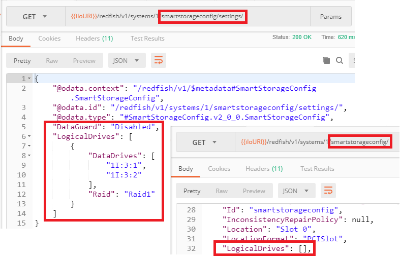

---
markdown:
  toc:
    hide: false
    depth: 3
  lastUpdateBlock:
    hide: false
breadcrumbs:
  hide: true
seo:
  title: Setting Bios and Storage Controller Properties with Redfish
---

# Setting Bios and Storage Controller Properties with Redfish


François Donzé - Technical consultant, HPE

July 2018

Updates: March 2024; November 2025

 

The concept of deferred / pending settings in the <a href="https://servermanagementportal.ext.hpe.com/docs/concepts/biosdatamodel/#bios-current-and-pending-areas" target="_blank">Bios</a> and `SmartStorageConfig` subsystems of HPE iLO 5 is briefly presented in the <a href="https://servermanagementportal.ext.hpe.com/" target="_blank">HPE Reference API</a> documentation. With two examples, this document illustrates what is happening when properties are modified in those subsystems using the Redfish REST API against HPE servers.



- The `SmartStorageConfig` <a href="https://servermanagementportal.ext.hpe.com/docs/concepts/datatypesandcollections/" target="_blank">data type</a> is <a href="https://servermanagementportal.ext.hpe.com/docs/redfishservices/ilos/ilo6/ilo6_adaptation/#hpe-smart-storage-model-oem-deprecated" target="_blank">deprecated in HPE iLO 6</a> (and later) based servers.

- The latest versions of iLO 5 firmware support both the HPE `SmartStorageConfig` and the DMTF standard storage models. Volume management with controllers implementing the DMTF storage model is described in the <a href="https://servermanagementportal.ext.hpe.com/docs/redfishservices/ilos/supplementdocuments/storage/" target="_blank">HPE server management portal</a>.

This blog post assumes that the reader is familiar with REST APIs in general and Redfish in particular.
A good entry point for developers to grasp the power of Redfish is the
<a href="https://www.hpe.com/us/en/servers/restful-api.html#" target="_blank">iLO RESTful API Ecosystem</a>.


## Foreword

For didactic purposes, direct URIs to targets are used instead of relying on crawling the
Redfish tree to discover the target URIs, as explained in the
<a href="https://developer.hpe.com/blog/getting-started-with-the-redfish-api-part-2/" target="_blank">Getting Started with the Redfish® API Part 2</a>
blog post.

Note that in the following paragraphs, `{{Subsystem-URI}}` refers to an URI like
`https://<ilo-IP>/redfish/v1/<subsystem>/` where `<subsystem>` represents either `Bios`
or `SmartStorageConfig`. These subsystems contain the currently used properties.

Each of them has a pending sub-zone called `Settings/` and are explained in the next paragraph.

## Deferred / pending high-level concept description

1. Modifications in these subsystems are performed using HTTP `PATCH` or HTTP `PUT` against
   `{{Subsystem-URI}}/`**`Settings/`**.
2. Upon a successful transaction, the HTTP return code is `200 OK` with the associated message:
   `One or more properties were changed and will not take effect until the system is reset`.
3. During the next system reset, the content of `{{Subsystem-URI}}/Settings/` is transferred one level up,
   in `{{Subsystem-URI}}/`. The return status of this transfer is present in `{{Subsystem-URI}}`
   with an associated message.

The important thing to note in this flow is that the final status code and associated message of a property setting is visible **after the system reset**.

## Successful example

In this example, a Raid1 storage array of two physical disks has been created using Postman. To achieve this goal, one
needs to issue a `PUT` to `{{iloURI}}/redfish/v1/Systems/1/SmartStorageConfig/Settings/` with a body
(aka payload) similar to the example shown below:

<i>Figure 1: Body to PUT to .../SmartStorageConfig/Settings/</i>

 

Upon successful completion of this `PUT` request, the HTTP status return code is `200 OK`,
which means that the remote Web server understood what to do with this well-formed payload.

The Body of the HTTP response contains an `error` property with a `SystemResetRequired` message.
This property is a Redfish object sent by the Redfish server.
It is there to provide details concerning the next step required to complete the modification process.

<i>Figure 2: PUT Return Status</i>

At this stage of the process, only the staging / "pending zone" of the Smart Array has changed and contains
the `PUT` payload. To verify this assertion, one can compare the content of
`{{Subsystem-URI}}/Settings/` with the content of `{{Subsystem-URI/}}`.

In the pending zone (`.../SmartStorageConfig/Settings/`) note the payload sent to the
Redfish server. As you can see, however, in the "running zone" (`.../SmartStorageConfig/`)
the `LogicalDrives` array is still empty:

<i>Figure 3: GET Pending and Current LogicalDrives</i>

 

It is now time to reset the server and perform a `GET` of the running zone. In the response body of this operation,
the first Redfish object is a `@Redfish.Settings` collection containing a single `MessageID` mentioning `Success`.
This single message is synonym of a successful transfer of the "pending zone" into the "running zone".
We will see later in this document what we get in case of an un-successful transfer.

<i>Figure 5: GET Running zone after server reset</i>

 

Further down in this response you will find the `LogicalDrives` array containing the Raid1 disk array:

## Unsuccessful example

In order to emphasize the fact that the modification status of properties in the `Bios` and `SmartStorage`
subsystems must be done after a system reset, note the case study below where the JSON `PUT` payload is syntactically
correct but embeds a value typo (`Raid` instead of `Raid1`) and is missing a required key-value (`DataGuard=Disabled`):

<i>Figures 7: PUT of a bad payload</i>

 

Sending this request returns an HTTP `200 OK` status and a `SystemResetRequired` Redfish message just like in the previous example:

<i>Figure 8: PUT return status of bad Redfish request</i>

The pending zone contains the faulty payload:

<i>Figure 9: Faulty payload in pending zone</i>

 

After the server reset, a `GET` of the running zone responds with a `MessageArgs=[DataGuard]` object and two `MessageID`keys. The first one mentions `DataGuard` as a missing property and the second one (`Success`) means that the analysis of the transfer from the pending zone to the running zone has successfully ended. This `Success` message does not mean that the transfer has occurred.

Moreover, note that there is nothing that mentions the `Raid` typo. It means that analysis of
the payload to transfer stops at the first error found.

<i>Figure 10: DataGuard Property Missing</i>

 

If you drill down to the `LogicalDrives` array you will notice that it is still empty. Hence the transfer did not occur.

<i>Figure 11: Empty LogicalDrives array</i>

 

If you `PUT` a new payload with the `DataGuard=Disabled` property but still without correct Raid level and reset the
server, you will notice an `InvalidRAIDLevel` message explaining the problem.

<i>Figure 12: Wrong Raid Level error</i>

 

## Conclusion

Understanding the pending / deferred process when modifying Bios and SmartStorage properties using the Redfish API as well as the different types of return codes (HTTP, MessageID...) should ease program development and troubleshooting sessions.

Don't forget to check out other [blog posts](/docs/references_and_material) to learn more about Redfish tips and tricks.
