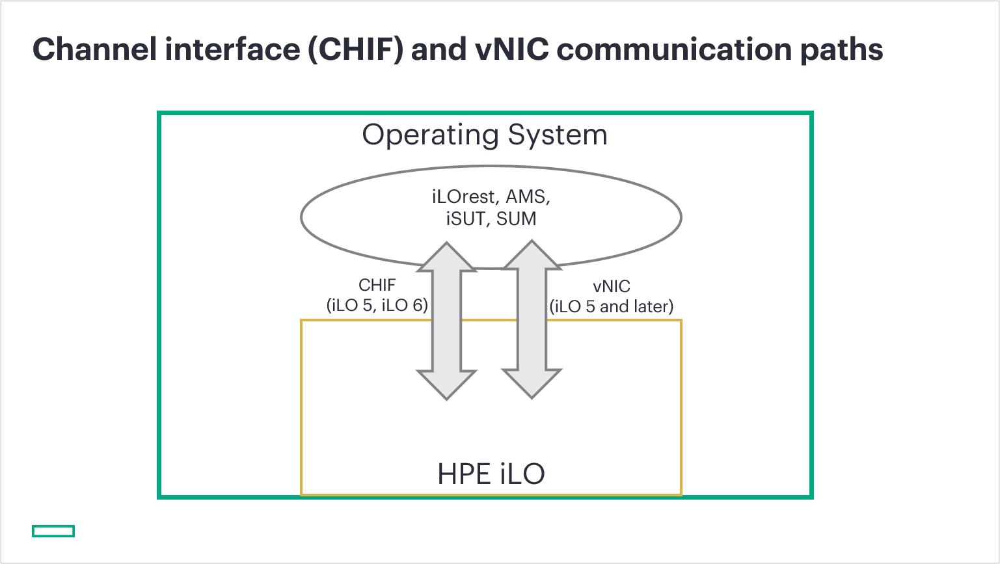

---
markdown:
  toc:
    hide: false
    depth: 3
  lastUpdateBlock:
    hide: false
breadcrumbs:
  hide: true
seo:
  title: CHIF driver not found
---

# CHIF driver not found


<span style="font-size: larger;">François Donzé</span> - Technical consultant, HPE

June 2021<br>
Update: September 2025

## Introduction

When using the HPE RESTful Interface Tool
(<a href="https://github.com/HewlettPackard/python-redfish-utility/releases/latest" target="_blank">iLOrest</a>)
or other applications like the Smart Update Manager
(<a href="https://www.hpe.com/us/en/servers/smart-update.html" target="_blank">SUM</a>)
or the integrated Smart Update Tool
(<a href="https://support.hpe.com/hpesc/public/docDisplay?docId=sd00006333en_us&docLocale=en_US" target="_blank">iSUT</a>)
you may get errors similar to: `Chif driver not found, please check that the chif driver is installed`,
without any other information to identify the origin of the problem or to fix it.
This article attempts to explain when this error occurs and why.

## What is the Channel Interface?

The Channel Interface (CHIF) is an HPE proprietary in-band communication path between
applications and the Insight Lights Out (iLO) within HPE iLO based servers.
In the details, it consists of a kernel driver and an associated dynamic loadable/shared library (`.dll` on Windows and `.so` on Linux).

This driver can only be loaded and used when an iLO chipset is embedded in the computer.



<i>Figure 1: The CHIF allows communication between OS applications and iLO</i>

<br>

The CHIF driver is embedded in supported Operating Systems (OS).
HPE applications using this communication path are packaged with its companion library and can
seamlessly use this path.

For home grown applications using the
<a href="https://github.com/HewlettPackard/python-ilorest-library" target="_blank">HPE Redfish library</a>
or PowerShell Cmdlets
(i.e. <a href="https://www.powershellgallery.com/packages?q=HPESysinfoCmdlets" target="_blank">HPESysinfoCmdlets</a>),
you may have to install it from HPE Software ProLiant Pack (SPP) or download it from the
<a href="https://support.hpe.com/hpesc/public/km/search#q=ilo%207%20channel%20interface%20driver&t=DriversandSoftware&sort=relevancy&numberOfResults=25" target="_blank">HPE Support Center</a>
before a manual installation.


The CHIF between the OS and HPE iLO has been deprecated with the
introduction of iLO 7. The HPE virtual Network Interface (vNIC) becomes
the preferred path.

Refer to the
<a href="/docs/redfishservices/ilos/supplementdocuments/securityservice#transitioning-to-hpe-ilo-7" target="_blank">transitioning to iLO 7</a>
documentation section for more information.


## Quick reminder of iLOrest in-band management

The <a href="https://github.com/HewlettPackard/python-redfish-utility/releases/latest" target="_blank">iLOrest</a>
tool allows in-band and out-of-band Redfish management as explained in
<a href="/docs/references_and_material/blogposts/etc/managingilosessions/managingilosessionswithredfish.md" target="_blank">this article</a>.

If you are logged in an HPE iLO 4 or iLO 5 based server as a privileged user (`root` or `Administrator`),
you can perform <a href="/docs/redfishservices/ilos/supplementdocuments/vnic#in-band-management" target="_blank">in-band management</a>
tasks with iLOrest without providing any credentials. You just have to issue GET or SET commands in a straight forward manner to query the local iLO Redfish service.

The following picture shows an SSH root session creation, toward an HPE DL360 Gen10 with the execution of an iLOrest GET command without any formal login process.
The `Discovering data...Done` message means that iLOrest could effectively log into the local iLO 5 and save metadata in its cache.
Then, it displays the output of the GET command (`Model=iLO 5`).


<i>Figure 2: Successful in-band GET command</i>

<br>

## When do you get the CHIF Driver not found error ?

The most typical situation is when you are logged in, as a privileged user in a non-iLO based server, a virtual machine or a laptop,
and you issue an iLOrest command or launch a Python or PowerShell script performing in-band Redfish commands.

In those cases, there is no iLO underneath the operating system. Hence the CHIF driver, although present as a file somewhere on disk,
cannot not be properly loaded by the application.

### Issuing iLOrest in-band commands on a non-iLO based server

The most typical iLOrest invocation is:

```shell
ilorest login <RedfishService-IP-address>
ilorest cmd1
ilorest cmd2
...
ilorest logout
```

If you don't provide any `<RedfishService-IP-address>` to the `iLOrest login` command,
or if you omit completely this command, iLOrest uses
the `blobstore://.` [target URL](#in-band-python-scripts) and tries to connect to the local iLO via the CHIF.

If you use a
<a href="https://youtu.be/ur9UKRV_0S8" target="_blank">Redfish client</a>
different from iLOrest that uses another library like the
<a href="https://github.com/DMTF/python-redfish-library" target="_blank">DMTF Python Redfish Library</a>,
you will not be able to perform in-band management through the CHIF. An alternative is to enable the
<a href="http://localhost:4000/docs/redfishservices/ilos/supplementdocuments/vnic#managing-the-virtual-nic" target="_blank">iLO virtual NIC</a>
and use its IP address as target URL.

The following figure shows an SSH privileged session into a VMware virtual machine and an iLOrest in-band GET command returning the error.


<i>Figure 3: Unsuccessful in-band GET from Virtual Machine</i>

<br>

The next screenshot shows the same iLOrest command launched from a Microsoft Windows laptop.


<i>Figure 4: Unsuccessful in-band GET from laptop</i>

<br>

The following paragraphs address In-band Python scripts, PowerShell Cmdlets and VMware infrastructures with respect to the CHIF driver. 

### In-band Python scripts

The `blobstore://.` URL mentioned above, can be used as well, in Redfish Python scripts based upon the
<a href="https://github.com/HewlettPackard/python-ilorest-library" target="_blank">HPE python-ilorest-library</a>
to perform in-band management operations. Such programs will have the same behavior as iLOrest since iLOrest uses as well the HPE Python Redfish library.

In the following picture you can see the execution in a virtual machine, of the
<a href="https://github.com/HewlettPackard/python-ilorest-library/blob/master/examples/Redfish/get_ilo_ip.py" target="_blank">get_ilo_ip.py</a>
python example configured for in-band management.

The `grep` command, following the `dmidecode` command returns all the lines of the `get_ilo_ip.py` file,
containing strings `SYSTEM_URL` or `LOGIN_ACCOUNT` or `LOGIN_PASSWORD`. Lines starting with a `#` sign are commented lines, thus, not executed.

The target URL (`SYSTEM_URL`) points to `blobstore://.` and, the `LOGIN_ACCOUNT` and `LOGIN_PASSWORD` variables are empty. With this configuration,
the `RedfishClient` method will try to connect to the CHIF driver to access the local iLO. However, it fails because it the script is executed on a virtual machine.

The result of this in-band configuration is a `ChifDriverMissingOrNotFound` error.


Only the last two lines of stack dump are displayed for clarity.



<i>Figure 5: blobstore target URL</i>

<br>

### Note concerning HPE PowerShell Cmdlets

 As of the writing of this article, only the
 <a href="https://www.powershellgallery.com/packages?q=HPESysinfoCmdlets" target="_blank">HPESysinfoCmdlets</a>
 uses the CHIF driver for in-band management. Other PowerShell Cmdlets like the
 <a href="https://www.powershellgallery.com/packages/HPEiLOCmdlets/" target="_blank">HPEiLOCmdlets</a>
 or the
 <a href="https://www.powershellgallery.com/packages/HPERedfishCmdlets/" target="_blank">HPERedfishCmdlets</a>
 cannot be configured for in-band management through the CHIF driver.

### Miss configured HPE/VMware infrastructures

I've seen cases where VMware system managers installed manually a `.rpm` iLOrest package in their ESXi hypervisor instead of getting it installed properly with a
<a href="https://vibsdepot.hpe.com/hpe" target="_blank">supported HPE custom image</a>.
It is important to remember that HPE bundles and tests specific application packages of
iLOrest, SUM, SUT and the Agentless Management Service (AMS) for the ESXi hypervisor.
Manual installation of those applications will generate problems like the `Chif driver not found` error.

## Other related problematic situations

The previous sections of this article tried to explain the root causes of the `Chif driver not found` error.
However you can face situations involving the CHIF driver where iLOrest commands return a valid output, but from the wrong system!

### iLOrest scripts accessing a wrong iLO

In this context, you are a privileged user launching an iLOrest script from a iLO based server, targeting a remote iLO.
However, the script supplies wrong credentials to the remote iLO. In that case, iLOrest returns an error code, but sadly enough,
the script does not test the return code of the login process and continues its execution.

As you are privileged on a physical iLO based system with the CHIF driver up and running,
iLOrest performs following requests successfully on your system via the CHIF driver in place of the remote server.
This situation is embarrassing because you perform management actions on the wrong system.

The following picture displays a script launched from an iLO 4 based computer, targeting an iLO 5,
but supplying faulty username and password in the login command and discarding errors (`&> /dev/null`).

As a consequence, the next iLOrest command retrieves the local iLO 4 firmware version, instead of the remote iLO 5 firmware version!


<i>Figure 6: iLOrest accessing wrong iLO</i>

<br>

## Take away

The most important things you should remember concerning the `Chif driver not found` error are:

- The CHIF driver is an HPE proprietary driver allowing communications between applications and iLO

- The error occurs when the CHIF driver cannot be loaded by applications calling it.

- Avoid performing remote management tasks as an OS privileged user.

Don’t forget to check back the
<a href="https://developer.hpe.com/blog/" target="_blank">HPE DEV blog</a> site for more Redfish related articles and tutorials.
