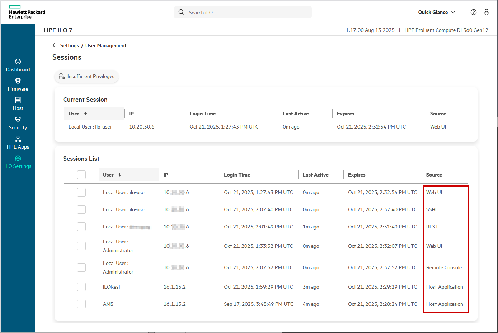
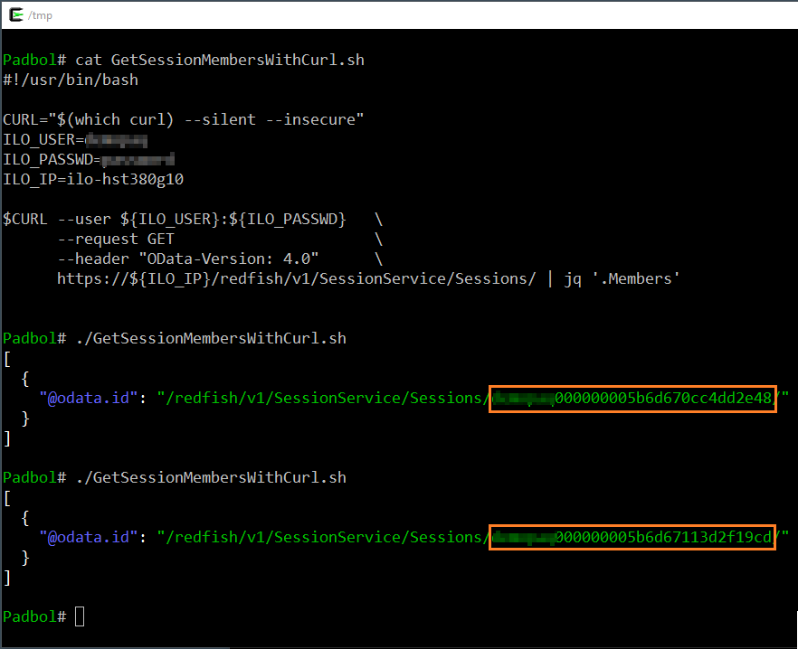
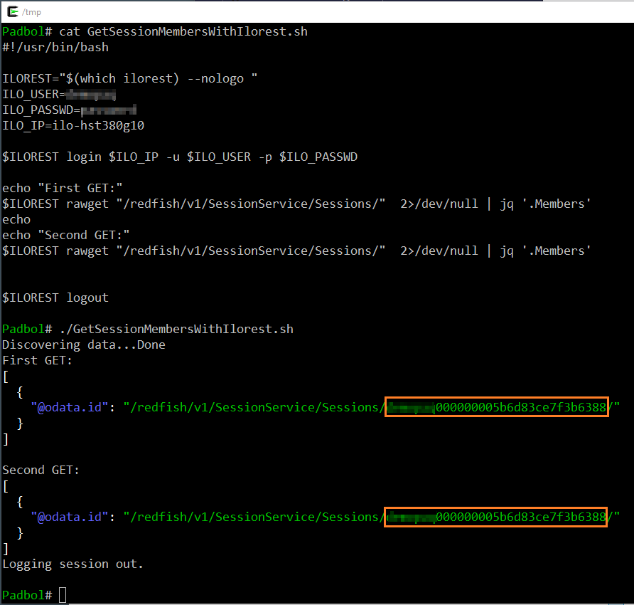
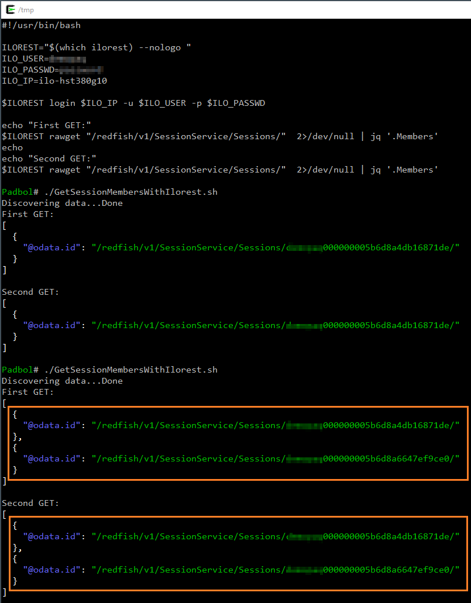
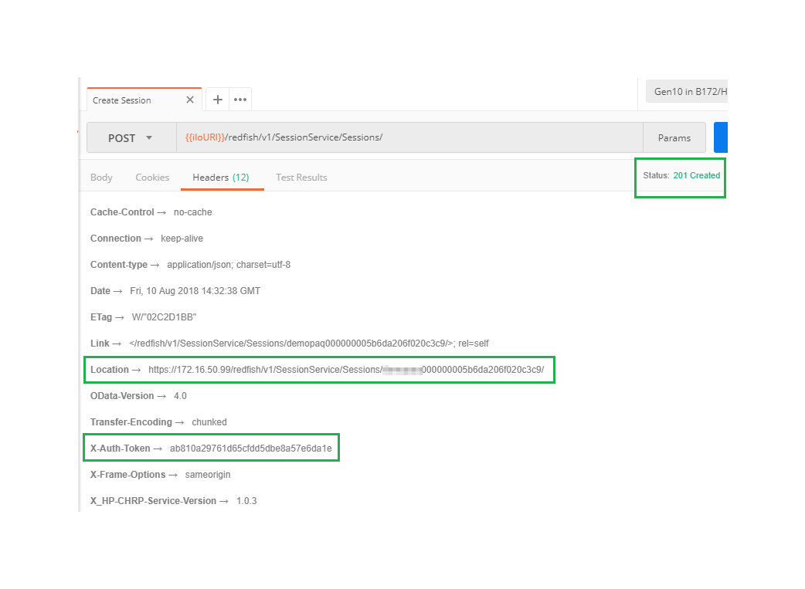
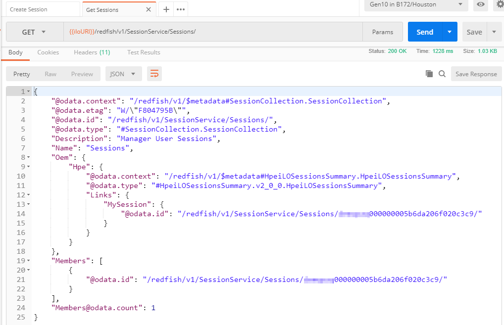
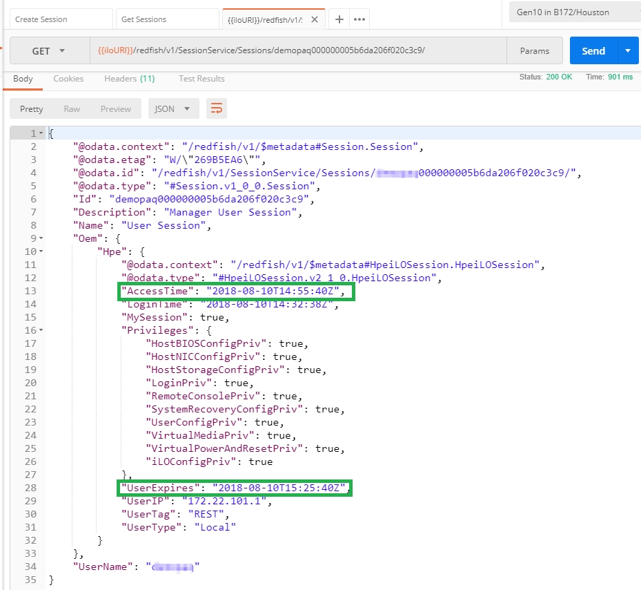

---
markdown:
  toc:
    hide: false
    depth: 3
  lastUpdateBlock:
    hide: false
breadcrumbs:
  hide: true
seo:
  title: Managing iLO sessions with Redfish
---

# Managing iLO sessions with Redfish


<span style="font-size: larger;">François Donzé</span> - Technical consultant, HPE

August 2018<br>
Updated: March 2024; October 2025

## Introduction

HPE Integrated Lights-Out (iLO) accepts a limited number of
[sessions](#session-types).
Reaching the maximum number of sessions can lead to embarrassing situations where server management operations
are impossible until active connections are manually or automatically disconnected after the pre-defined timeout or a manual iLO reset is performed.

This blog post is a companion document to a
<a href="https://support.hpe.com/hpsc/doc/public/display?docId=emr_na-a00041654en_us&docLocale=en_US" target="_blank">Customer Advisory</a>
that explains the typical contexts generating this problem as well as best practices to prevent it using the
<a href="http://www.dmtf.org/redfish" target="_blank">Redfish®</a> RESTful API.


Only Rest sessions are covered in detail in this blog post.
However, the overall idea is valid for the other session types, listed in the next paragraph.


## Session types

HPE iLO accepts several session types:

-  **Command Shell**  (SSH, Telnet....)
-  **Remote/Graphical Console**  (i.e. HTML 5)
-  **Serial Console** 
- **Web UI**: Sessions opened using a Web browser.
- **Rest**: Sessions created using a Redfish client like [iLOrest](/docs/redfishclients/ilorest-userguide),
  <a href="https://www.postman.com/" target="_blank">Postman</a>, Python or PowerShell script....
- **Rest Host**: Sessions opened via
  <a href="/docs/redfishservices/ilos/supplementdocuments/vnic#in-band-management" target="_blank">in-band management</a> and the
  <a href="/docs/references_and_material/blogposts/etc/chif/chif-driver-not-found" target="_blank">CHIF</a> (iLO 5 and iLO 6)
- <a href="/docs/redfishservices/ilos/supplementdocuments/securityservice#transitioning-to-hpe-ilo-7" target="_blank">**Host Application**</a>:
  Sessions created via the <a href="/docs/redfishservices/ilos/supplementdocuments/vnic" target="_blank">Host Interface</a> (iLO 7 and later).


At the time of writing, Web UI, Rest, Rest Host and Host Application session types are not defined in any Redfish schema.
As a consequence, it is difficult to know their limits.

Using best practice mentioned in this article will help you never hit those limits.


The following figure shows the list of opened sessions in an HPE iLO 7. The last column displays the session type.
All session types are represented except the Serial Console.



<i>Figure 0: Session types</i>

<br>

## Out-of-band versus In-band management

Out-of-band (<a href="/docs/redfishservices/ilos/supplementdocuments/vnic#out-of-band-management" target="_blank">OOB</a>)
management consists of starting a management application on a system different from the managed server.
Using the IP address of the managed iLO and privileged credentials, the remote application is able to connect and perform management tasks.
Server management and deployment using Ansible scripts is a typical use case of OOB.

With the
<a href="/docs/redfishservices/ilos/supplementdocuments/vnic#in-band-management" target="_blank">in-band management</a>
technique, you start the management application in the operating system of the managed server.
The application reaches the iLO through an internal path
(<a href="/docs/references_and_material/blogposts/etc/chif/chif-driver-not-found" target="_blank">CHIF</a> or
<a href="/docs/redfishservices/ilos/supplementdocuments/vnic" target="_blank">Host Interface/vNIC</a>).
This method suits perfectly in <a href="https://www.chef.io/" target="_blank">Chef</a> or
<a href="https://puppet.com/" target="_blank">Puppet</a> management infrastructures.

## Redfish session management basics

Session management using the Redfish RESTful API is performed with the `/redfish/v1/SessionService` Redfish object. When this  service  is enabled, iLO active sessions are listed below the `Sessions` sub-tree of the service. Each and every iLO successful login creates an entry at this URI.

## OOB management with basic authentication

In the following screenshot I used the popular `curl` tool and its
<a href="/docs/concepts/redfishauthentication/#basic-authentication" target="_blank">Basic Authentication</a>
mechanism (`--user user:password`) to login and retrieve the active iLO session list. For clarity reasons, I used as well the `--silent` and `--insecure` options.
However, they don't interact with our demonstration.

Each invocation of the script returns a list composed of a single but different iLO session.
This is due to the Basic Authentication mechanism which deletes automatically the session after completion of the HTTP GET request.



<i>Figure1: Get session members with cURL</i>

<br>

As a conclusion, the basic authentication mechanism, no matter the used tool, has the advantage of self-cleaning the session list.
Said differently, the risk of reaching the maximum number of iLO sessions with this technique is very low.
However, basic authentication does not suite all the needs of server management.

## OOB management with OAuth 2.0 authentication

For more complex operations, a better way to connect to a Redfish service is to use the OAuth 2.0 mechanism to
<a href="/docs/concepts/redfishauthentication/#session-authentication" target="_blank">create a session object</a>
in the Redfish session manager. A successful Redfish session creation is synonym of the creation of an iLO session.
In return the Redfish service sends a unique session token and associated session location to the Redfish client.
Subsequent HTTP operations will be authorized using the session token.

The <a href="https://github.com/HewlettPackard/python-redfish-utility/releases/latest" target="_blank">HPE iLOrest interface tool</a>
uses this token session mechanism and stores the token somewhere in the file system of the Redfish client.
The following script illustrates the different behavior in terms of session management between the OAuth 2.0 protocol and the Basic Authentication processes.

The script starts with a login command and then retrieves twice the session list.
It appears that both lists contains one identical record. This is the proof that both iLOrest calls used the same token to authenticate.



<i>Figure 2: Get session members with iLOrest</i>

<br>

## Reaching the iLO maximum number of connections with OOB scripts

The last command of the previous script is an `ilorest logout` operation.
Among other things explained further, `ilorest logout` asks the Redfish server to disconnect its iLO session and to delete
the corresponding Redfish record in the Redfish session manager.

What happens if we omit this last `logout` command in a script using the Token authentication method?

In that case, the opened session will stay active in the iLO and in Redfish.
During the next invocation of the script, `ilorest login` will ask again for a session creation and will overwrite the token generated
during the first invocation with the new one and then perform the requested GET operations with this new token.
As a result, the previous session is still active in the iLO and present in the Redfish web server although not used  by anybody anymore!

In the following screenshot, we removed the `logout` command and launched the script twice.
The second invocation shows two active sessions. A third invocation would have shown three active sessions...



<i>Figure 3: Two iLOrest logins with no logout in between</i>

<br>

At some point of time, if you call again and again such a badly written script,
you will reach the iLO maximum number of sessions and get completely locked out until the iLO is physically reset or until sessions are removed when the `UserExpires`
 value time 
is reached.

## iLO session life cycle management with Redfish

So far, we have studied OOB Redfish session management with tools like `curl` and `ilorest`. Writing your own management application, requires the knowledge of other details in the Redfish API.

In this paragraph we explain and illustrate iLO session creation, use and deletion using the
<a href="https://www.getpostman.com/" target="_blank">Postman API development environment</a>.
The ultimate goal is to provide the necessary knowledge to avoid reaching the maximum number of iLO sessions in an homemade Redfish script or application.

### Session Creation

To a create an iLO session via Redfish, you have to HTTP POST a new record in
the `{{iloURI}}/redfish/v1/SessionService/Sessions/` URI. `{{iloURI}}` represents a Postman variable containing something similar to:
`https://ilo-IP`. The headers of this POST request must contain at least the `OData-Version` and `Content-Type` headers:


<i>Figure 4: Session creation headers</i>

<br>

The payload/body of this POST request must contain valid and privileged iLO username and password:


<i>Figure 5: Session creation body</i>

<br>

Upon successful creation, the `201 Created` return code is received with the `Location` and `X-Auth-Token` keys in the response headers:



<i>Figure 6: Session creation header response</i>

<br>

If you want Postman to automatically store the session location as well as the associated token in specific variables, you can populate
the `Tests` tab with the following JavaScript code:


<i>Figure 7: Postman test script to store Token and Location headers</i>

<br>

### Using session information

Subsequent requests to the Redfish server must contain the `X-Auth-Token` header with the received token value,
in addition to the `OData-Version` and `Content-Type` headers.


<i>Figure 8: `X-Auth-Token` header</i>

<br>

The following GET request retrieves the list of the sessions in a remote iLO using the token obtained during the previous POST request.



<i>Figure 9: Session list</i>

<br>

If we analyze the details of the sessions part of this list, we notice the `AccessTime` and `UserExpire` properties (next picture).
If this session is idle until the `UserExpire` timestamp, the session will automatically expire and the token will not be valid anymore.



<i>Figure 10: Session details</i>

<br>

### Session deletion

To avoid any risk of session saturation, it is wise to delete active sessions at the end of the management programs.
This operation is performed with an HTTP DELETE operation toward the `{{SessionLocation}}` received in the headers of the previous POST request.

Upon successful deletion, you receive a `200 Ok` return code as well as a success `MessageId` in the response body:


<i>Figure 11: Session deletion</i>

<br>

## In-band management with iLOrest

It is now time to switch from out-of-band to in-band management. As said previously,
in-band management uses an internal path between the Redfish client sitting in the operating system and the Redfish server in the iLO.
HPE embeds the Channel Interface (
<a href="/docs/references_and_material/blogposts/etc/chif/chif-driver-not-found#what-is-the-channel-interface" target="_blank">CHIF</a>)
driver in supported operating systems and the associated dynamic/sharable library in host applications requiring this
communication path: `ilorest`, `iSUT`, `SUM` and  the `Agentless Management Service`.

With HPE iLO 7 and later, the CHIF between the OS and the iLO has been removed.
However, host applications can perform in-band management via the HPE
<a href="https://www.dmtf.org/sites/default/files/standards/documents/DSP0270_1.0.0.pdf" target="_blank">Host Interface</a> implementation,
called <a href="/docs/redfishservices/ilos/supplementdocuments/vnic" target="_blank">vNIC</a>.

In this paragraph we analyze the behavior of in-band iLOrest sessions.

The first command of the following screenshot asks for the list of the storage controllers in the underlying server.
Before displaying this list, iLOrest automatically initiates a `login` command into the local iLO through the CHIF driver to create an iLO session.
Then, it retrieves the entire Redfish tree and caches it in `/root/.iLORest/cache` in Linux and `%USERPROFILE%\AppData\Roaming\.iLORest` in Windows.
Finally it displays the requested list.

The second iLOrest command asks again for the list of storage controllers and the answer comes instantaneously from the cached Redfish tree.
Finally, the `logout` command deletes the cached info and removes the iLO session.


<i>Figure 12: Regular iLOrest session</i>

<br>

In some cases, (i.e. read-only operating system) you may want to specify the `--nocache` attribute telling iLOrest to use the system memory instead of a
file system for caching the session and data information.

To illustrate this case, I launched `ilorest --nocache` three times in a row to get the list of smart storage controllers.
We notice that iLOrest performs a login operation in each of the three invocation.
The last iLOrest command  retrieves the list of the active sessions made of four sessions: three for the GET operations and one for the `rawget`.


<i>Figure 13: In-band `ilorest --nocache`</i>

<br>

Each time iLOrest is invoked with the `--nocache` attribute, it caches session and data information in memory.
When it exits, this memory area is released and becomes unreachable.
However, the session is still active in Redfish and in the iLO.

Future invocations of `ilorest --nocache` will have to login again and thus, create another iLO session, which will not be removed when iLOrest exits.
In our case, the four invocations of `ilorest --nocache` resulted in four iLO sessions that will stay active until a manual delete, session expiration or an iLO reset.

### In-band session deletion

The previous example shows clearly a high risk of session saturation when using `ilorest --nocache`.
To avoid this saturation you should include in your iLOrest scripts, a formal deletion of one or several sessions before being locked out.

In an in-band management context, this can be done with `ilorest rawdelete`.
You can adapt the following pseudo code and insert it in different places of your in-band scripts:

```shell
SessionList <-- ilorest rawget "/redfish/v1/SessionService/Sessions"

for Session in SessionList ; do
    ilorest rawdelete Session
done
```

## Conclusion

Generally speaking, iLO session saturation can be avoided by performing formal logout operations using Redfish or tools like iLOrest.
This best practice is valid in both out-of-band and in-band management contexts.

Don't forget to check out some of my other <a href="https://developer.hpe.com/search/?term=donze" target="_blank">blog posts</a> on the HPE Developer portal to learn more about Redfish tips and tricks.
