---
markdown:
  toc:
    hide: false
    depth: 3
  lastUpdateBlock:
    hide: false
breadcrumbs:
  hide: true
seo:
  title: Part 1 – File types and Smart Components
---

# HPE firmware updates: Part 1 – File types and Smart Components


François Donzé - Technical consultant, HPE

August 2020 
Updates: July 2023, September 2025

## Introduction

Computer firmware updates are extremely important as they offer new features, fix bugs, and deliver security improvements. The diversity of devices within a computer that contain firmware is high and, unfortunately, due to their nature and origin, there is not a single path to update them. As an example, HPE ProLiant or Synergy BIOS/ROM firmware may not be updated with the same tools as a partner add-on network card.

An efficient firmware update strategy requires the knowledge of several key components like update agents and firmware package types, as well as an awareness of all the associated tools involved. This multipart blog series describes the main objects related to firmware updates in HPE iLO 5 based servers and the relationships between them, important information to know when addressing firmware updates.

In this first part, I will cover firmware file types and Smart Components (SC), including SC security and partner-specific considerations. It should be noted that I will not be covering the potential dependencies found with high-level management software like HPE OneView or the HPE iLO Amplifier Pack. For information on those topics, please refer to the specific product [documentation](http://www.hpe.com/support/hpesc).

The
<a href="../part2/firmware_update_part2" target="_blank">second part</a>
concerns firmware operating modes on different network topologies. Finally, once the firmware concepts are well understood, you will be ready to read
<a href="../part3/firmware_update_part3" target="_blank">part three</a>, which deals with the automation of firmware updates using the
<a href="https://redfish.dmtf.org/" target="_blank">Redfish®</a> standard.

## Firmware binaries

Depending on the device being updated (aka flashed), the type of file containing the firmware is different. As an example, the Power Management Controller firmware is embedded in a `.hex` file while the System Programmable Logic Device firmware file uses the extension `.vme`. The exhaustive list of HPE firmware binary types is presented in a Help pop-up window of the iLO Graphical User Interface: `Firmware & OS Software --> Update Firmware` (right pane) `--> ?
 --> Server firmware file type details`.

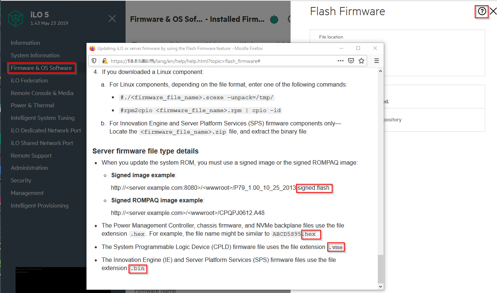

<i>Figure 0: Binary file types</i>

## Smart Components

HPE and partner vendor (Intel, Mellanox, Marvell, etc.) firmware binaries are packaged in Smart Components. They are distributed individually via the online
<a href="https://support.hpe.com/hpesc/public/home/" target="_blank">HPE Support Center</a>
or grouped in support packs like the
<a href="http://www.hpe.com/servers/spp" target="_blank">Service Support Pack for ProLiant</a> (SPP).

Smart Components are self-executable modules that contain firmware binaries, drivers, and
potentially JSON/XML metadata, as well as the code used to install or flash the embedded firmware or driver.
They are packaged in different files types: `.fwpkg, .zip, .rpm` and `.exe`. In old SPPs,
you may also find`.scexe` extensions.

You can browse and extract the content from Smart Components using tools like `7-Zip` on Windows or `unzip, rpm` or `rpm2cpio` combined with `cpio` on Linux (see below picture). The following screenshots show content from different SC types.

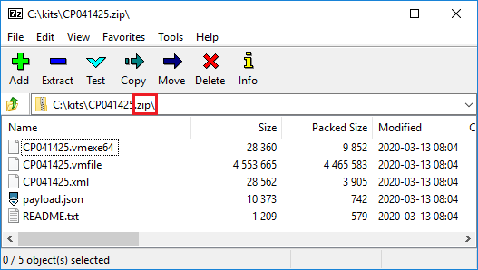

<i>Figure 1: .ZIP Smart Component with with embedded metadata</i>

 
 

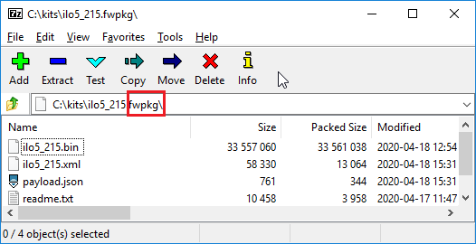

<i>Figure 2: .FWPKG Smart Component with embedded metadata</i>

 
 

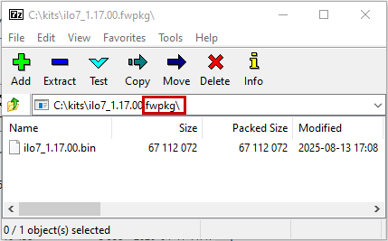

<i>Figure 2b: .FWPKG Smart Component without metadata</i>

 
 

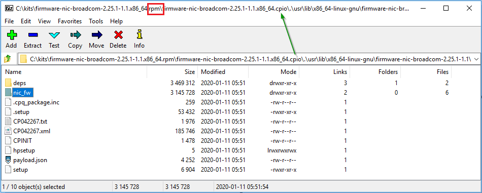

<i>Figure 3: .RPM Smart Component with embedded metadata</i>

## Security concerns

Smart Components are digitally signed by Hewlett Packard Enterprise (HPE) to avoid any injection of malware following the creation of the SC. The digital signature is either embedded in the SC (i.e. `.fwpkg`) or in an external companion file (`.compsig`). During the upload of Smart Components into the iLO Repository of a server, iLO verifies and validates the signature. If the signature does not validate correctly, iLO discards the SC and returns and error similar to “The file signature is invalid”.

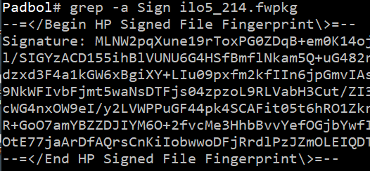

<i>Figure 4: Partial signature of a .fwpkg component</i>

 

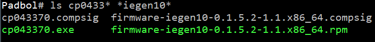

<i>Figure 5: Smart Component with associated compsig file</i>

 

HPE binaries contained in the SC also include an HPE signature. The following screenshot shows the beginning and the end of the fingerprint section found in an iLO. It also shows the ROM/BIOS firmware extracted from the respective Smart Components.

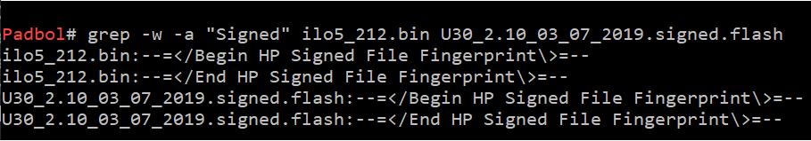

<i>Figure 6: Binary firmware contains are signed</i>

 

Smart Components larger than 32 MiB have several associated `.compsig` files, because iLO, like all of the Baseboard Management Cards (BMC) compliant to the Redfish® standard, has a limited transfer size of 32 MiB. The following picture shows a component in SPP 2020.03 with four `.compsig` files. To upload this SC into an iLO repository, you will need to first split it into chunks of 33554432 bytes (32 \* 1024 \* 1024) to match the `.compsig` files. You can automatically and seamlessly perform this split operation using tools like
<a href="https://support.hpe.com/hpesc/public/docDisplay?docId=sd00006333en_us&docLocale=en_US" target="_blank">iSUT</a>,
<a href="https://support.hpe.com/hpesc/public/docDisplay?docId=sd00005941en_us&page=GUID-38833ABF-B036-49D7-B855-35BB738287C5.html&docLocale=en_US" target="_blank">SUM</a> or
<a href="https://github.com/HewlettPackard/python-redfish-utility/releases/latest" target="_blank">iLOrest</a>.

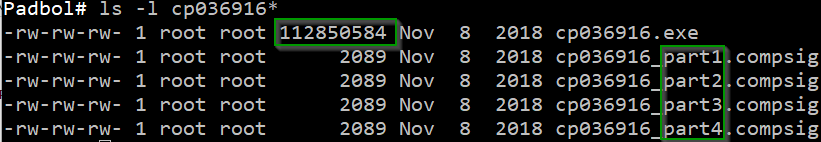

<i>Figure 7: Large components require several .compsig files</i>

 

## Update agents

HPE iLO can flash its own firmware as well as the firmware of other devices. However, it is not able to flash all types of firmware to their target locations. Other update agents exist that can help with this and are listed in the `UpdatableBy[]` JSON array.

The description of each element (`Uefi, RuntimeAgent` and `Bmc`) is shown in the following screenshot.

 property description")

<i>Figure 8: UpdatableBy (array) property description</i>


Search for string `UpdatableBy` in the search box of the
<a href="https://servermanagementportal.ext.hpe.com/" target="_blank">HPE Server Management Portal</a> for more detail of that array.


## Smart Component metadata

Smart Components are associated to metadata stored in one or more files with different suffixes (`.xml`, `.json`, etc.) and provided inside or outside of the main SC file. Recent .FWPKG components don't embed `payload.json` and `<component>.xml` files anymore as shown in Figure 2b above. Instead, a `<component>.json` file is delivered by the HPE Support Center or within SPPs.

Among other things, the metadata files list the update agents able to process the component. This list can be viewed from the iLO Graphical User Interface in the `Firmware – iLO Repository` screen.

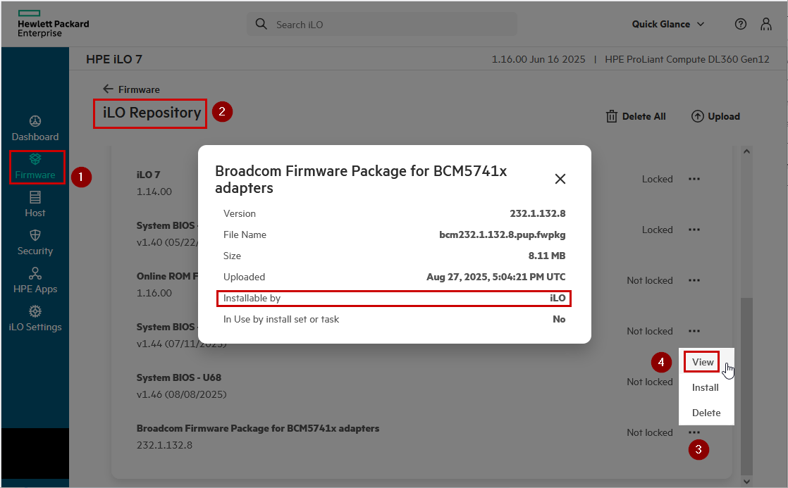

<i>Figure 9: Smart Component metadata in iLO GUI</i>


If you modify any file in the main Smart Component package (i.e. `payload.json`) iLO will refuse to upload the SC since the signature has changed.


## Partner Smart Components

HPE partner (Intel, Marvell, Mellanox, etc.) firmware and drivers are packaged in signed Smart Components by HPE. Very often, they also contain executables, scripts, and dynamically linked libraries (`.dll`) that are proprietary to the partner. It is crucial to understand that the list of update agents that are able to flash a partner’s firmware is dictated by the partner. Neither HPE nor end customers have the possibility to alter this list.

For example, Smart Component `cp040152.exe` contains firmware updates for Intel Fortville based adapters.
As in Figure 10, the embedded `payload.json` only lists `RuntimeAgent` in the `UpdatableBy` array.
Moreover, the `FirmwareImages` section explicitly mentions that UEFI is not able to flash the binary file `.//FW/BootIMG.FLB`.
In other words, only OS-based applications, like
<a href="https://support.hpe.com/hpesc/public/docDisplay?docId=sd00006333en_us&docLocale=en_US" target="_blank">iSUT</a>
or
<a href="https://support.hpe.com/hpesc/public/docDisplay?docId=sd00005941en_us&page=GUID-38833ABF-B036-49D7-B855-35BB738287C5.html&docLocale=en_US" target="_blank">SUM</a>,
are able to perform the firmware updates of these converged network adapters by launching the tools provided by the partner. The consequences of using this type of SC is discussed in Part 2 of this series.

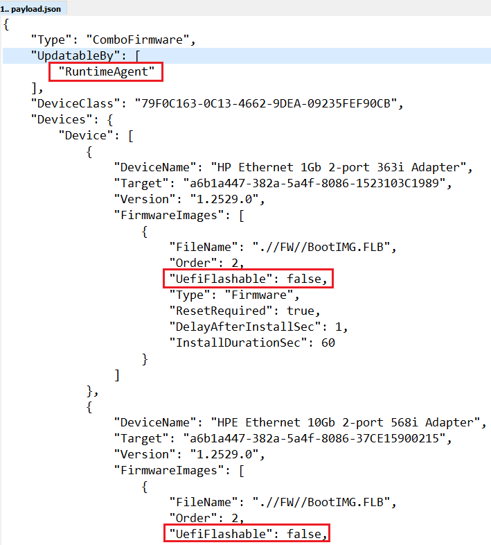

<i>Figure 10: Embedded metadata of an HPE partner firmware</i>

 

With the implementation of the Platform Level Data Model for Firmware Update
(<a href="/docs/references_and_material/blogposts/pldm/pldm_fwupd/pldm_fwupd" target="_blank">PLDM for FWUPD</a>)
in both iLO firmware and external supplier devices, the firmware update process is simplified as it does not require any run time agents anymore.
Third party suppliers SCs implementing this standard are packaged in a `component.fwpkg` or `<component>.pup.fwpkg`
file with associated metadata `<component.json>` or `<component>.pup.json` file.
Figure 9 above shows a `.pup` component and Figure 10b the decoupled `.json` metadata file.

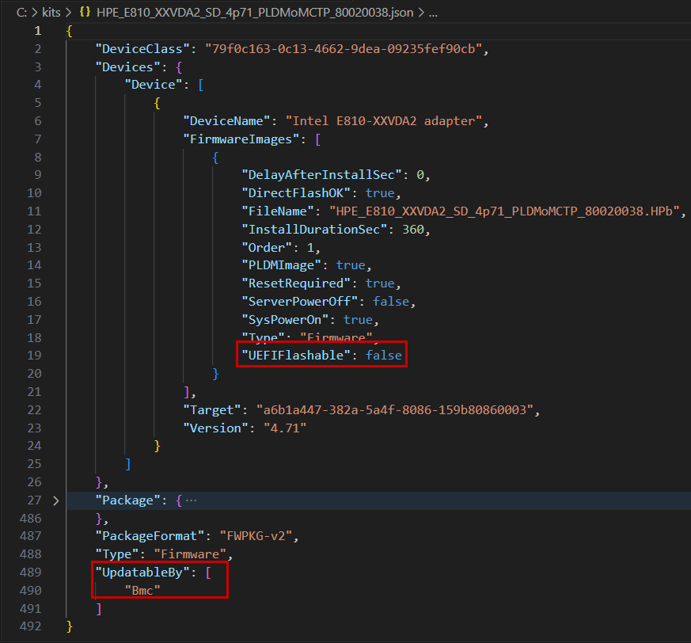

<i>Figure 10b: Decoupled metadata of an HPE partner firmware</i>

 

## Summary

In this article, I covered the following objects and concepts involved in HPE firmware updates, as well as their relationships:

- HPE Firmware binary types
- PE and partner Smart Components
- Update agents

This is important information you need to plan your firmware update strategy, but it is not sufficient. In my
<a href="../part2/firmware_update_part2" target="_blank">second</a>
article on this subject, I describe different update operating modes as well as the interactions between different objects.

Make sure you check as well the
<a href="https://developer.hpe.com/search/?term=donze" target="_blank">HPE DEV blog</a>
site often to view my next post as well as other interesting tutorials and articles.
