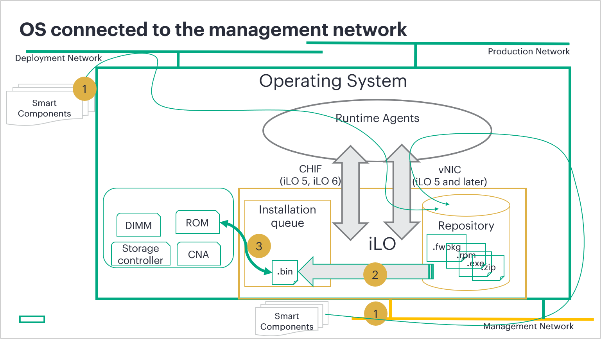
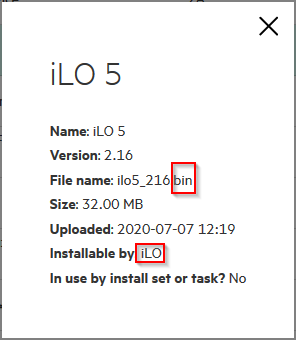
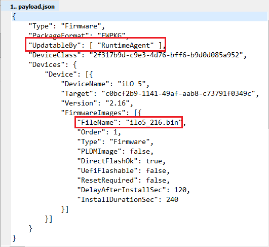
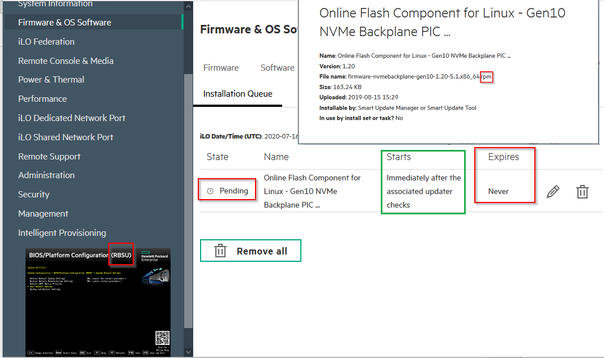
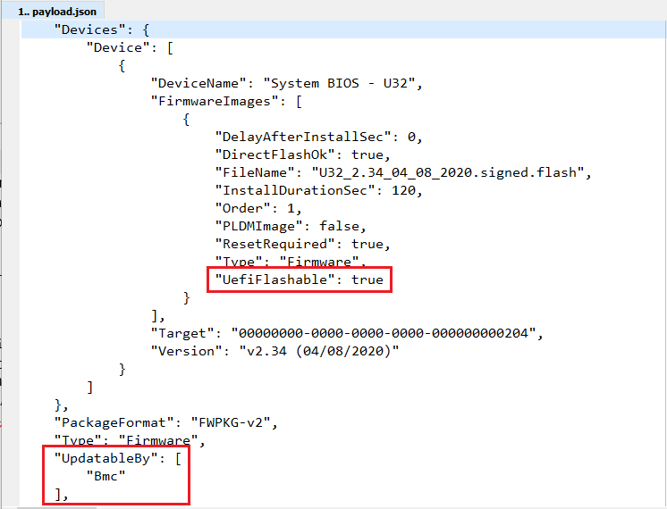
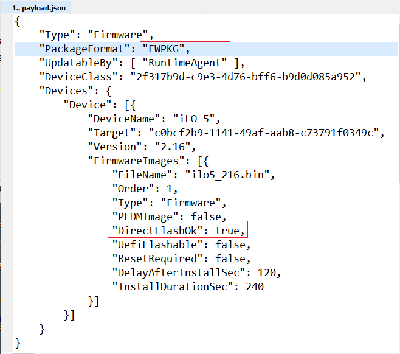
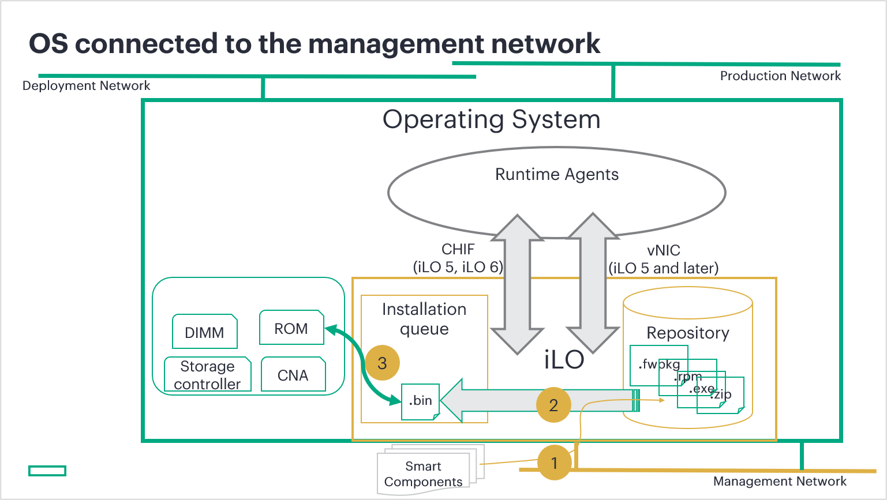

---
markdown:
  toc:
    hide: false
    depth: 3
  lastUpdateBlock:
    hide: false
breadcrumbs:
  hide: true
seo:
  title: Part 2 – Interaction in operating modes
---

# HPE firmware updates: Part 2 - Interaction in operating modes


François Donzé - Technical consultant, HPE

August 2020 
Updates: July 2023, September 2025

## Introduction

In
<a href="../part1/firmware_update_part1" target="_blank">my first blog</a> post regarding how to deal with HPE firmware upgrades, I discussed the main objects involved:

- Firmware binary types
- Smart Components (SC)
- Update agents including Runtime Agents

In this article, I will explain the interaction between these objects when used in three different operating modes.

## Firmware update operating modes

The different firmware binary types, Smart Components (SC), the iLO Repository, Installation Queue and Runtime Agents allow for several operating modes on different network topologies. The presence (or lack thereof) of an operating system (OS), increases the complexity of this multi-dimensional matrix. The operating mode classifications presented below are based on the presence (or absence) of an operating system in the server and the server’s connectivity to the management network. The operating system may be one of the following types:

- Standard production OS (Red Hat, Suse, Windows, ESX, etc.)
- Deployment or maintenance helper (WinPE,
  <a href="https://livecdlist.com/" target="_blank">Linux LiveCD</a>,
  SPP iso DvD).

Before covering these different operating modes, let me give you a quick recap of the objects you would find present in a typical HPE infrastructure ready to be updated.

As mentioned in the
<a href="https://support.hpe.com/hpesc/public/docDisplay?docId=sd00004310en_us&docLocale=en_US" target="_blank">iLO User Guides</a>, “the iLO Repository is a secure storage area in the nonvolatile flash memory embedded on the system board”. It can store all types of Smart Components (`.rpm, .zip, .exe`) as well as binary firmware (`.bin, .signed.flash,` etc.).

They also points out that “The iLO Installation Queue is an ordered list of components and commands that were added to the queue”. The elements present in this queue are processed one after the other and the actions performed on them depend on their type (`.zip, .rpm, .bin`, etc.) and their associated metadata.

Runtime Agents refers to the Integrated Smart Update Tools
(<a href="https://support.hpe.com/hpesc/public/docDisplay?docId=sd00006333en_us&docLocale=en_US" target="_blank">iSUT</a>)
 and the Smart Update Manager
 (<a href="https://support.hpe.com/hpesc/public/docDisplay?docId=sd00005941en_us&docLocale=en_US" target="_blank">SUM</a>),
two software utilities used in a standalone mode or embedded in other software
like HPE OneView or the iLO Amplifier Pack. When used standalone in an in-band manner,
iSUT and SUM communicate with the underlying iLO using the
<a href="../../etc/chif/chif-driver-not-found" target="_blank">HPE iLO Channel Interface</a> (CHIF).

<i>Figure 1: Runtime agents, CHIF and vNIC communication paths</i>

The typical HPE firmware update flow, regardless the operating mode, consists of three main steps:

1. Upload Smart Components or binary files to the iLO Repository
2. Add the SCs to the installation queue
3. Call the appropriate update agent


This article focuses on Smart Components and does not discuss the case where HPE
binaries transparently bypass steps 1 and 2 when using the Update Firmware menu
of the iLO GUI, the Redfish
<a href="https://servermanagementportal.ext.hpe.com/docs/redfishservices/ilos/supplementdocuments/updateservice/#simpleupdate-action" target="_blank">Simple Update</a>
or an
<a href="/docs/references_and_material/blogposts/firmware_updates/part3/firmware_update_part3/#http-push-update" target="_blank">HTTP push update</a> method.


## Operating mode 1: Operating system present and connected to the management network

Connecting an OS to the management network may not be a recognized best practice. However, several IT departments implement this network architecture and, from a didactic point of view, this mode is interesting as it helps explain the other modes.

This mode allows the entire update process to be managed from a remote node located on the management network through the OS, the iLO, or both. Some companies use a deployment network to install and update operating systems and drivers. This deployment network can also be used to upload Smart Components to the iLO Repository via Runtime Agents, the CHIF or the virtual NIC.

<i>Figure 2: OS connected to the management network</i>

Smart Components can either be uploaded directly to the iLO Repository or first stored in the operating system before being processed by Runtime Agents. The first option has no limitation related to the type of SCs, since iLO accepts all of them.  On the contrary, if you choose the second option, make sure you provide the right SC type to the right OS: `.rpm` SCs to Linux, `.zip` SCs to VMware and`.exe` SCs to Windows. Firmware packages (`.fwpkg`) are OS independent and can be uploaded to each and every supported OS. Binary files (`.bin, .signed.flash`….) can only be uploaded to the iLO Repository as Runtime Agents don’t know how to process them.

Once SCs have been placed in the OS, Runtime Agents will install/unzip/execute them before uploading binary files with associated metadata to the iLO Repository (step 1) through the CHIF or the vNIC. Then, they will ask iLO to perform steps 2 and 3.

When SCs are directly uploaded to the iLO Repository, iLO can automatically chain steps 2 and 3, but only when the SC type is `.exe` or `.fwpkg`. iLO is smart enough to extract binary firmware files and associated metadata from `.exe` and `.fwpkg` SCs before calling the appropriate update agent. This is not true for `.rpm` and `.zip` SCs, as explained further down.

If you manually extract a binary file from its SC and upload it to the iLO Repository without any associated meta data, iLO is able to associate an appropriate update agent. The following picture shows the properties of the `ilo5_216.bin` file extracted from its `.fwpkg` SC and uploaded to the iLO Repository. iLO automatically detected that this file can be processed by the iLO itself.

<i>Figure 3: Binary file's embedded metadata</i>

Note that this association may be different from what is present in the `payload.json` of the original SC. In this particular example, the associated metadata file mentions `RuntimeAgents` as the only update agent.

<i>Figure 4: Metadata in separated file</i>

If ILO is autonomous regarding `.exe, .bin` and `.fwpkg` Smart Components, it needs external help to process `.rpm` and `.zip` SCs, as it lacks tools like `unzip` and `rpm`. After adding these SC types in the Installation Queue, iLO “raises a flag”, asking for help from Runtime Agents. If started and properly configured, Runtime Agents take control of the update process. They copy the entire SC into a place within the OS labeled “staging area” and extract the binary files and metadata using OS-provided tools before continuing the update process prescribed by the metadata.

If Runtime Agents are not running, or if they are configured in a manual mode requiring an action from a human being (i.e. iSUT `OnDemand` mode), the iLO flag remains raised forever, blocking other SCs in the Queue.

The following screenshot shows a system at RBSU clearly telling that no OS is booted. Hence, there can’t be any Runtime Agent running. An `.rpm` SC has been added to the Queue and iLO reports that the update will start “Immediately after the associated updater checks”. The term “updater check” refers to a Runtime Agent processing the flag raised by the iLO.

To unlock this situation, you need to start up an OS and a Runtime Agent or remove this task from the Installation Queue.

<i>Figure 5: SC waiting endlessly for a runtime agent</i>

Firmware Packages (`.fwpkg`) can be processed by both Runtime Agents and iLO. If you upload an `.fwpkg` directly in the iLO Repository and add it to the Installation Queue, iLO is able to extract the binary and metadata files and trigger the next step. This next step would be a call to the appropriate update agent that is mentioned in the associated metadata file.

As an example, OS independent firmware package `U32_2.32_03_09_2020.fwpkg` contains the following metadata: `UpdatableBy: Bmc` and `UefiFlashable: True`.

<i>Figure 6: FWPKG ROM metadata</i>

If this SC is uploaded first in the operating system and submitted to a Runtime Agent, it will extract the binary file and hand it over to the iLO (Bmc) via the CHIF or the vNIC. Then, iLO will ask UEFI to flash it during the next reboot.

If you first upload it to the iLO Repository and add it to the Installation Queue, iLO will directly ask UEFI to flash it during the next reboot.

As second example, I uploaded the OS independent firmware package `ilo5_216.fwpkg` to the iLO Repository and then added it to the Installation Queue. iLO was able to read and interpret the `payload.json` file (see next screenshot), specifying that a Runtime Agent has to be called to continue the update process despite the `DirectFlashOk: True`. Once notified, the Runtime Agent copied the SC into a staging area within the OS, analyzed the metadata and asked iLO to flash the binary.

<i>Figure 6: FWPKG iLO 5 metadata</i>

## Operating mode 2: Operating system present but not connected to the management network

In this mode, an operating system is booted but has no connectivity to the management network. Hence, Smart Components cannot be uploaded first into the OS. If the OS has connectivity to a deployment network, we must assume that this network is not used to upload SCs in the OS. Otherwise, we would have fallen back to the previous operating mode in which SCs can be uploaded to the OS.

<i>Figure 8: OS not connected to the management network</i>

Operating modes 1 and 2 are very similar. Here, the only difference from the previous operating mode is that SCs cannot be uploaded first to the OS. All the SCs to be processed are directly uploaded to the iLO Repository from the management network.

All types of Smart Components can be processed with no exception: `.zip` and `.rpm` SCs will wait for a Runtime Agent to process them as soon as they are added in the Installation Queue. Other SCs (`.exe, .bin` and `.fwpkg`) will be processed by iLO, eventually calling a Runtime Agent if specified in the `payload.json` metadata file, once they have been added to the Installation Queue.


With the implementation of the Platform Level Data Model for Firmware Update
<a href="/docs/references_and_material/blogposts/pldm/pldm_fwupd/pldm_fwupd" target="_blank">PLDM for FWUPD</a>
in both iLO firmware and external supplier devices, the firmware update process is simplified as it does not require any run time agents anymore.


## Operating mode 3: No operating system present

This is typically the mode used when servers have just arrived from the factory and need a firmware update prior to the installation of the production operating system. This is often the case within companies who are not willing to use a helper OS like WinPE, Linux CD or an SPP `.iso` DvD. Use of a helper OS with an embedded Runtime Agent would allow you to fall back to the previous operating mode.

<i>Figure 9: OS not present in the system</i>

This operating mode introduces several limitations related to firmware updates, which are easy to identify using the mechanisms explained in previous modes. The first limitation concerns Linux and VMware OS dependent Smart Components (`.rpm` and `.zip`) containing firmware updates. These cannot be processed at all since they always require the help of a Runtime Agent as soon as they are added to the Installation Queue.

The second limitation targets `.fwpkg` and `.exe` Smart Components with `RuntimeAgent` as the only element in the `UpdatableBy` array. This is the case for SCs like the `cp040152.exe` SC presented earlier in this document or `cp038867.exe` containing Intel Persistent Memory Optane firmware.

`.fwpkg` and `.exe` SCs with `UEFI` or `BMC` values that are part of the `UpdatableBy` array are not affected by this limitation. `SPSGen10_04.01.04.381.fwpkg` and `cp043490.exe` are examples updatable by UEFI.

Binary files `.bin, signed.bin, signed.flash, signed.vme` (CPLD), `.hex` (PIC) have no limitation in this operating mode and can be processed seamlessly.

## Summary

HPE ILO provides a very powerful and flexible firmware update architecture with its Repository, Installation Queue and associated Runtime Agents. However, due to the many objects involved, one must have a clear understanding of the different update paths one can use based on the different operating modes in order to build an efficient firmware update strategy.

If you remember nothing else, just remember that Smart Components requiring the presence of a Runtime Agents will stall the entire update process if none are found. This requirement can happen when OS dependent components (`.zip, .rpm`) are added to the iLO Installation Queue or when RuntimeAgents are the only update agent listed in the SC metadata file, no matter the type of SC (`.fwpkg, .exe`…). Don’t forget to check back on the
<a href="https://developer.hpe.com/search/?term=redfish" target="_blank">HPE DEV blog</a>
for more blog posts related to this subject.
