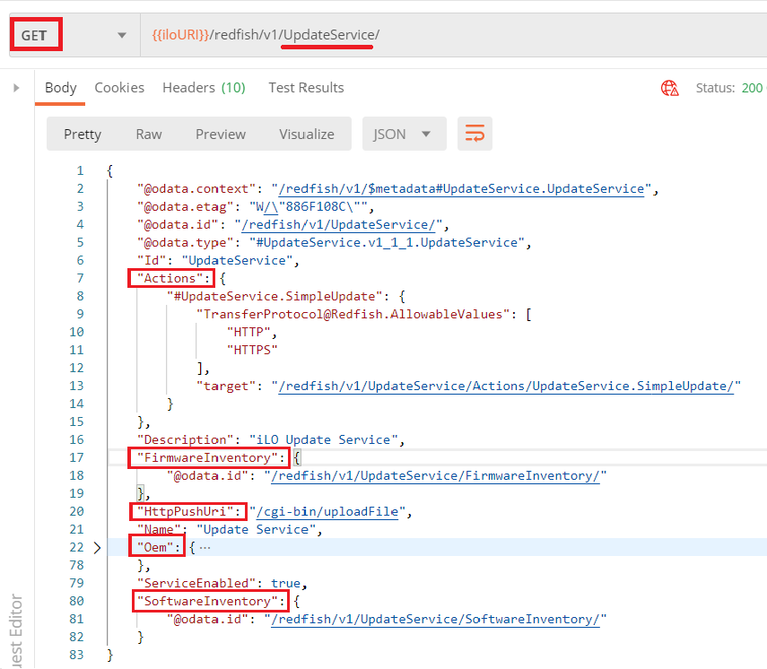
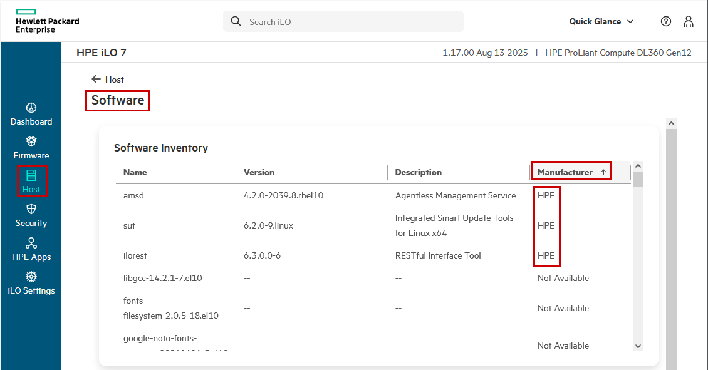

---
markdown:
  toc:
    hide: false
    depth: 3
  lastUpdateBlock:
    hide: false
breadcrumbs:
  hide: true
seo:
  title: Part 3 - The Redfish update service
---

# HPE firmware updates: Part 3 - The Redfish update service


François Donzé - Technical consultant, HPE

August 2020 
Updates: July 2023, September 2025

## Introduction

In the first two blogs of this three part series regarding HPE firmware updates, I explained the
<a href="../part1/firmware_update_part1" target="_blank">different objects</a>
 involved in firmware updates and how they are packaged, as well as the interaction between these objects when used in different
 <a href="../part2/firmware_update_part2" target="_blank">operating modes</a>.

This third article describes the standard Redfish® update service, including its simple update and Original Equipment Manufacturer (OEM) extension actions, and offers numerous examples and screenshots.

For didactic reasons, cases described in this blog post have been performed with the
<a href="https://www.postman.com/" target="_blank">Postman</a>
platform for API development with hard-coded resource locations. Writing Redfish scripts with hard-coded locations is definitively a bad practice as explained in this
<a href="https://developer.hpe.com/blog/getting-started-with-ilo-restful-api-redfish-api-conformance/" target="_blank">article</a>
and demonstrated in these
<a href="https://github.com/HewlettPackard/hpe-notebooks/tree/master/Redfish" target="_blank">Jupyter Notebooks</a>.
“Well written” public examples in
<a href="https://github.com/HewlettPackard/python-ilorest-library/tree/master/examples/Redfish"  target="_blank">Python</a>
and
<a href="https://www.powershellgallery.com/packages/HPRESTCmdlets/1.2.0.0" target="_blank">PowerShell</a>
can be found on the Internet.

## The Redfish update service

The Redfish update service contains software and firmware information as well as methods for updating these resources. Located at `/redfish/v1/UpdateService`, it
is populated with five endpoints, which are highlighted in the next screenshot.
Note that this picture shows the output of a request performed against an iLO 5 (version 2.18) implementing
<a href="https://redfish.dmtf.org/schemas/v1/UpdateService.v1_1_1.yaml" target="_blank">schema version 1.1.1</a>
of the Redfish update service. Later schemas may have different content.

In this article, I will cover these five endpoints in the following order: `SoftwareInventory`, `FirmwareInventory`, `Actions`, `HttpPushUri` and finally the `Oem.Hpe` extension.

<i>Figure 1: UpdateService properties</i>

## Software inventory

From the `SoftwareInventory` endpoint, you can retrieve the collection of HPE software installed in the Operating System (OS). This collection contains the items listed in the iLO Graphical User Interface (GUI), which are shown in the screenshot below.

Since this list comes from the OS, it is mandatory to have the system booted. Moreover, the HPE
<a href="https://support.hpe.com/hpesc/public/km/search#q=Agentless%20Management%20Service&t=All&sort=relevancy&numberOfResults=25" target="_blank">Agentless Management Service</a>
(AMS) must be present and started in the OS in order to have a communication link with the iLO through the HPE Channel Interface
(<a href="../../etc/chif/chif-driver-not-found" target="_blank">CHIF</a>)
or the host interface
(<a href="https://servermanagementportal.ext.hpe.com/docs/redfishservices/ilos/supplementdocuments/vnic/" target="_blank">vNIC</a>).

The following two screenshots show the list of HPE software displayed by the iLO 5 and iLO 7 Graphical User Interfaces (GUIs)
of a Linux server.

<i>Figure 2: iLO GUI 5 SoftwareInventory</i>

 

<i>Figure 2b: iLO 7 GUI SoftwareInventory</i>

 

To retrieve the above collection using the `SoftwareInventory` endpoint of the Redfish update service, you have to perform
a `GET` request toward `/redfish/v1/UpdateService/SoftwareInventory`. This gives you the collection of URIs pointing to the details
of each HPE installed software. The next picture shows the five URIs that correspond to the same HPE software present in the above screenshot.
Note that the list of running and installed software present in the iLO GUI is not returned by Redfish.

<i>Figure 3: SoftwareInventory collection</i>

To avoid issuing multiple GET requests for retrieving the details of each installed software, you can append the `$expand=.`
<a href="https://www.dmtf.org/sites/default/files/standards/documents/DSP0266_1.7.0.pdf" target="_blank">OData query</a>
as shown in the next screenshot (note that this screenshot has been truncated
to display only the first item of the collection). The dot (“.”) sign of this
OData query indicates that only the current level of the hierarchy has to be
expanded, not the lower levels. Details concerning the support of OData queries
can be found in the `ProtocolFeaturesSupported` property of the Redfish Service root endpoint (`/redfish/v1`).

<i>Figure 4: Expanded SoftwareInventory</i>

A Python example for fetching the software inventory of a server without hard coding its location can be found in the
<a href="https://github.com/HewlettPackard/python-ilorest-library/blob/master/examples/Redfish/software_firmware_inventory.py" target="_blank">HPE Python iLOrest library</a>
on GitHub.

## Firmware inventory

Similar to the `SoftwareInventory` resource, the `FirmwareInventory` endpoint contains the collection of all installed firmware in a server. The exact endpoint is `/redfish/v1/UpdateService/FirmwareUpdate` and, with a single `?$expand=.` OData query, you can retrieve all the details of installed firmware on your server.

<i>Figure 5: Expanded firmware collection</i>

A Python example to retrieve the firmware inventory of a server (using Redfish) can be found in the
<a href="https://github.com/HewlettPackard/python-ilorest-library/blob/master/examples/Redfish/software_firmware_inventory.py" target="_blank">HPE Python iLOrest library</a>
on GitHub.

## Actions

The Redfish update service provides the list of actions that a Redfish client can perform against a server. The Redfish implementation of the server used in this article contains only one action: the `SimpleUpdate` action that can be performed by issuing an HTTP or HTTPS POST request toward the following endpoint: `/redfish/v1/UpdateService/Actions/UpdateService.SimpleUpdate`

The `SimpleUpdate` action is a “pull” update, which means that the Redfish server has to pull the firmware update image from the provided URI. Hence, the payload of the request must contain the URI of a firmware file that will be fetched from the network location and flashed instantaneously (iLO firmware) or staged and flashed during next reboot (UEFI/Bios firmware).

The implementation of the `SimpleUpdate` used for the writing of this article allows only HTTP and HTTPS transfer protocols. You can mention the appropriate transfer protocol either in the `ImageURI` resource (next image) or in the `TransferProtocol` parameter (the image following this one).

<i>Figure 6: Simple update action</i>

 

<i>Figure 7: Simple update action with transfer protocol</i>

 

You can monitor the update process by polling the `State` and `FlashProgressPercent` properties part of the `Oem.Hpe` section as shown in the following screenshot.

<i>Figure 8: Monitoring a simple update</i>


By typing string _Oem.Hpe.States_ in the search box of the
<a href="https://servermanagementportal.ext.hpe.com" target="_blank">Server Management Portal</a> you will get the exhaustive list of
the possible Simple Update states shown in the next figure.


<i>Figure 9: Simple update possible states</i>

 

With iLO 5 firmware 2.30 and higher versions, a successful `SimpleUpdate` returns two pointers in the Task Service: a task location and a task monitor location.
The task location (`/redfish/v1/TaskService/Tasks/22` in the next picture) contains the details of the update and the task monitor location (`/redfish/v1/TaskService/TaskMonitors/22`)
contains the status of the task at the time of the query.

The following two pictures show, respectively, the response of a successful `SimpleUpdate` and the task monitor details including a running task state. Note that the accomplished percentage of the task is not present in the Task Monitor location. It is only mentioned in the `Oem.Hpe` extension properties, as mentioned above.

<i>Figure 10: Successful SimpleUpdate</i>

 

<i>Figure 11: Task monitor details</i>

 

<i>Figure 12: SimpleUpdate task states</i>


Only iLO binaries (`.bin`) and UEFI/Bios binaries (`.signed.flash`) can be processed with the `SimpleUpdate` action. If you supply a Smart Component or a firmware package (`.fwpkg`), the response to the POST request will contain a successful return code (`200 OK`). However, the flash operation will never occur and an error record will be posted in the iLO event log, as shown in the following image.


<i>Figure 13: iLO Event log generated by a SimpleUpdate non-supported file type</i>

 

The iLO log record can be retrieved from the `Oem.Hpe` extension of the update service, as shown below.

<i>Figure 14: Log record generated by a firmware invalid format</i>

 

### Scripting a SimpleUpdate

There are several possibilities to script a `SimpleUpdate` action. Here are some of them.

The
<a href="https://github.com/HewlettPackard/python-redfish-utility/releases/latest" target="_blank">HPE iLOrest</a>
utility provides the `firmwareupdate` macro command. The command expects the URI of the binary firmware image to flash. The sources of this macro command is public and published on
<a href="https://github.com/HewlettPackard/python-redfish-utility/tree/master/src/extensions/iLO_COMMANDS" target="_blank">GitHub</a>.

<i>Figure 15: iLOrest `firmwareupdate` example</i>

 

A simple Python script updating an iLO 5 firmware is published in the
<a href="https://github.com/HewlettPackard/python-ilorest-library/blob/master/examples/Redfish/update_ilo_firmware.py" target="_blank">HPE Python iLOrest Library</a>
on GitHub. This Python example has been transformed into an
<a href="https://github.com/HewlettPackard/ansible-ilorest-role/blob/master/library/update_ilo_firmware.py" target="_blank">Ansible module</a>.
The associated
<a href="https://github.com/HewlettPackard/ansible-ilorest-role/blob/master/examples/update_firmware.yml" target="_blank">Ansible Playbook</a> is also present on the same GitHub repository.

## HTTP Push Update

The HTTP Push Update endpoint (`HttpPushUri`) allows you to embed a firmware update component
in the body of a request and push it to a server. As its name suggests,
it is a “push” update method in contrast to “pull” methods that I just described with `SimpleUpdate`.

The update service schema
<a href="http://redfish.dmtf.org/schemas/v1/UpdateService.v1_8_1.json" target="_blank">version 1.8.1</a>
provides the following description of the `HttpPushUri` property: “_The URI used to perform an
HTTP or HTTPS push update to the update service.
The format of the message is **vendor-specific**._”

To overcome the loose definition of the `HttpPushURI`, Redfish introduced the `MultipartHttpPushUri` method in version
<a href="http://redfish.dmtf.org/schemas/v1/UpdateService.v1_6_0.json" target="_blank">1.6.0</a>
of the Update Service schema (not yet implemented in the server used for writing this article).

The payload of a POST request to the `HttpPushURI` (Figure 16) is the concatenation of several parts,
including session credentials, parameters, and component signature files (if any), in addition to the firmware file.
Refer to these
<a href="/docs/redfishservices/ilos/supplementdocuments/updateservice#httppushuri" target="_blank">cURL and Python examples</a>
for pushing a component with no associated `.compsig` file.

An example showing the build of such a payload with an associated `.compsig` file is published in the
<a href="https://github.com/HewlettPackard/python-ilorest-library/blob/master/examples/Redfish/upload_firmware_ilo_repository_with_compsig.py" target="_blank">HPE python iLOrest library GitHub repository</a>.


In figure 16, note the required `sessionKey` **cookie** in the headers of the request.
Refer to this cURL and Python
[examples](/docs/concepts/redfishauthentication/#session-authentication)
to create the session key/token required
in the header of HttpPushUri payload requests.


<i>Figure 16: HttpPushUri payload</i>

 

## The update service Oem.Hpe extension

The flexibility of the Redfish standard offers the possibility for computer makers to extend it with
properties not present in the standard or proprietary added-value features, as explained in this
<a href="/docs/references_and_material/blogposts/why_is_redfish_different/why_is_redfish_different_part1#oem-extensions" target="_blank">blog post</a>.
HPE has a unique way of managing firmware through the iLO Repository that can only be leveraged by Redfish in its `Oem.Hpe` extension.

The iLO Repository is a persistent storage area for update components. To trigger the installation of a single component or a group of components (install set) already present in the iLO Repository, you just need to add its name to the Installation Queue. Components in this queue are processed according to their specificities and nature. Refer to
<a href="../part1/firmware_update_part1" target="_blank">Part 1</a>
and
<a href="../part2/firmware_update_part2" target="_blank">Part 2</a>
of this blog series for component description and to the
<a href="https://servermanagementportal.ext.hpe.com/docs/redfishservices/ilos/supplementdocuments/updateservice/#software-and-firmware-management-flow" target="_blank">HPE API Reference document</a>
for a detailed flow of operations.

The update service `Oem.Hpe` extension is a pull update service like the `SimpleUpdate` service described earlier.
However, it is not limited to instant flash of binary firmware files. It provides all the necessary operations to fully manage the HPE iLO update subsystem.

The list of possible macro actions (i.e. delete _all_ `InstallSets`) of this extension is presented below.

<i>Figure 17: An Oem.Hpe action</i>

 

Micro actions (i.e. delete a specific component in the iLO Repository) are also possible and can be easily identified by analyzing the `Allow` header of GET requests of a specific item. The GET request in the following screenshot retrieves the details of component `9456ccd7` stored in the iLO Repository. The `Allow` header of the response mentions the PATCH and DELETE requests as valid operations against this single component. Hence, if you want to delete this entry, just send a DELETE request to this URI.

<i>Figure 18: Response's Allow header</i>

 

### ILO Repository management

The ilO Repository (also called Component Repository) end point is returned by the `Oem.Hpe.ComponentRepository` property of the update service.
As of the writing of this document, it is located at: `/Redfish/v1/UpdateService/ComponentRepository`.

<i>Figure 19: Component repository location</i>

 

You can use the `?$expand=.` OData query to retrieve the content of all the components with only one GET request. In the following screenshot, you can see that 23 components are already present in this repository as well as some information concerning the available and used sizes of the repository. For presentation reasons, only the first component is present here.

<i>Figure 20: Expanded iLO Repository content</i>

 

#### Component upload

To upload a new component to the iLO Repository, you have to send a POST request to the appropriate target mentioned in the Oem Hpe Actions list,
as shown in Figure 21. The body of this request contains the URI of the firmware image (`ImageURI`) to post and the associated signature file location (`CompSigURI`).

Requests of binary and firmware packages with an embedded signature don’t need to contain the `CompSigURI` property.

In addition to the `ImageURI` and `CompSigURI`, you must supply Boolean parameters to specify if you want to keep the component
in the iLO Repository (`UpdateRepository`) and trigger an immediate flash when the upload is complete (`UpdateTarget`).

The following screenshot shows the body of a POST request for components smaller than 32 MiB in size with one associated signature file.

<i>Figure 21: Payload for the upload of a small firmware</i>

 

Components larger than 32 MiB (33554432 bytes) cannot be sent as such and must be split into 32 MiB chunks before being uploaded.
More information on these large Smart Components can be found in the security paragraph of the
<a href="../part1/firmware_update_part1" target="_blank">first part</a>
of this blog series.

On Linux, you can use the `dd` command to perform this split operation. The first command shown below takes component `cp040154.exe` as the input file, reads the first 32 MiB of its content, and writes this content to output file `cp040154.part1`.

The second `dd` command skips the first 32 MiB content of the input file and writes the remaining content to output file `cp040154.part2`.

<i>Figure 22: Split of a big component</i>

 

Once the component has been split, you need to perform a POST request for each component parts with the associated signature file as shown in the next screenshot.
Note that those POST requests can only be performed sequentially.

In addition to the image URI, component signature URI, and Boolean properties, you have to supply two more parameters for each chunk:
the `ComponentFileName` to use for the reassembled file and the `Section` number indicating the chunk number being posted.
The following picture shows the two POST requests needed to upload Smart Component `cp040154.exe` and associated signature files.
Note that the `ComponentFileName` parameter is identical in the two POST requests.

<i>Figure 23: Upload parts of a big component</i>

 

Similar to a `SimpleUpdate` POST, the response of POSTs to the `AddFromURI` target contains a variety of information,
including a task monitor URI when the iLO 5 firmware is higher than 2.30. This URI is present in both the body and the headers section of the response.

<i>Figure 24: Task monitor response's header</i>

 

You can poll the `TaskState` property regularly to trigger the upload of the component chunks. The following picture shows a running upload state.

<i>Figure 25: Another task monitor snapshot</i>

 

Once the first part of the Smart Component has been successfully POSTed (`TaskState=Completed`), you can send the remaining parts one after the other.

ILO automatically detects the last part and concatenates them all in a file with the name mentioned in the `ComponentFilename` property.

### Installation Queue management

In this section, I will provide you with several examples that explain how to add and delete specific components to the iLO Installation Queue.
The last example shows the cleanup of the entire queue using a single request.

#### Addition of a component in the Installation Queue

You can add the name of a component present in the iLO Repository into the Installation Queue by sending a POST request to the `UpdateService/UpdateTaskQueue` URI.
Note that the term “_Installation Queue_” mentioned in the iLO GUI becomes “_Update Task Queue_” in a Redfish context. However, they refer to the same subsystem.

The following screenshot shows the addition of component `cp040154.exe` in the Installation Queue with three properties:
`Name`, `Filename` and `Command`. The `Name` property is not required,
but it is interesting to provide as it appears as a description in the Installation Queue listing.
The `Filename` property contains the component file name visible in the iLO Repository.
Thus, this property is required. The `Command` property is required as well, as it describes the action to take by the Installation Queue subsystem.

Smart Components are associated to
<a href="../part1/firmware_update_part1/#smart-components" target="_blank">meta-data</a>
information needed to process their installation.
Hence, no other property is required in the request to better qualify the deployment process.

<i>Figure 26: Adding a component to the Installation Queue</i>

 


The list of possible values for the `Command` property, shown in the next figure, can be found in the
<a href="https://servermanagementportal.ext.hpe.com" target="_blank">HPE API RESTful Reference Document</a>
by typing keyword _hpecomponentupdatetask_ in the search box. You can as well restrict your search to
a specific iLO generation.


<i>Figure 27: Command values</i>

 

The body response of a component addition in the Installation Queue contains the URI of this new item in the list,
as well as many other details. This URI can be used later to review the details or to delete the component from the queue,
as explained in the next paragraph.

<i>Figure 28: Body response of a component addition to the Installation Queue</i>

 

The following example adds a binary firmware file in the Installation queue. Since this component does not contain any
meta-data describing how to process it, you can mention this information the `UpdatableBy` property. In this particular case,
the component will be processed by the iLO update agent. Refer to the
<a href="../part1/firmware_update_part1" target="_blank">Part 1</a>
of this article series to learn more about update agents.

<i>Figure 29: Add a binary firmware to queue and flash it</i>

 

#### Deletion of a component from Installation Queue

To delete a single component from the Installation Queue, you just have to send a DELETE request toward the component URI in the Installation Queue.

<i>Figure 30: Deletion of an item in the Installation Queue</i>

 

#### Removal of all items in the Installation Task Queue

You can remove all items in the Installation Queue with a single POST query toward the `DeleteUpdateTaskQueueItems` target in the `Oem.Hpe` Actions of the Update Service.
The body of this request is empty, as shown in the following image.

<i>Figure 31: Deleting all items in the Installation Queue</i>

 

### Maintenance windows management

The ilO update subsystem can trigger updates during a specific maintenance window of time. The management of update tasks and maintenance windows can be done with Redfish calls. In this section, I’ll discuss the following scenarios:

- Creation of a maintenance window
- creation of an update task scheduled in an existing maintenance window
- Deletion of a specific maintenance window
- Deletion of all maintenance windows

#### Creation of a maintenance window

The minimum set of parameters required to create a maintenance window is presented in the following screenshot.

`StartAfter` and `Expire` properties have to follow the ISO 8601 Redfish-extended format detailed in the
<a href="https://www.dmtf.org/sites/default/files/standards/documents/DSP0266_1.8.0.pdf" target="_blank">DMTF specifications</a>.

<i>Figure 32: Maintenance window creation</i>

 

The response of a successful creation of a maintenance window contains various information including its URI and Id.

<i>Figure 33: Response to a maintenance window creation</i>

 

The `Id` can be used when you want to create an update task and schedule it during a specific maintenance window. The following screenshot shows the payload of a request adding filename `cp040154.exe` present in the iLO Repository to the installation queue during maintenance window `7ada2ed8`.

<i>Figure 34: Adding a component in a maintenance window</i>

 

The response returns the URI of the task with a `Pending` state as well as other useful information.

<i>Figure 35: Response to the addition of a component to the maintenance window</i>

 

#### Deletion of a specific maintenance window

The deletion of a specific maintenance window is pretty straightforward, as you just need to DELETE its URI. If components are scheduled in a deleted maintenance window, their execution is canceled and they appear as such in the Installation Queue (`State=Canceled`).

<i>Figure 36: Deleting a maintenance window</i>

 

#### Deletion of all maintenance windows

You can delete all the maintenance windows with a single POST request toward the `DeleteMaintenanceWindows` target in the `Oem.Hpe` Actions resource.

<i>Figure 37: Deleting all maintenance windows</i>

 

### Install sets

An install set is a group of components that can be applied to supported servers with a single command.
The HPE update Oem extension allows you to easily manage such groups of components, including the System Recovery Set,
a special install set used to recover from severe issues. Useful documentation concerning install sets and the
System Recovery Set is located in the help page of the Firmware / Install Sets of the iLO graphical user interface,
visible by clicking on the "?" sign in the top right corner of the window.

From the `UpdateService/InstallSets` endpoint, you can create, view, patch, invoke (deploy) and delete install sets.
The schema location describing in detail this resource is mentioned in the headers of GET responses toward this endpoint.

<i>Figure 38: Install set schema location</i>

 

#### Install set creation

You can create an install Set with a POST request to the install set end point mentioned above and a body similar to the one of the following picture. A `Sequence` array must be present with at least one component referenced by its filename in the iLO Repository.

<i>Figure 39: Install set creation</i>

 

In the response of a successful install set creation you will get its`Id,`which can be used to view its details, modify it or delete it.

#### Install set modification

You can modify an install set with a PATCH to its URI and a body similar to the one in the screenshot below.

<i>Figure 40: Install set modification</i>

 

Note that, after its modification, the `Id` (and thus the URI) of the modified install set has changed.
The new `Id` and URI are mentioned in the response body of the PATCH request shown below:

<i>Figure 41: Patching an install set</i>

 

#### Install set invocation

Existing install sets contain an `Actions` property with, at least, the Invoke action and associated Target URI.

<i>Figure 42: Install set invocation</i>

 

You can POST an invoke request to add all the components of the install set in the Installation Queue.
The payload of such a request can contain the properties mentioned in the Install Schema mentioned earlier.
In the following screenshot, the Installation Queue will be cleared before the addition of this install set (`ClearTaskQueue`).
The effective update will occur during the specified maintenance window.

<i>Figure 43: Body for an install set invocation</i>

 

## Summary

The HPE Redfish update service implementation described in this article explains two pull methods and one push method for updating
firmware on HPE iLO based servers: The simple update, the `Oem.Hpe` pull methods and the Http Push method.
The Redfish data model is constantly changing and other update methods (i.e. the
<a href="http://redfish.dmtf.org/schemas/v1/UpdateService.v1_8_2.json" target="_blank">MultiPartHttpPushURI</a>)
have been published, but not yet implemented, in HPE iLO based servers. However, this lack of implementation does not mean that
those servers are not compliant to the latest Redfish standard. Read the
<a href="https://developer.hpe.com/blog/getting-started-with-the-redfish-api-part-2/" target="_blank">Getting Started with the Redfish - Part 2</a>
blog for a better understanding of the Redfish standard and its data model versioning mechanism.
Don’t forget to check back the
<a href="https://developer.hpe.com/blog/" target="_blank">HPE DEV blog</a> site for more Redfish related articles and tutorials.
